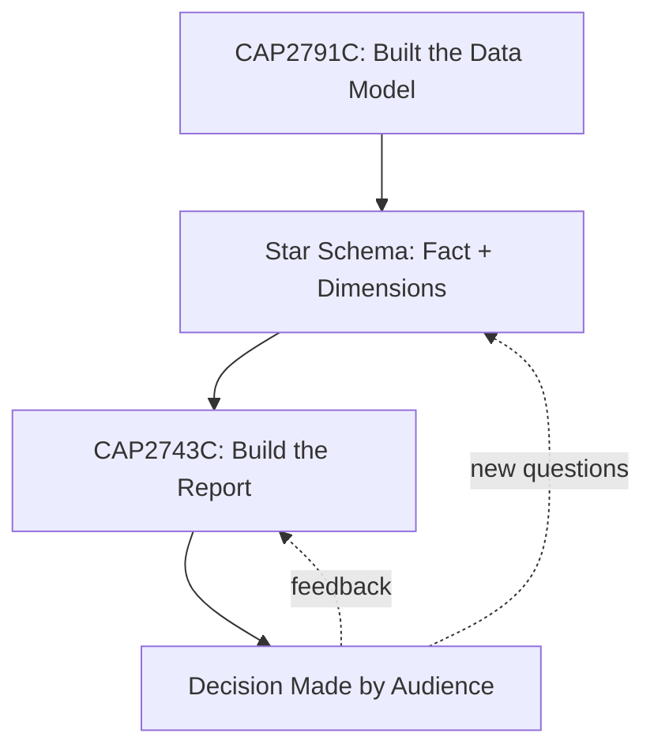
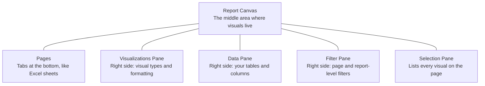
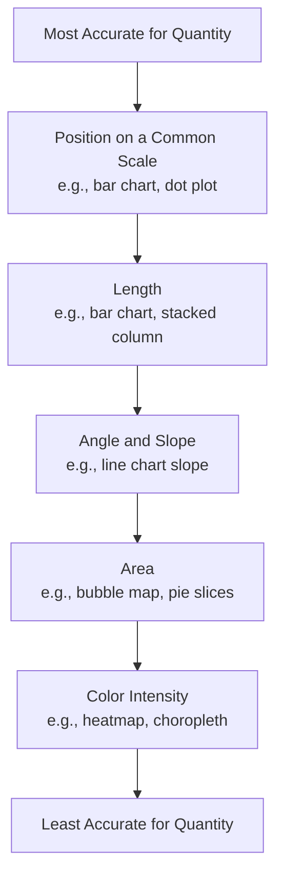
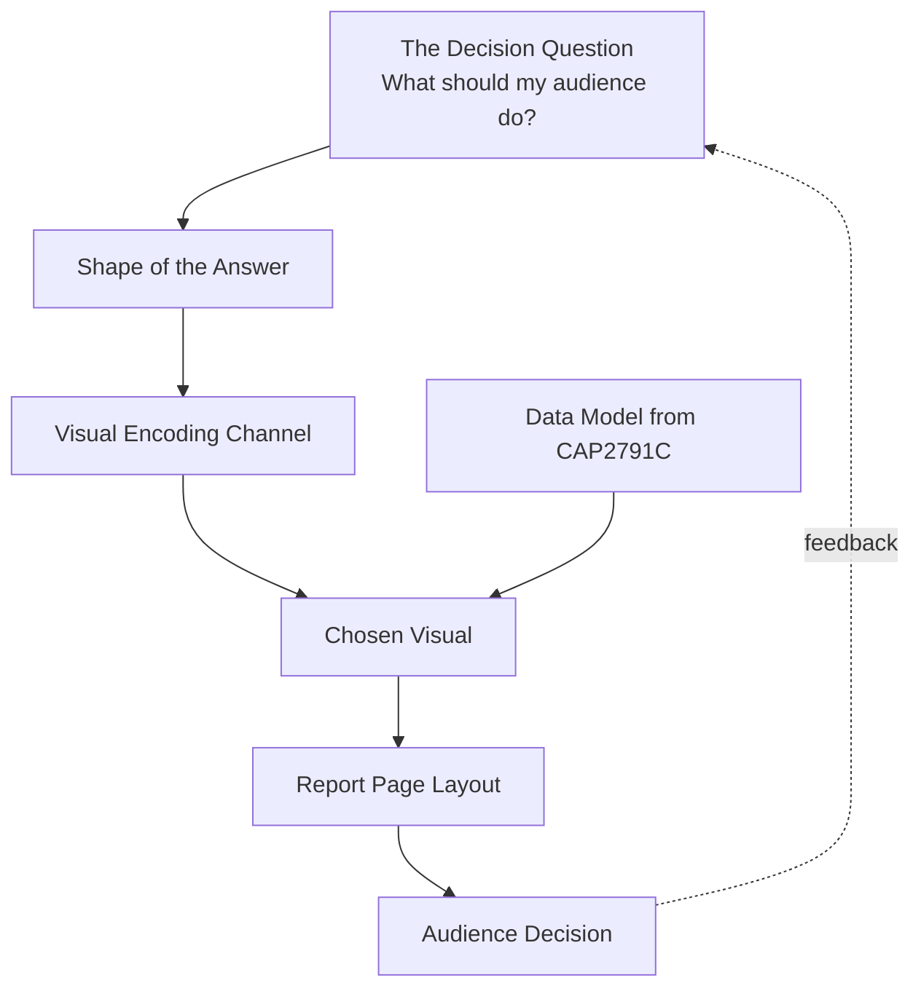

<!--
NANO BANANA PRO IMAGE PROMPT
File: images/ch01/fig-1-1-crossroads.png
Title: The Crossroads

Subject: A young Latina professional in her mid-20s, business-casual attire, standing at a fork in an indoor walkway.
Action: She is mid-step, turning her head to look from one path to the other; one path glows softly while the other is dim.
Environment: Inside a modern, glass-walled corporate workspace at dusk; Miami skyline visible through the windows (palm tree silhouettes, ocean glow on the horizon); subtle holographic data elements floating along the lit path — a glowing bar chart, a KPI card, a faint map.
Lighting: Cool blue ambient with warm gold accents on the lit path; cinematic, depth of field with the protagonist in sharp focus.
Style: Photo-real with a subtle digital-painting finish; clean, premium, editorial; consistent with the book's broader visual identity.
Constraints: No text, no readable chart labels, no logos, no other people; 16:9 aspect ratio.
-->

:::{figure} ../images/ch01/fig-1-1-crossroads.png
:label: fig-1-1
:alt: Camila at a crossroads in a glass-walled corporate hallway at dusk, holographic data visuals lining a lit path; Miami skyline beyond the windows.
:width: 100%
:align: center

**Figure 1.1.** *The Crossroads.* Camila chooses between two paths — one lit by the data she has just learned to wield.
:::

**Chapter 1 of 8** | **Part 1 of 4: Foundations of Visualization**

---

### Power BI View Compass — Where We Live This Chapter

| View | What You See | What You Do Here | Used In This Chapter |
|------|-------------|-------------------|----------------------|
| **Report View** | A canvas with visuals (charts, tables, cards) | Build reports, drop in visuals, format them | **Primary view (1.3, 1.6)** |
| **Table View** | Rows of data in a spreadsheet-like grid | Inspect data values, check columns | Mentioned (1.1) |
| **Model View** | Table boxes connected by lines (your star schema) | Manage relationships | Mentioned (1.1) |
| **DAX Query View** | Code editor for testing DAX | Test measures | Not used yet |
| **Power Query Editor** | Separate window with green ribbon | Clean and transform data | Not used yet — that was CAP2791C |

> 💜 **Where Am I?** This chapter lives almost entirely in **Report View**. You will see the other views mentioned, but you will not need to leave Report View to complete any demo in this chapter.

---

## Opening: The Stare

It is 8:47 a.m. on a Monday in October. **Camila Reyes** is three weeks into her first job out of Miami Dade College — junior BI analyst at the AdventureWorks regional sales office in downtown Miami. She has been up until midnight perfecting her first Power BI report.

She has every metric **Marcus Bell**, her boss and the VP of Sales for the South Florida region, has ever asked for. Revenue by territory. Units sold by category. Year-over-year growth. Top resellers. Eleven visuals across two pages. The colors match the company's brand. Every label is aligned to the pixel.

Marcus, a former Navy supply officer who has run sales operations for fifteen years, stares at her screen.

The stare lasts long enough that Camila starts to worry.

Then he says: *"OK. What do you want me to do?"*

She doesn't have an answer.

This is the moment every report has to survive. Not the moment when the data loads. Not the moment when the chart renders. The moment when someone with a decision to make looks at your work and asks: **what next?**

This chapter is about learning to ask that question — *what should my audience do after seeing this?* — before you build anything. By the end of these pages you will not be a Power BI expert. You will be something more useful: someone who knows what a report is *for*.

### Learning Objectives

By the end of this chapter, you will be able to:

1. **Explain** how the data model you built in CAP2791C powers every report you will build in this course.
2. **Identify** the four main parts of a Power BI report (pages, visuals, panes, filters) and locate each in the interface.
3. **Describe** the four visual encoding channels — position, length, color, and area — and rank them by accuracy for showing quantity.
4. **Choose** a visual type based on the question being asked, not on what looks impressive.
5. **Connect** Power BI Desktop, the Power BI Service, and the course GitHub repository into a working environment for the rest of the semester.

### Chapter Roadmap

The chapter has six subchapters. The first five are conceptual — we build the mental model before we touch the software. The last one is hands-on — you set up your environment and walk through three demonstrations that put the ideas to work.

---

## 1.1 Where We Left Off — Recapping the Data Model from CAP2791C

If you are reading this, you finished CAP2791C: Power BI Data Preparation and Modeling. You spent sixteen weeks doing the hardest part of business intelligence. You ingested raw files. You cleaned them in Power Query. You built relationships between tables in Model View. You wrote your first DAX measures. By the end of that course, you had a working **star schema** — a fact table at the center, dimension tables surrounding it, all connected by keys.

Think of what you built as a fully assembled bicycle. The frame is welded. The drivetrain is installed. The wheels are true. The brakes work. Every part is connected the way it should be. The bicycle is ready to ride.

But here is the thing about an assembled bicycle: if no one rides it, it does not get anyone anywhere.

That is where CAP2743C picks up. The data model is the bicycle. The **report** is the ride. The decision your audience makes after seeing the report — that is the destination.

**Diagram 1.1.** The bridge from CAP2791C to CAP2743C. The model exists to power the report. The report exists to drive a decision. Decisions raise new questions, which sometimes feed back into the model.

For this whole course we use the **AdventureWorks** dataset. AdventureWorks is a fictional global bicycle company — a real Microsoft sample dataset that has been used for Power BI and SQL training for over a decade. It is also the dataset Microsoft uses on the PL-300 certification exam, so working with it serves a second purpose. The data spans multiple fiscal years, two sales channels (Reseller and Internet), six countries across three regions, and a product catalog of bikes and components.

In the fictional world of this textbook, AdventureWorks has a regional sales office in downtown Miami. Camila works there. Marcus runs it. Their day-to-day is South Florida. The data they analyze is global. That dual frame — local people, global data — is going to come up a lot.

<strong style="color: #1B4F72;">💡 WHY ARE WE DOING THIS?</strong>  
The temptation in this course is to ignore CAP2791C and treat Power BI as if it starts fresh in the Report View. It does not. Every filter you click on a report ripples through the relationships you built last semester. Every measure you display was written against the star schema you designed. The model is not background — it is the engine. The report is the steering wheel.

---

## 1.2 Why Visualization Matters: Turning Numbers into Decisions

Let us go back to Camila's Monday morning meeting.

<!--
NANO BANANA PRO — CHAPTER 1 FIGURE 2 (concept infographic)
File: images/ch01/fig-1-2-data-dump-vs-decision.png
Title: A Data Dump vs. a Decision
Concept: A report exists to drive a decision, not to display data — the Decision Question.
Archetype: Before/after — two panels, central "THE DECISION QUESTION" arrow.
Reference: images/_style-reference/fig-3-2-two-reactions.png
Labels: panel headers "DATA DUMP" / "A DECISION"; callouts "11 VISUALS, 0 ANSWERS" / "CALL THESE TWO TERRITORIES"; footer "WHAT DOES MY AUDIENCE NEED TO DECIDE?".
Palette: navy #1B2A47, gold #C9A23A, white / pale-blue background.
-->

:::{figure} ../images/ch01/fig-1-2-data-dump-vs-decision.png
:label: fig-1-2
:alt: A before-and-after infographic. On the left, a cluttered report crammed with eleven small mismatched charts, labeled "11 visuals, 0 answers." On the right, a focused report with one sorted bar chart and a number card, labeled "call these two territories." A central arrow reads "the Decision Question."
:width: 100%
:align: center

**Figure 1.2.** *A Data Dump vs. a Decision.* Same data, two reports — one is a record, the other drives a decision.
:::

> **Story: Eleven Visuals, Zero Answers**
>
> Marcus had asked for a report on the South Florida sales territory. Camila built one. It was thorough. Eleven visuals across two pages. Revenue by territory broken out by sales channel. Units sold by product category. Year-over-year growth as a percentage. Top ten resellers ranked. A map of the United States with bubbles sized by sales amount. A line chart of monthly trends going back two years. Two tables. One KPI card. A donut chart.
>
> Marcus scrolled through page one. Then page two. Then back to page one. He pulled out a notebook and pen — the actual paper kind, from his Navy days — and wrote nothing.
>
> "Camila," he said, "which of these territories should I personally call this week?"
>
> She started clicking. The map could show her, kind of. The bar chart, sort of. The trend line, maybe.
>
> Marcus closed the laptop. *"I needed your help and I didn't get it. Try again Thursday."* He stood, took his coffee, and left for his 9:00.
>
> Camila walked back to her desk. The report was beautiful. It was also useless.
>
> ---
> ***Technical Connection:*** Camila's report contained everything Marcus had ever asked for. It was a complete record of the data. But a *record of the data* is not the same thing as *help with a decision*. Visualization is selective communication. The work is not in showing more — it is in showing less, and showing the right things.

This is the central lesson of the entire course. Reports are not data dumps. Reports are arguments. Every chart you build is making a case for some piece of information being more important than the other things you could have shown. If everything is on the page, nothing is.

The question that drives every good report is not *"what data do I have?"* It is *"what does my audience need to do?"*

Once you know the decision — call these territories this week, cut the inventory on this product line, move budget from this campaign to that one — the rest gets clearer. You know which question to answer. You know which data to pull. You know which visual to use. You know what to leave out.

Throughout this book you will see this called the **Decision Question**. Get in the habit of asking it before you open Power BI:

> *What does my audience need to decide, and what visual best supports that decision?*

If you cannot answer that question in one sentence, you are not ready to build the report yet.

---

## 1.3 The Anatomy of a Power BI Report

Open Power BI Desktop and the Report View greets you with a lot of furniture. There is a canvas in the middle. Panes on the right. A ribbon at the top. Tabs at the bottom. Most students see this and freeze.

Let us name the parts.

**Diagram 1.2.** The anatomy of a Power BI report. Five parts wrap around the canvas. Learn these names; the rest of the chapter and the rest of the book uses them constantly.

**The Canvas** is the white area in the middle of the screen. Visuals — your charts, tables, and cards — live on the canvas. Think of it as the dashboard of a car: the speedometer, fuel gauge, GPS, and climate controls all have their assigned zones. Where you place a visual matters as much as what visual you choose.

**Pages** are the tabs along the bottom of the canvas. They work like Excel sheets — each page is its own canvas, and a single report can have one page or thirty. New report, one default page. You add more by clicking the plus sign next to the last tab.

**The Visualizations Pane** sits on the right. Its top half shows every visual type Power BI offers — bar charts, line charts, maps, cards, and so on. Its bottom half changes depending on which visual you have selected; it lets you assign data to that visual (an X-axis, a Y-axis, a legend) and format how the visual looks. You will live in this pane for the next four chapters.

**The Data Pane** (sometimes called the Fields Pane in older interfaces) shows your tables and their columns. This is where the data model from CAP2791C shows up. Every table you loaded — Sales, Product, Customer, Sales Territory, Date — appears here as a folder you can expand. Drag a field onto the canvas and Power BI auto-creates a visual for you.

**The Filter Pane** also sits on the right, between the Visualizations and Data panes. It controls filters at three levels: this visual, this page, or the whole report. You will not use it much in Chapter 1 — slicers and the Filter Pane get their own treatment in Chapter 4.

**The Selection Pane** is hidden by default. You turn it on from the **View tab** of the ribbon. It lists every visual on the current page, lets you rename them, hide them, lock them, and change their stacking order. Useful when a page gets busy.

A vocabulary note: people use "Power BI" to mean three different things, and it helps to keep them straight.

- **Power BI Desktop** — the free application that runs on your Windows machine. This is where you build reports.
- **Power BI Service** — the web app at `app.powerbi.com`. This is where you publish reports so other people can see them.
- **Power BI** (the platform) — the umbrella term that includes both, plus the mobile apps, gateways, and so on.

In this chapter you will use Power BI Desktop only. We will publish to the Service in Chapter 7.

<strong style="color: #6C3483;">💜 TAKE A BREATH</strong>  
You have absorbed a lot of vocabulary. Stand up, stretch, get some water. Look at something more than ten feet away — it gives your eye muscles a break. The next section is the conceptual heart of the chapter, and you want to be fresh for it.

---

## 1.4 Visual Encoding 101 — Position, Length, Color, Area

<!--
NANO BANANA PRO — CHAPTER 1 FIGURE 3 (concept infographic)
File: images/ch01/fig-1-3-visual-encoding.png
Title: Visual Encoding 101
Concept: The four visual encoding channels ranked by how accurately the eye reads quantity.
Archetype: Row diagram — four channel rows, each with a demonstration and a verdict pill.
Reference: this figure is itself a locked style anchor in images/_style-reference/.
Labels: rows POSITION / LENGTH / AREA / COLOR; pills "MOST ACCURATE" / "HIGHLY ACCURATE" / "OFTEN MISJUDGED" / "CATEGORIES, NOT QUANTITY".
Palette: navy #1B2A47, gold #C9A23A, white / pale-blue background.
-->

:::{figure} ../images/ch01/fig-1-3-visual-encoding.png
:label: fig-1-3
:alt: A four-row infographic titled "Visual Encoding 101." Each row demonstrates one channel — position, length, area, color — with a verdict: position is most accurate, length highly accurate, area often misjudged, and color is for categories not quantity.
:width: 100%
:align: center

**Figure 1.3.** *Visual Encoding 101.* The four channels a chart can use, ranked by how accurately the eye reads quantity from each.
:::

> **Story: Dr. Iyer's Whiteboard**
>
> The Tuesday after the Marcus meeting, Camila drove out to MDC's West Campus and found her former professor's office. **Dr. Priya Iyer** had taught Camila's data modeling course the previous semester. They had stayed in touch. Camila had texted her the night before: *"My boss hated my first report. Can we talk?"*
>
> Dr. Iyer did not ask Camila to open her laptop. She walked over to the whiteboard and drew four rows of dots.
>
> The first row had dots in different **sizes** — small, medium, large, extra-large.
> The second row had dots all the same size, placed at different **positions** along a horizontal line.
> The third row had dots all the same size and position, but different **colors**.
> The fourth row had dots arranged as different **shapes** — circle, square, triangle, hexagon.
>
> "Which row," Dr. Iyer asked, "lets you compare quantities most accurately?"
>
> Camila looked. The first row — different sizes — she could rank, sort of. The third row — colors — she could not rank at all. The fourth row — shapes — was meaningless for quantity. The second row, with dots placed along a line, was instant. The dot farthest to the right was the biggest. The dot farthest to the left was the smallest. She did not have to think about it.
>
> "Position," Dr. Iyer said. "Position along a common axis is the most accurate visual channel humans have. That is a fact about how human vision works, not about Power BI. Length — like the bars in a bar chart — is the second most accurate. Color works great for *categories* and terribly for *quantities*. Area — like circles on a bubble map or slices of a pie — is the worst of all, because human eyes systematically misjudge area."
>
> She paused. "Before you click a single visual in Power BI, you should know which channel you are using and why."
>
> ---
> ***Technical Connection:*** Choosing a visual is choosing a visual channel. Different channels carry different amounts of information accuracy. Sections 1.4 and 1.5 unpack which channels are accurate for which purposes, and how to translate that into Power BI's visual menu.

What Dr. Iyer was teaching is called **visual encoding** — the principle that a chart "encodes" data into one or more visual channels, and the eye "decodes" the data back out. Some channels are high-fidelity. Others lose information along the way.

**Diagram 1.3.** The visual encoding accuracy hierarchy. This ranking is based on decades of perception research by William Cleveland, Robert McGill, and others. Position beats length, length beats angle, angle beats area, area beats color intensity. The further down the list you go, the more the eye has to guess.

There is also something called **pre-attentive processing**. Some visual features — a single red dot in a sea of black dots, a single tall bar in a row of short ones — register in your brain before you consciously decide to look. They take about 250 milliseconds. They happen automatically. A well-designed chart uses pre-attentive features to put your audience's attention where it belongs *before they have time to think*.

A cyclist sees a pothole this way. Her conscious mind has not yet said the word "pothole," but her hands are already turning the handlebars. That is pre-attentive processing in the real world.

A bar chart with one bar colored red and the rest gray does the same thing for the eye. So does a single tall bar at the top of a sorted list. So does a KPI card with a giant number and small label. Good visualization uses these features on purpose. Bad visualization uses them by accident — which is why some charts feel busy and exhausting to read.

> 💡 **WHY ARE WE DOING THIS?**
>
> Power BI gives you thirty-plus visual types out of the box, and more from AppSource. Without a framework for choosing, you will pick the visual that looks the most impressive, or the visual that fills the most space, or the visual that is closest to the top of the Visualizations Pane. The accuracy hierarchy gives you a real reason to pick one visual over another. From this chapter forward, every visual choice in this book gets justified against this hierarchy.

---

## 1.5 Choosing the Right Visual for the Right Question

Now you have a framework. The question — *what does my audience need to decide?* — leads to a smaller question — *what shape does the answer take?* — which leads to a visual.

Some shapes and their natural visuals:

| The Audience Wants To... | Shape of Answer | Best Visual Type |
|--------------------------|----------------|------------------|
| Compare quantities across categories | A ranked list | **Bar chart** (sorted) |
| See how something changes over time | A line moving across dates | **Line chart** |
| See parts adding up to a whole | A composition | **Stacked bar** (not pie, when accuracy matters) |
| Spot relationships between two numeric variables | A cloud of points | **Scatter plot** |
| See one number at a glance | A big number | **Card** or **KPI** |
| Browse a lot of detail row-by-row | A grid | **Table** or **Matrix** |
| Compare values across geography | A map | **Filled map** or **Bubble map** |

This is not a complete list — Chapter 2 walks through every major visual type. For now, the takeaway is the chain of reasoning: **question → shape → visual**.

Back to Camila.

> **Case Study: The Marcus Meeting, Take Two**
>
> Camila has until Thursday to deliver a better report. She does not open Power BI yet. She opens a blank page in her notebook and writes Marcus's question at the top:
>
> *"Which territories should I personally call this week?"*
>
> Underneath, she works through the chain:
>
> **What is the shape of the answer?** A ranked list of territories. Marcus does not want a map. He does not want a trend line. He wants to know which territories are at the top of a priority list, with the most important one first.
>
> **What data does the answer need?** Territory name, plus some measure of recent performance, plus some way to know which are below where they should be.
>
> **What visual fits the shape?** A bar chart, sorted descending, showing one measure per territory. Position encoding for accurate quantity comparison. Length encoding as a backup channel.
>
> **What does Marcus's eye see first?** The longest bar at the top, because the chart is sorted. That is the first place he should look — the territory he should call first.
>
> **What gets cut?** Everything that does not answer the question. The map goes. The year-over-year growth percentage goes. The donut chart goes. The product category breakdown goes. The reseller table goes. Nine of her eleven visuals go.
>
> By the time she finally opens Power BI Wednesday afternoon, she knows what she is building. A single page. Three visuals. One question.
>
> On Thursday morning Marcus looks at it. He pulls out his notebook. He writes down two territory names. He looks at Camila and says, *"This. This is what I needed."*

<!--
NANO BANANA PRO — CHAPTER 1 FIGURE 4 (concept infographic)
File: images/ch01/fig-1-4-match-question-visual.png
Title: Match the Question to the Visual
Concept: The audience's question decides the chart type — five question types mapped to their best visual.
Archetype: Card row — five cards, each a question type with its recommended visual.
Reference: images/_style-reference/fig-1-3-visual-encoding.png
Labels: cards COMPARE CATEGORIES (sorted bar), CHANGE OVER TIME (line chart), PARTS OF A WHOLE (stacked bar), ONE KEY NUMBER (card), A RELATIONSHIP (scatter plot).
Palette: navy #1B2A47, gold #C9A23A, white / pale-blue background.
-->

:::{figure} ../images/ch01/fig-1-4-match-question-visual.png
:label: fig-1-4
:alt: A five-card infographic titled "Match the Question to the Visual." Each card pairs a question type with its best chart: compare categories with a sorted bar, change over time with a line chart, parts of a whole with a stacked bar, one key number with a card, and a relationship with a scatter plot.
:width: 100%
:align: center

**Figure 1.4.** *Match the Question to the Visual.* Five common questions, and the visual that answers each most accurately.
:::

<strong style="color: #7D6608;">⚠️ COMMON MISTAKE</strong>  
The mistake is starting with the visual instead of the question. Many students open Power BI, scroll through the Visualizations Pane, and pick the chart that looks coolest. Then they figure out what data to put in it. This is backwards. The question comes first. The shape of the answer comes second. The visual is the third decision, not the first.

---

## 1.6 Setting Up Your Workspace

Time to actually open the software. This section has three parts: environment setup, then three demonstrations that put Sections 1.2 through 1.5 to work in Power BI.

### Step 1: Confirm Power BI Desktop is Installed and Current

Power BI Desktop is a free Windows application. If your machine is a Mac, you will use the lab Windows machines on campus, or a Windows virtual machine. There is no native Mac version.

<strong style="color: #1E8449;">✅ DO THIS</strong>  
1. Open Power BI Desktop from your Start menu. 
2. Click <strong>File</strong> → <strong>About</strong>. 
3. Confirm the version is from the last six months. Microsoft releases monthly updates and we want a current version. 
4. If your version is older, close Power BI Desktop and reinstall from the Microsoft Store (search "Power BI Desktop"). The Store version updates automatically.

### Step 2: Sign In to the Power BI Service

You publish reports to the **Power BI Service** so other people can see them. MDC provides every student a Microsoft 365 account that includes a Power BI Service license.

<strong style="color: #1E8449;">✅ DO THIS</strong>  
1. In Power BI Desktop, look at the top-right corner of the application window. 
2. Click <strong>Sign in</strong>. 
3. Enter your MDC student email address (the one ending in <code>@mymdc.net</code>). 
4. Complete the Microsoft sign-in flow in the browser window that pops up. 
5. Return to Power BI Desktop. The top-right corner should now show your name and a small avatar.

<strong style="color: #922B21;">🛑 STOP AND CHECK</strong>  
You should see your name in the top-right corner of Power BI Desktop. If you see "Sign in" instead, the sign-in did not complete. Try again. Without a signed-in account, you cannot publish to the Service later, and several features will be missing from the demos below.

### Step 3: Clone or Download the Course GitHub Repository

The course materials — datasets, sample files, chapter readings — all live in a GitHub repository linked from the course Canvas page. Your AdventureWorks file lives there. You have two options to get it: clone the repo with Git (if you took CIS 1000 or have used Git before) or download the ZIP.

<strong style="color: #1E8449;">✅ DO THIS</strong>  
1. Open the course Canvas page and click the <strong>Course GitHub Repository</strong> link in the left-hand navigation. 
2. On the repository page, click the green <strong>Code</strong> button. 
3. Click <strong>Download ZIP</strong>. 
4. Save the ZIP to your Documents folder, then right-click it and choose <strong>Extract All</strong>. 
5. The extracted folder contains a <code>data/</code> folder. Inside, find <code>AdventureWorks_Sales.xlsx</code>. Note the full file path — you will need it.

### Demo 1: Your First Visual

Now you have the software, you have an account, and you have the data. Time to make something.

**The goal:** Connect Power BI Desktop to AdventureWorks and create one visual showing Sales Amount by Country.

**See it.** The Home tab of the ribbon at the top of Power BI Desktop has a group of buttons on the left labeled **Data**. The first button is **Get data**.

**Name it.** That button is the entry point for every data source Power BI supports — Excel files, CSV files, SQL Server databases, web pages, Salesforce, and so on.

**Find it.** Home tab → Data group → Get data.

**Do it.** Click **Get data**, then select **Excel workbook**, then navigate to the AdventureWorks_Sales.xlsx file you extracted. In the Navigator window that opens, check the boxes next to **Sales_data**, **Product_data**, **Date_data**, and **Sales Territory_data**. Click **Load** (not **Transform Data** — Power Query work belongs to CAP2791C, and this dataset is already clean).

Wait while Power BI loads. You will see a progress dialog. When it finishes, look at the Data pane on the right side of the screen. You should see four tables listed, each as a collapsible folder.

Now create your first visual.

**Do it.** Expand **Sales Territory_data** in the Data pane and drag the **Country** field onto the canvas. Power BI auto-creates a **Map visual**, with bubbles on each country. Now expand **Sales_data** and drag **Sales Amount** onto that same visual. The bubbles resize according to total sales.

<strong style="color: #922B21;">🛑 STOP AND CHECK</strong>  
You should see a world map with bubbles over the United States, Canada, the United Kingdom, France, Germany, and Australia. The bubbles should vary in size. If you see a blank canvas or an error, check that you dragged the fields onto the canvas (not into the Visualizations pane), and that both fields are still in the visual's Location and Bubble size wells.

Look at the map. Could you, in five seconds, tell me which country has the second-highest sales? Probably not. The bubbles look pretty similar. The areas are hard to compare. This is the **area** encoding from Dr. Iyer's whiteboard — the worst channel for quantity. Power BI's *default* is rarely the *right* visual.

### Demo 2: Replace the Map with the Right Visual

Same data, same question, better visual.

**Do it.** With the map still selected, look at the Visualizations pane on the right. In the top half of the pane, find the **Clustered bar chart** icon (it looks like three horizontal bars stacked vertically). Click it. The map transforms into a bar chart.

Now sort it.

**Do it.** Hover over the top-right corner of the bar chart. Click the three-dot **More options** icon. Hover **Sort axis**, then click **Sales Amount**. Hover **Sort axis** again and click **Sort descending**. The bars now reorder so the largest sales country is on top.

Compare the two visuals. With the bar chart, you can rank every country in under a second. With the map, you could not. The position-and-length encoding wins.

### Demo 3: Camila's First Real Report Page

Now build the page Camila showed Marcus.

**Do it.** Click in the empty white area of the canvas to deselect the bar chart. Then in the Visualizations pane, click the **Card** icon (it looks like the number 123). A blank card appears. Drag **Sales Amount** onto it. The card now shows the total sales across every country and every year — a single number that anchors the page.

**Do it.** Click in the empty area again. In the Visualizations pane, click the **Bar chart** icon. Power BI creates a second bar chart. Drag **Region** (from Sales Territory_data, not Country) into the **Y-axis** well. Drag **Sales Amount** into the **X-axis** well. Sort it descending the same way as before. You now have a regional ranked list — the second visual Camila showed Marcus.

**Do it.** Drag the three visuals into a clean layout: the card in the top-left, the country bar chart on the right taking up most of the canvas, the region bar chart on the bottom-left. Three visuals. One question. One decision.

This is not yet a finished report — it has no title, no theme, no formatting polish. Chapter 3 handles all of that. But the conceptual work is done. Marcus could open this page on Thursday morning and know exactly what to do.

<strong style="color: #6C3483;">💜 TAKE A BREATH</strong>  
You built your first Power BI report. That is a real skill — the kind that goes on a résumé. Save your file as <code>Ch01_FirstReport.pbix</code> in your Documents folder. Close the laptop, stretch, drink water. The closing section pulls everything together.

---

## Chapter Closing

### Key Takeaways

- A report exists to drive a decision, not to display data. The first question to ask, every single time, is: *what does my audience need to do?*
- The data model you built in CAP2791C powers every visual you build in CAP2743C. Relationships, measures, and clean tables — the engine that makes Report View work.
- A Power BI report is built from five named parts: the canvas, pages, the Visualizations pane, the Data pane, and the Filter pane (plus the Selection pane when pages get busy).
- Every visual encodes data into one or more visual channels. Position and length are the most accurate channels for quantity. Color and area are the least accurate.
- Pre-attentive processing means some visual features — a single red bar, a tall outlier, a big number — register in the eye in 250 milliseconds, before conscious thought. Good charts use this on purpose.
- Power BI's default visual is rarely the right visual. The chain of reasoning is **question → shape of answer → visual type**, and the visual is the *third* decision, not the first.

### Concept Map

**Diagram 1.4.** How the chapter's ideas fit together. The Decision Question drives the shape of the answer, which drives the visual channel, which drives the visual type. The data model from CAP2791C feeds every visual. The audience's decision feeds back into the next iteration of the question.

### Vocabulary Review

- **Report View** — The Power BI Desktop view where you build reports by placing visuals on a canvas.
- **Page** — A single canvas in a report. Reports can have many pages, accessed by tabs at the bottom.
- **Visual** — A chart, table, card, or other graphical element placed on a page.
- **Visualizations Pane** — The right-side pane where you choose a visual type and assign data fields to it.
- **Data Pane** — The right-side pane (sometimes called the Fields pane) showing every table and column from your data model.
- **Filter Pane** — The right-side pane that controls filters at the visual, page, and report levels.
- **Selection Pane** — A hidden-by-default pane (turned on from the View tab) that lists every visual on the current page.
- **Visual Encoding** — The principle that a chart translates data into one or more visual channels (position, length, color, area, shape), and the eye translates back.
- **Pre-attentive Processing** — The eye's ability to register certain visual features (color, size outliers, position outliers) before conscious thought, in about 250 milliseconds.
- **Power BI Service** — The web application at app.powerbi.com where reports are published for sharing. Separate from Power BI Desktop, which is where reports are built.

### Bridge to Chapter 2

You can now name the parts of a Power BI report. You can articulate why one visual beats another. You have built your first three-visual page. What you do not yet have is a deep working knowledge of *which visual type to use for which kind of question*. Chapter 2 fixes that. We walk through the entire built-in visual toolkit — bar, column, line, area, pie, scatter, histogram, box plot, table, matrix, card, KPI, map — and for each one we cover: when it shines, when it lies, and how to configure it. By the end of Chapter 2, your Visualizations pane will stop being a menu of mysteries and start being a tool you reach for with intention.

### Self-Check Questions

1. Marcus asks Camila: *"Which product category declined the most last quarter?"* Of the following visuals, which best answers his question? (a) A pie chart of category share; (b) A map with bubbles by category; (c) A bar chart of category sales sorted ascending by year-over-year change; (d) A donut chart of category share with last quarter highlighted. *(Answer: c — a sorted bar chart on a meaningful measure. Position encoding for ranking; the worst category sits at the top of the sorted list.)*

2. *True or False:* Color is the most accurate visual channel for comparing quantities. *(Answer: False. Position is the most accurate, length is second. Color is for categories, not quantities.)*

3. You drag a Country field onto a Power BI canvas and Power BI auto-creates a map. You realize the audience needs to rank countries, not see them geographically. What is the fastest way to switch the visual? (a) Delete it and start over; (b) Right-click the field; (c) Click the visual, then click a different visual icon in the Visualizations pane; (d) Open Power Query. *(Answer: c — selecting the visual and clicking a new icon in the Visualizations pane swaps the type while keeping the data assignments.)*

4. Which of the following is *not* a part of the Report View interface in Power BI Desktop? (a) Canvas; (b) Visualizations Pane; (c) Power Query Editor; (d) Filter Pane. *(Answer: c — Power Query Editor is a separate window for data transformation, used in CAP2791C, not the Report View.)*

5. In one sentence, restate the Decision Question. *(Sample answer: "What does my audience need to decide, and what visual best supports that decision?")*

### Reflection Prompt

Think about a chart you have seen recently — in the news, on social media, in a class, in an email from your bank. What question was the chart trying to answer? Did it succeed? What visual channel was it using (position, length, color, area)? If you had to redesign it for the same audience, what would you change, and why?

---

*End of Chapter 1.*
