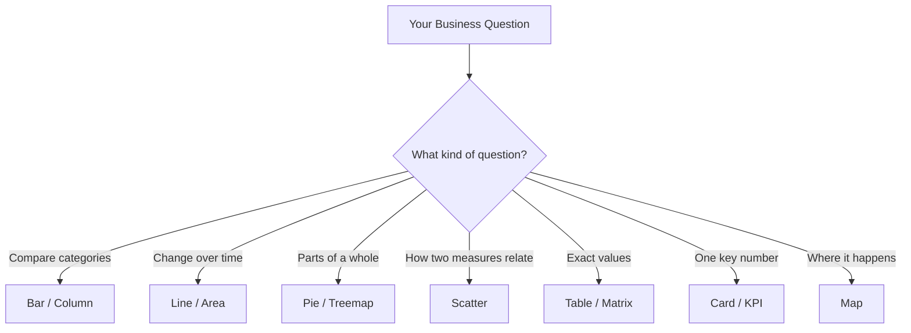
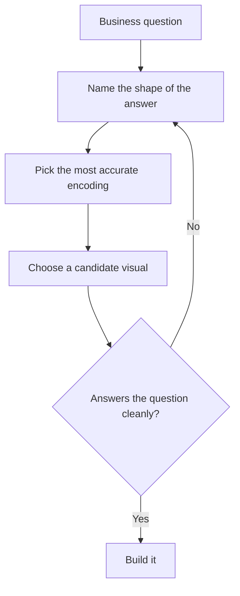
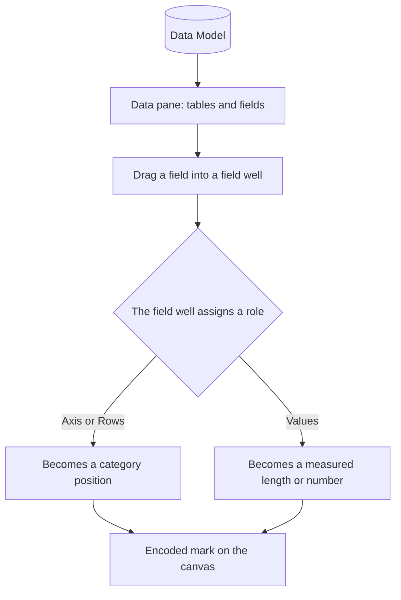
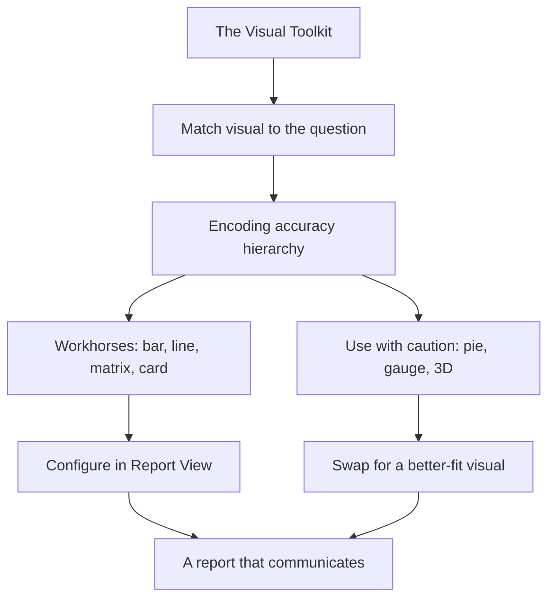

<!--
NANO BANANA PRO — CHAPTER 2 OPENING IMAGE
File: images/ch02/fig-2-1-visual-toolkit-wall.png
Subject: A bicycle mechanic's pegboard tool wall inside a modern AdventureWorks bike shop, with a tidy assembly bench in the foreground.
Action: Among the mounted wrenches and tire levers hang translucent, softly glowing holographic data visuals — a bar chart, a line chart, a single-number data card; one holographic visual is lifted slightly off its hook, as if being chosen for a job. On the bench, a laptop shows a partially built report glowing on screen.
Environment: A clean, modern bike shop interior at dusk; Miami skyline and palm-tree silhouettes visible through a large window, ocean glow on the horizon — echoing the setting of the Chapter 1 opening image.
Lighting: Cool blue ambient with warm gold accents; cinematic, shallow depth of field with the tool wall in sharp focus; a cool turquoise glow radiating from the holographic visuals.
Style: Photo-real with a subtle digital-painting finish; clean, premium, editorial; consistent with the Chapter 1 opening image and the book's broader visual identity.
Constraints: No text, no readable chart labels, no logos, no people; 16:9 aspect ratio.
-->

:::{figure} ../images/ch02/fig-2-1-visual-toolkit-wall.png
:label: fig-2-1
:alt: A bike-shop pegboard tool wall where the hanging tools are translucent holographic data visuals — bar chart, line chart, KPI card — with a laptop showing a partial report on the bench.
:width: 100%
:align: center

**Figure 2.1.** *The Visual Toolkit Wall.* Like a mechanic's pegboard, the Visualizations pane is a wall of tools. The job is choosing the right one.
:::

**CAP2743C: Power BI — Data Visualization and Analysis**
**Chapter 2 of 8 · Part 1 of 4: Foundations of Visualization**

---

> **Power BI View Compass — Chapter 2**
>
> This entire chapter lives in **one place**: the **Report View** of Power BI Desktop. That is the canvas where you drop visuals and arrange them into a page.
>
> | View | What you see | Used in Chapter 2? |
> |------|--------------|--------------------|
> | **Report View** | A blank or filled canvas with a Visualizations pane and a Data pane | **Yes — the whole chapter** |
> | Table View | Your data in a spreadsheet-style grid | No |
> | Model View | Table boxes connected by relationship lines | No |
> | DAX Query View | A code editor for testing DAX | No |
>
> You will not switch views in this chapter. When a step needs you to confirm where you are, look for the **WHERE AM I?** anchor.

---

## Opening: The Dashboard Camila Did Not Build

*In this opening, you will see the problem the whole chapter solves, then get the roadmap for solving it.*

Camila Reyes had been a junior BI analyst at AdventureWorks' Miami office for exactly five weeks when the Teams message arrived. It was from Marcus Bell, the VP of Sales, and it was three words long: *"Can we copy?"*

Attached was a dashboard built by the Northwest region's analyst. Eight visuals crammed onto one page. Five were pie charts. One was a gauge with a needle on 73% — though 73% of *what* was anyone's guess, because the label had scrolled off. In the corner sat a 3D column chart, tilted so the back columns looked shorter than they really were.

Something was wrong with it. Camila could feel that. But when she tried to put the problem into words, all she had was a half-remembered line from Chapter 1: *area is the least accurate way to show a number.* True — and not enough. She could not rebuild this dashboard from one principle, or defend a single change to Marcus.

Here is the gap this chapter closes. In Chapter 1 you learned to *think* visually — the **visual encoding accuracy hierarchy** (the ranked list of how precisely the eye reads position, length, angle, area, and color) and the habit of moving from a question to the shape of its answer to a visual. That was the steering. This chapter hands you the rest of the car: the **full toolkit** of Power BI's core visuals — what each one is for, how to configure it, and the specific way each one *lies* when pointed at the wrong question.

By the end of this chapter, you will be able to:

1. **Match a business question to the visual type** that answers it most accurately.
2. **Configure the workhorse comparison and card visuals** in Power BI Desktop's Report View, including sorting a chart by its measure.
3. **Recognize the failure mode of each visual family**, including the exact point where a pie chart stops communicating.
4. **Apply Chapter 1's encoding accuracy hierarchy** to defend a visual choice out loud to a stakeholder.
5. **Rebuild a poorly designed dashboard** by swapping each visual for a better-fit alternative.

The roadmap: you will first organize the toolkit by the *question* each visual answers (Section 2.1). Then you will walk the families — comparisons, trends, parts of a whole, relationships, exact numbers, maps, and single key numbers (Sections 2.1 through 2.7). Two hands-on builds are spaced through those sections, rising in difficulty. The chapter closes where it started: you will rebuild Marcus's inherited dashboard, one defensible swap at a time.

*Transition:* Before you touch a single visual, you need a way to organize the toolkit in your head — so let us start with the wall it hangs on.

---

## 2.1 Comparing Categories: Bar and Column Charts

*Section 2.1 of 2.8 — In this section, you will learn to organize every Power BI visual by the question it answers, then build and sort your first comparison chart.*

### The Tool Wall

<!--
NANO BANANA PRO — CHAPTER 2 FIGURE 2
File: images/ch02/fig-2-2-tool-wall-walk.png
Title: Walking Past the Pegboard
Subject: Camila Reyes and Dr. Priya Iyer walking through an AdventureWorks bicycle service area, mechanic truing a wheel in the background.
Action: Mid-stride; Dr. Iyer gesturing toward the pegboard of bicycle tools.
Environment: Industrial-but-clean service floor; pegboard wall with neatly hung wrenches, tire levers, spoke keys, a chain breaker.
Lighting: Cool industrial overhead light with warm late-afternoon sun through a high window.
Style: Photo-real with subtle digital-painting finish; clean, premium, editorial.
Constraints: No readable text on tools or signage, no logos; 16:9 aspect ratio.
-->

:::{figure} ../images/ch02/fig-2-2-tool-wall-walk.png
:label: fig-2-2
:alt: Camila and Dr. Iyer walking through an industrial bicycle service area; Dr. Iyer gestures toward a pegboard of bicycle tools; a mechanic trues a wheel in the soft-focus background.
:width: 100%
:align: center

**Figure 2.2.** *Walking Past the Pegboard.* The spoke key looks like a wrench in a pinch. It is not. Five pie charts on Marcus's dashboard were five spoke keys reached for as wrenches.
:::

> **The Tool Wall**
>
> On Camila's third day, Dr. Priya Iyer — her mentor, and a former MDC professor who still talked like one — walked her past the AdventureWorks service floor. A mechanic was truing a bicycle wheel at a bench. Behind him hung a pegboard wall: wrenches in rising sizes, tire levers, a chain breaker, a spoke key.
>
> "Look at the spoke key," Priya said. "Tiny. Looks like it could pass for a small wrench in a pinch. But the mechanic would never grab it for a bolt — he'd round off the head and waste ten minutes." She tapped the board. "Every tool on this wall is ground to fit one job. The skill is not strength. It is knowing which tool the job in front of you is asking for."
>
> Camila thought about the eight visuals on Marcus's dashboard. Five pie charts. Five times someone had reached for the spoke key.
>
> ---
> *Technical Connection:* Power BI's visuals work like that pegboard. A bar chart, a line chart, and a card are not interchangeable — each is shaped to fit one kind of question. Becoming fluent in visualization is not about knowing every visual. It is about reading the question in front of you and recognizing which visual it is asking for.

The fastest way to build that fluency is to stop organizing visuals by what they *look* like and start organizing them by the **question** they answer. A pie chart and a treemap look nothing alike, but they answer the same question.

  <strong style="color: #1A5276;">💡 WHY ARE WE DOING THIS?</strong> 
  Organizing the toolkit by question — instead of by appearance — lets you choose a visual <em>before</em> you build it, the way the mechanic chooses a tool before he reaches for it. When a stakeholder asks for "a chart," you will not be guessing; you will be asking one thing: what is the shape of the answer they need? That habit is the core skill the PL-300 exam tests under "select an appropriate visual," and it separates a report that decorates from a report that informs.

There are seven question families. Figure 2.1 lays them out.

**Figure 2.1: The Toolkit Map** — Every core Power BI visual sorted by the question it answers. This chapter teaches the toolkit in this order, family by family.

Not every family carries equal weight. Four visuals — the column or bar chart, the line chart, the matrix, and the card — do roughly 80% of the work in a typical AdventureWorks report. This chapter goes **deep** on those four and stays **brief** on the rarer ones (ribbon, area, box plot, treemap, ArcGIS, gauge): enough to recognize them, name the one question they answer, and know their main failure mode. You will not configure a box plot from scratch in Week 4, but you will be ready to recognize one on the PL-300 exam.

*Micro-checkpoint:* Before reading on, name the question family you would reach for if Marcus asked, "Which product category sold the most last quarter?"

### The First Family: How Do Categories Compare?

That Marcus question — *which category sold the most* — is the most common question in business intelligence, and it belongs to the first family: **categorical comparison**. You have a set of categories (product categories, sales regions, salespeople) and one number measured for each, and you want to see how they stack up.

The visual for this job is the **bar chart** or its sibling the **column chart**. The only difference is direction: a **column chart** draws vertical bars, a **bar chart** draws horizontal bars — the same tool turned ninety degrees. Reach for the horizontal **bar chart** when you have many categories or long category names; reach for the vertical **column chart** when categories are few and labels are short.

Why is this family the workhorse? Return to Chapter 1's encoding accuracy hierarchy. Bar and column charts encode each value as **position along an axis** and **length of a bar** — the two channels the eye reads most precisely. When one bar reaches past another, your eye registers the difference accurately and instantly. That is not true of every visual, as Section 2.3 will show painfully.

Two cousins live in this family. A **clustered** column chart places bars side by side within each category — use it to compare a sub-group across categories, such as sales by category split by year. A **stacked** column chart piles segments inside a single bar — use it sparingly. Stacking shows a total cleanly, but the segments floating in the middle do not share a common baseline, so the eye cannot compare them well. Only the bottom segment sits on the axis — the encoding hierarchy talking again.

  <strong style="color: #7D6608;">⚠️ COMMON MISTAKE</strong> 
  Leaving a column chart in its default, unsorted order. Power BI will often sort bars alphabetically or by the order data loaded — neither of which answers a comparison question. If the question is "which category sold the most," the chart should be sorted by the measure, largest to smallest, so the ranking is the first thing the eye lands on. An unsorted comparison chart makes the reader do the ranking work themselves. You will fix this in the build below.

### Demo 1 — Build a Sorted Column Chart

Time to put a visual on the canvas. This first build is heavily guided; the demos that follow will hand you more of the wheel.

  <strong style="color: #922B21;">🛑 WHERE AM I?</strong> 
  Open <strong>AdventureWorks_Sales.xlsx</strong> in Power BI Desktop — the same model you finished Chapter 1 with. Confirm you are in <strong>Report View</strong>: look at the three icons on the far-left edge of the window and make sure the top one (a small bar-chart icon) is highlighted. You will see a blank canvas in the center, a <strong>Visualizations pane</strong> beside it, and the <strong>Data pane</strong> on the far right listing your seven tables. You will stay in this view for the rest of the chapter.

**Step 1: Add an empty column chart to the canvas.**

1. **See It:** The **Visualizations pane** shows a grid of small icons, each a visual type.
2. **Name It:** The **Clustered column chart** icon — vertical bars of differing heights.
3. **Find It:** Top group of icons in the **Visualizations pane**, upper-left of that grid.
4. **Do It:** Click it once. An empty chart placeholder appears on the canvas.

*What you should see:* A blank chart frame, and empty field wells now showing below the icons — **X-axis**, **Y-axis**, and **Legend**.

**Step 2: Put product categories on the X-axis.**

1. **See It:** In the **Data pane** on the far right, the **Product** table has an arrow to expand its fields.
2. **Name It:** The field is **Category**.
3. **Find It:** Inside the expanded **Product** table in the **Data pane**.
4. **Do It:** **Drag** **Category** into the **X-axis** field well.

*What you should see:* The horizontal axis now lists category names. No bars yet — you have given the chart something to compare, but nothing to measure.

**Step 3: Put a measured number on the Y-axis.**

1. **See It:** In the **Data pane**, the **Sales** table also expands.
2. **Name It:** The measure is **Total Sales** (carried over from your Chapter 1 model).
3. **Find It:** Inside the expanded **Sales** table in the **Data pane**.
4. **Do It:** **Drag** **Total Sales** into the **Y-axis** field well.

  <strong style="color: #1E8449;">✅ DO THIS</strong> 
  Sort the chart by its measure. Click the <strong>More options</strong> button — the three dots (<strong>…</strong>) in the top-right corner of the visual. In the menu, point to <strong>Sort axis</strong>, select <strong>Total Sales</strong>, then open the menu again and choose <strong>Sort descending</strong>. The tallest bar moves to the left.

  <strong style="color: #922B21;">🛑 STOP AND CHECK</strong> 
  Your chart should now show one vertical bar per product category, ordered tallest to shortest from left to right. The category that sold the most is the leftmost bar. If your bars are still in alphabetical order, the sort did not apply — reopen the <strong>…</strong> menu and confirm <strong>Sort axis</strong> is set to <strong>Total Sales</strong>, not <strong>Category</strong>.

You have built the workhorse. Every comparison question — by region, by salesperson, by month-name — is this same tool, pointed at a different category field.

*Transition:* Categories compared at a single moment is one question. The next family asks a question that moves: what happens to a number *over time*?

---

## 2.2 Showing Change Over Time: Line, Area, and Ribbon Charts

*Section 2.2 of 2.8 — In this section, you will learn the visual built for trends, and meet two of its cousins you will use far less often.*

When the question contains the words *over time*, *trend*, *growth*, *seasonal*, or *since last year*, you have left the comparison family and entered the **time family**. The default tool here is the **line chart**.

A line chart places time along the horizontal axis and a measure along the vertical axis, then connects the points. The reason it works is the connecting line itself: it encodes the *rate of change* as slope, and the eye reads slope well — a steep climb looks like growth because it *is* a steep climb. AdventureWorks sells bicycles, and bicycle sales in Florida are seasonal — think of stone crab season running October through May, a rhythm every Miami restaurant plans around. A line chart of monthly sales makes that rhythm visible as a shape you can point at. Nobody hands you that rhythm as a table of numbers; the shape *is* the information.

The line chart's two cousins each answer a narrower question:

- The **area chart** is a line chart with the space beneath the line filled in. The fill adds visual weight but no new information, and stacked areas lose their baseline — the same encoding problem as the stacked column. Use it only to emphasize cumulative volume for a *single* series.
- The **ribbon chart** is built for one question: *did the ranking change over time?* It shows categories as ribbons that cross over one another as their rank shifts. It is the right tool when rank-switching is the story, and the wrong tool for anything else.

  <strong style="color: #7D6608;">⚠️ COMMON MISTAKE</strong> 
  Reaching for a clustered column chart to show a trend across twelve or twenty-four months. It technically works, but a forest of separate columns asks the eye to compare heights one pair at a time. A line chart shows the whole trajectory as a single shape. The rule: if the horizontal axis is time and you care about the <em>movement</em>, use a line.

Selecting a visual is not a single jump from "I need a chart" to "here is a pie." It is a short chain of decisions, and Figure 2.2 shows that chain.

**Figure 2.2: The Visual Selection Flow** — The reasoning path from a business question to a built visual. The loop matters: if a candidate visual does not answer the question cleanly, you return to naming the shape of the answer — you do not force the visual.

*Micro-checkpoint:* Marcus asks, "Are our Touring Bike sales growing or shrinking across the year?" Walk that question through Figure 2.2 in your head. Where does it land?

  <strong style="color: #6C3483;">💜 TAKE A BREATH</strong> 
  You are at the midpoint of the toolkit. You have met the two families that carry the most weight in real reports — comparisons and trends — and you have built one chart with your own hands. That is genuine progress. Look away from the screen for a moment, roll your shoulders, get some water. The next three families are shorter on purpose: they are tools you need to <em>recognize</em> more than tools you will reach for every day. When you come back, the pace picks up.

*Transition:* The families so far — comparison and time — are tools you will use constantly. The next one is different. It is a family famous for being chosen far more often than it should be.

---

## 2.3 Parts of a Whole: Pie, Donut, and Treemap

*Section 2.3 of 2.8 — In this section, you will learn the part-to-whole family and, more importantly, learn when to walk away from it.*

The **part-to-whole** family answers the question *what share of the total does each piece hold?* The visuals are the **pie chart**, the **donut chart** (a pie with its center removed), and the **treemap** (nested rectangles sized by value). All three encode each value as **area** — and Chapter 1 told you exactly where area sits on the accuracy hierarchy: near the bottom.

This is the spoke key from the tool wall. It is not useless. It is a tool for one narrow job, reached for constantly for jobs it cannot do.

<!--
NANO BANANA PRO — CHAPTER 2 FIGURE 3
File: images/ch02/fig-2-3-marcus-colada.png
Title: Eleven Tacitas
Subject: A row of eleven tiny Cuban-coffee cups (tacitas) being poured unevenly; Marcus across the table looking at the row.
Action: Cuban colada coffee mid-pour from a small foam cup into the smallest tacita; Marcus's bemused expression.
Environment: Miami office break room, midafternoon.
Lighting: Bright midafternoon light, warm tones.
Style: Photo-real with subtle digital-painting finish; clean, premium, editorial.
Constraints: No readable text, no logos; 16:9 aspect ratio.
-->

:::{figure} ../images/ch02/fig-2-3-marcus-colada.png
:label: fig-2-3
:alt: A line of eleven small Cuban-coffee cups on an office break-room table being poured unevenly from a foam cup; Marcus Bell across the table watching with an amused expression.
:width: 100%
:align: center

**Figure 2.3.** *Eleven Tacitas.* Two cups: a fair split. Eleven cups: you cannot rank them by eye. That is the pie chart with eleven slices.
:::

> **Marcus and the Colada**
>
> Marcus liked his pie charts, and he told Camila so. So she did not argue — she brought him a colada from the cafeteria cart. One small foam cup of strong Cuban coffee, poured out to share, the way every Miami office does it midafternoon.
>
> "Two of us," Camila said, splitting it into two *tacitas*. "You can see we each got about half. That works." Then she pulled out a tray of eleven tiny cups and poured the rest of the colada unevenly across all of them. "Now — rank these. Which cup got the most? Second most? Point to the smallest."
>
> Marcus looked at the eleven cups for a moment and laughed. "I can't. They're all close."
>
> "That's your pie chart with eleven slices," Camila said. "The dashboard you sent me has one with fourteen."
>
> ---
> *Technical Connection:* A pie chart can communicate when there are two or three slices of clearly different sizes — the colada split two ways. Past about five slices, or when slices are close in size, the area-and-angle encoding fails and the reader cannot rank the pieces. A sorted bar chart answers the same "share of total" question and lets the eye rank every category instantly.

So when *may* you use a pie or donut? When you have **two or three categories**, the sizes are **clearly different**, and the single message is "this slice is the big one." For anything past that — and for any case where the reader needs to compare the pieces to *each other* rather than to the whole — use a sorted bar chart. The treemap survives slightly better with more categories because rectangles pack tighter than wedges, but it still encodes by area, so it inherits the same weakness.

  <strong style="color: #7D6608;">⚠️ COMMON MISTAKE</strong> 
  Using a pie chart to compare two time periods — one pie for this year, one for last year — and expecting the reader to spot what changed. The eye cannot reliably compare wedge sizes <em>across two separate circles</em>. If the question is "what changed," that is a comparison or trend question, not a part-to-whole question. Send it back through Figure 2.2.

*Micro-checkpoint:* AdventureWorks has four product categories. A pie chart of sales across all four — defensible or not? What single fact would change your answer?

*Transition:* Part-to-whole asks how pieces divide a total. The next family asks something the previous families cannot: how do two numbers move *in relation to each other*?

---

## 2.4 Relationships and Distributions: Scatter, Histogram, and Box Plot

*Section 2.4 of 2.8 — In this section, you will learn to recognize the family that reveals correlation and spread.*

Every family so far has charted **one** measure. This family charts the connection *between* two measures, or the *spread* within one. You will not build these in this chapter — the goal here is recognition: knowing one when you see it, and knowing the question it answers. A student who wants to go further will find these waiting in the Hands-On Challenge and again in Chapter 6.

> **🔍 RECOGNIZE IT — Relationships and Distributions**
>
> - **Scatterplot** — dots plotted against two measured axes, one dot per item. *Answers:* do these two measures move together? *Example:* list price against units sold, one dot per product. A cloud drifting up-and-right means they rise together; a shapeless cloud means they do not.
> - **Histogram** — a measure grouped into ranges (bins), with a count per range. *Answers:* is the spread even, or clustered with a few extremes? Power BI has no one-click histogram; you build it by binning a field — a technique you meet again in Chapter 6.
> - **Box plot** — a five-number summary (minimum, lower quarter, middle, upper quarter, maximum) per group. *Answers:* how does the spread compare across groups? Power BI has no native box plot; it is a custom visual imported from AppSource — a decision Chapter 3 takes up.

If you see dots scattered across two axes, the question is *relationship*. If you see ranges with counts, the question is *distribution*. That recognition is enough for now.

*Micro-checkpoint:* "Do our higher-priced bikes sell in lower volume?" Which visual in this family answers it?

*Transition:* The families so far all turn numbers into shapes. The next family does the opposite — and it is far more useful than its plain appearance suggests.

---

## 2.5 The Exact Numbers: Tables and Matrices

*Section 2.5 of 2.8 — In this section, you will learn the two visuals that show values as values.*

Sometimes the reader does not need a shape. They need the **number** — the exact figure, to the dollar, that they will paste into an email or read aloud in a meeting. That is the job of the **table** and the **matrix**, the most underrated visuals in Power BI.

A **table** is a flat grid: rows of records, columns of fields, the way a list looks in a spreadsheet. A **matrix** is the more powerful relative — it supports **row groups**, **column groups**, and **drill-down**, so it can show Total Sales broken down by Product Category down the side and by Year across the top, with subtotals. If you have built a PivotTable in Excel, the matrix is its Power BI equivalent — and naming that bridge out loud converts something unfamiliar into something you already know.

The reason these are workhorses: they make no encoding compromise. There is no length to misjudge, no area to misread — the number is the number. The trade-off is that the reader has to *read* rather than *glance*; a table cannot show a trend as a shape. That is why tables and charts so often work as a **pair** — the chart shows the pattern, the table backs it with exact figures.

It is worth pausing on what actually happens when you drag a field onto a visual — a move you have now done several times in Demo 1. Figure 2.3 traces it.

**Figure 2.3: From Field to Canvas** — A field does nothing on its own. The *field well* you drop it into assigns its role — category or value — and that role decides how the field is encoded on the canvas. Drop the same field in a different well and you get a different visual.

A field does nothing on its own. The field well you drop it into assigns its role and decides how it is encoded — that single mechanic is behind every visual you have built and every one still to come.

*Micro-checkpoint:* You drag Total Sales into a column chart's Y-axis well, then drag the same field into a card's Fields well. Same field — why two completely different results?

*Transition:* Tables and charts both assume the reader's question is about categories or time. But some questions are about neither — they are about *place*.

---

## 2.6 Putting Data on the Map: Filled, Bubble, and ArcGIS Maps

*Section 2.6 of 2.8 — In this section, you will learn to recognize the family that answers "where."*

When a field holds geography — a country, a state, a city, a postal code — and the question is *where is this happening?*, the **map** family answers it. As with the previous section, the goal here is recognition, not configuration.

> **🔍 RECOGNIZE IT — Maps**
>
> - **Filled map** (choropleth) — shades whole regions by value, darker for higher. *Use when* your geography is *areas*: states, countries, counties.
> - **Bubble map** — a sized circle on each point, bigger for higher. *Use when* your geography is *points*: individual stores, event sites, ports.
> - **ArcGIS Maps for Power BI** — a full geographic-information toolset with demographic and reference layers. Worth knowing it exists; more than most reports need.
>
> *The trade-off:* a map spends a lot of canvas, and bubbles encode by area — low on the accuracy hierarchy. Use a map only when the geographic *pattern itself* — the clustering, the spread, the empty regions — is the insight. If the real question is "which three regions sold the most," a sorted bar chart answers it more precisely in less space.

*Micro-checkpoint:* "Which sales region had the highest revenue?" — map, or sorted bar chart?

*Transition:* Every family so far has shown *many* values — many categories, many months, many regions. The last family does the opposite. It shows exactly one.

---

## 2.7 The One Number That Matters: Cards, Multi-Row Cards, and Gauges

*Section 2.7 of 2.8 — In this section, you will learn the single-value family and build the rebuilt slice of Marcus's dashboard.*

Some numbers are important enough to stand alone. Total revenue for the year. Order count this quarter. Average order value. These do not need a chart — they need to be **big, clear, and unmissable**. That is the **single-value** family.

- The **card** shows one number, large, with a label. It is the tool for the headline figure.
- The **multi-row card** shows several single numbers in one tidy block — useful for a small set of related headline figures sitting together.
- The **KPI visual** shows one number *against a target*, with a trend line behind it and color showing whether you are ahead or behind. Reach for it when the number only has meaning relative to a goal.
- The **gauge** shows one value as a needle on a radial dial, between a minimum and a maximum. And here is the honest assessment: the gauge is this family's spoke key. It spends a large amount of canvas to show a single number, and it encodes that number as an **angle** — low on the accuracy hierarchy. A card shows the same number more precisely in a fraction of the space. Reach for a gauge rarely, and only when the dial metaphor itself genuinely helps the reader, the way a speedometer helps a driver. For most "one number" jobs, the card wins.

Think of the difference as a speedometer versus a bike computer. The speedometer's sweeping needle is a gauge — fast to glance at, imprecise. The bike computer's digital readout is a card — exact, compact. When you need the precise figure, you want the readout.

  <strong style="color: #7D6608;">⚠️ COMMON MISTAKE</strong> 
  Filling a dashboard's top row with gauges because they look like a "dashboard." A row of three or four cards delivers the same headline numbers with more precision and far less clutter. If you find yourself reaching for a gauge, pause and ask whether a card would do the job — it almost always will.

### Demo 2 — Rebuild a Slice of Marcus's Dashboard

This is the applied build, and it connects straight into the case study. You will replace two of the inherited dashboard's pie charts with visuals that actually answer their questions.

  <strong style="color: #922B21;">🛑 WHERE AM I?</strong> 
  Still in <strong>Report View</strong>. Add a new report page for this rebuild: click the <strong>+</strong> icon on the page tab strip along the bottom of the window, so you have a clean canvas.

**Step 1: Replace "sales share by category" — a pie — with a clustered bar chart.**

The original showed each category's share of sales as a fourteen-month pie. The real question is a comparison. Add a **Clustered bar chart** (the horizontal one — category names get room), put **Category** on the **Y-axis**, **Total Sales** on the **X-axis**, and sort it descending using the **…** menu, the way you did in Demo 1.

**Step 2: Replace "this year vs last year" — a second pie — with a KPI card row.**

The original tried to show performance against last year with two side-by-side pies. Add three **Card** visuals across the top of the page. For each, click the **Card** icon, then drag one measure into the **Fields** well: **Total Sales** in the first, **Total Orders** in the second, **Average Order Value** in the third.

  <strong style="color: #1E8449;">✅ DO THIS</strong> 
  Line the three cards up in a row across the top of the canvas, equal in size, and place the clustered bar chart below them. You have now rebuilt one slice of the dashboard: three headline numbers a reader cannot miss, and one comparison they can rank instantly — replacing three visuals that asked the reader to guess.

  <strong style="color: #922B21;">🛑 STOP AND CHECK</strong> 
  Your page should show a row of three cards above a single sorted clustered bar chart. Each card shows one large number with a label. The bar chart shows categories ranked tallest to shortest. If a card shows a long decimal or an unexpected total, confirm you dragged a <em>measure</em> into the Fields well and not a plain numeric column — measures aggregate, raw columns may not.

  <strong style="color: #6C3483;">💜 TAKE A BREATH</strong> 
  You have now walked all seven families and built two things with your own hands — a sorted column chart and a rebuilt dashboard slice. The hard conceptual work of this chapter is behind you. What is left is putting it together into one finished rebuild. Stretch, step away from the screen for a minute. When you come back, you finish the job Marcus started.

*Transition:* You have the toolkit, and you have rebuilt one slice. Now you take on the whole inherited dashboard — the way Camila had to.

---

## 2.8 Practice: Rebuilding the Northwest Dashboard

*Section 2.8 of 2.8 — In this section, you will apply the full toolkit to the dashboard from the chapter's opening.*

<!--
NANO BANANA PRO — CHAPTER 2 FIGURE 4
File: images/ch02/fig-2-4-dashboard-rebuild.png
Title: The Rebuild
Subject: Camila at a desk with two monitors — left shows the chaotic inherited dashboard, right shows the rebuilt clean version.
Action: Mid-edit, leaning toward the right monitor.
Environment: Modern Miami office, late afternoon.
Lighting: Warm late-afternoon light from a window.
Style: Photo-real with subtle digital-painting finish; clean, premium, editorial.
Constraints: No readable on-screen text, no logos; 16:9 aspect ratio.
-->

:::{figure} ../images/ch02/fig-2-4-dashboard-rebuild.png
:label: fig-2-4
:alt: Camila Reyes at her desk with two monitors; left monitor shows a chaotic dashboard with pie charts and a 3D column chart, right monitor shows a clean rebuilt version with a single sorted bar chart and a KPI card.
:width: 100%
:align: center

**Figure 2.4.** *The Rebuild.* Eight cluttered visuals on the left. Three defensible ones on the right. The toolkit is the same; the question discipline is what changed.
:::

Here is the practical challenge. Marcus's inherited dashboard had eight visuals. You will rebuild it visual by visual, and for each one you will document the swap as a three-part record: **what was there**, **what question it should answer**, and **what visual answers that question better**.

This is the case study, and it is partially worked below. Two visuals are done for you — they are Demo 2. Five more are described. The eighth is yours to finish.

| # | What was there | Question it should answer | Better visual |
|---|----------------|---------------------------|---------------|
| 1 | Pie: sales share by category | How do categories compare? | Sorted clustered bar *(done in Demo 2)* |
| 2 | Two pies: this year vs last year | What are the headline numbers? | KPI card row *(done in Demo 2)* |
| 3 | Pie: sales by region | Where is revenue happening? | Filled map *(or sorted bar if ranking is the real question)* |
| 4 | 3D column chart: monthly sales | What is the trend over time? | Line chart |
| 5 | Pie: orders by salesperson (11 slices) | How do salespeople compare? | Sorted bar chart |
| 6 | Gauge: "73%" | One number against a target | KPI visual, with the target defined |
| 7 | Pie: product sub-category share | Parts of a whole | Treemap if many categories; sorted bar if ranking matters |
| 8 | Table of every transaction, unsorted | *Your turn — diagnose it* | *Your turn — choose and defend* |

For visual #8, work through Figure 2.2: name the shape of the answer, pick the encoding, choose a candidate, and check it. A table is not automatically wrong — but an *unsorted* table of every transaction rarely answers a real question on its own. Decide what question the dashboard's audience actually has, and either give the table a sort and a purpose or replace it.

When Camila finished her rebuild, she did not walk into Marcus's office with "your dashboard was bad." She walked in with the swap table. For every change, she had the question it answered and the encoding reason behind it. Marcus kept two of his pie charts — the two with three clearly different slices, which is precisely where a pie earns its place. Everything else changed, and he could see why.

That is the difference between decorating a report and defending one.

---

## Chapter Closing

### Key Takeaways

- **Organize visuals by the question they answer, not by how they look.** There are seven question families: comparison, time, part-to-whole, relationship and distribution, exact values, geography, and single key number.
- **Four visuals do most of the work** — the bar or column chart, the line chart, the matrix, and the card. Going deep on these four buys you fluency faster than shallow knowledge of all of them.
- **Bar and column charts win the comparison job** because they encode value as position and length — the two channels the eye reads most accurately. Always sort a comparison chart by its measure.
- **Line charts own questions about change over time** because the connecting line encodes rate of change as slope.
- **The part-to-whole family encodes by area**, which sits low on the accuracy hierarchy. A pie chart communicates only with two or three clearly different slices; past that, a sorted bar chart does the job better.
- **Tables and matrices make no encoding compromise** — the number is the number. Pair a chart with a table to give the reader both the pattern and the precision.
- **The gauge spends a lot of canvas for one imprecise number.** For most single-value jobs, a card is the better tool.

### Concept Map

**Figure 2.4: Chapter 2 Concept Map** — How the chapter's ideas connect. The encoding accuracy hierarchy from Chapter 1 is the hinge: it sorts the toolkit into workhorses and cautions, and both paths lead to the same goal — a report that communicates rather than decorates.

### Vocabulary Review

- **Categorical comparison** — A question that asks how a measure stacks up across a set of categories.
- **Column chart / bar chart** — Visuals that show comparison using vertical (column) or horizontal (bar) bars; the same tool turned ninety degrees.
- **Clustered vs. stacked** — Clustered places sub-group bars side by side for comparison; stacked piles them in one bar, which hides the middle segments from accurate comparison.
- **Trend** — The movement of a measure over time; the question the line chart is built to answer.
- **Ribbon chart** — A time visual built specifically to show whether rankings changed across periods.
- **Part-to-whole** — A question about each piece's share of a total; the pie, donut, and treemap family.
- **Treemap** — A part-to-whole visual using nested rectangles sized by value.
- **Scatterplot** — A visual that plots two measures against each other to reveal a relationship.
- **Distribution** — The spread of a single measure across its range; shown by histograms and box plots.
- **Matrix** — A grid visual supporting row groups, column groups, and drill-down; Power BI's equivalent of an Excel PivotTable.
- **Card** — A single-value visual showing one number large, with a label.
- **Gauge** — A single-value visual showing a value as a needle on a radial dial; precise enough only when the dial metaphor genuinely helps.
- **Field well** — The slot in the Visualizations pane where you drop a field; the well assigns the field's role and decides how it is encoded.

### Bridge to Chapter 3

You can now choose the right visual for a question and configure it. But the rebuilt dashboard you finished a moment ago still looks like default Power BI — gray bars, system fonts, no shared color identity. A correct visual and a *professional* visual are not the same thing. Chapter 3 takes up formatting, conditional logic, and custom visuals: themes, color rules that respond to the data, and the trade-offs of importing visuals from AppSource — including, as promised, the box plot. Here is the teaser question to carry forward: if a bar chart's color can be driven by the data itself, what should decide *which* color means *what*?

### Self-Check Questions

1. Marcus asks for "a chart showing how each of our eight sales regions compares on revenue." Which visual family does this question belong to, and what is the one configuration step you must not skip?
2. A colleague shows you a pie chart with nine slices and asks why it is hard to read. Using the encoding accuracy hierarchy, explain the problem in one or two sentences.
3. You need to show both the *shape* of sales across the year and the *exact figure* for each category in each quarter. Describe the two-visual layout that delivers both.
4. When is a gauge a defensible choice over a card — and when is it not?
5. A dashboard has a 3D column chart of monthly sales. Walk the question through the Visual Selection Flow (Figure 2.2) and name the visual it should be instead.

### Hands-On Challenge (40–60 minutes)

Using **AdventureWorks_Sales.xlsx**, build a single report page titled **"Sales Toolkit Page"** containing exactly five visuals, each from a *different* question family:

- **Milestone 1:** A KPI card row — three cards showing Total Sales, Total Orders, and Average Order Value.
- **Milestone 2:** A sorted bar or column chart comparing Total Sales across product categories.
- **Milestone 3:** A line chart showing Total Sales over time, drilled to monthly.
- **Milestone 4:** A matrix of Total Sales with Category in rows and Year in columns.
- **Milestone 5:** One visual from a family not yet used on the page — a map, a scatterplot, or a treemap — and a one-sentence written note stating the question it answers and why that family fits.

For each visual, write a single sentence naming the business question it answers. Submit the report file and your five sentences.

### Discussion Prompts

1. Think of a chart you have seen recently — at work, in the news, on social media. Which question family was it from, and did the visual fit the question? If not, what would you have used?
2. Camila chose not to tell Marcus his dashboard was "bad" — she brought a swap table instead. Why might the way you *deliver* a visualization critique matter as much as the critique itself?
3. The chapter argues that four visuals do roughly 80% of real reporting work. Do you find that liberating or limiting — and what might be lost if an analyst only ever used those four?
