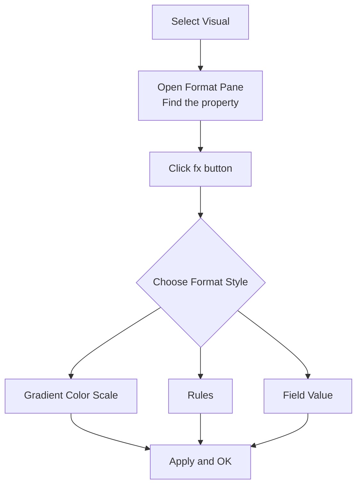
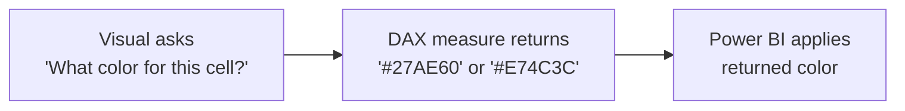
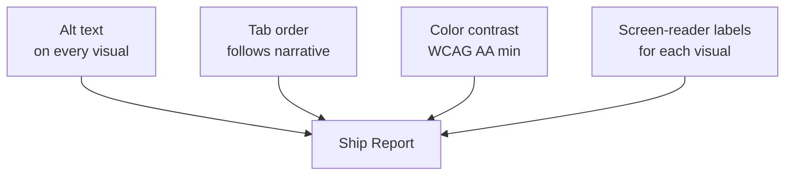
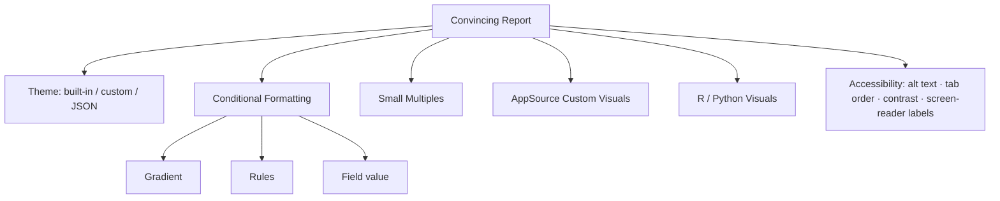

<!--
NANO BANANA PRO — CHAPTER 3 OPENING IMAGE
File: images/ch03/fig-3-1-designers-desk.png
Title: The Designer's Desk

Subject: Camila Reyes — the same young Latina BI analyst from Chapter 1 — at her downtown Miami office desk in early evening.
Action: She is leaning slightly forward, comparing a beautifully themed Power BI dashboard on her monitor with a small fan of Pantone-style color swatch cards laid out beside her keyboard.
Environment: A modern Class A office workspace, glass-walled, with the Miami skyline visible through floor-to-ceiling windows at golden hour; palm tree silhouettes; ocean glow on the horizon. On her desk: a leather notebook open to hand-sketched color swatches and typography samples, a small white espresso cup, the swatch fan, and a wireless keyboard. The monitor displays a clearly branded dashboard — deep navy palette with gold accents, a sorted bar chart, a KPI card, and a clean line chart.
Lighting: Warm golden window light from the right; cool monitor glow on Camila's face; cinematic, shallow depth of field with Camila and the swatch fan in sharp focus, the skyline softly out of focus.
Style: Photo-real with a subtle digital-painting finish; clean, premium, editorial; consistent visual identity with the Chapter 1 and Chapter 2 opening images.
Constraints: No readable text on the dashboard or swatches, no logos, no other people, no AI-generated weirdness on hands; 16:9 aspect ratio.
-->

:::{figure} ../images/ch03/fig-3-1-designers-desk.png
:label: fig-3-1
:alt: Camila Reyes at her Miami office desk in golden-hour light, comparing a branded Power BI dashboard on her monitor with a fan of color swatch cards on her desk; the skyline visible through glass walls.
:width: 100%
:align: center

**Figure 3.1.** *The Designer's Desk.* The work shifts here. The numbers were already right. Now the report has to look like its conclusions matter.
:::

**Chapter 3 of 8** | **Part 2 of 4: Design and Interaction**

---

### Power BI View Compass — Where We Live This Chapter

| View | What You See | What You Do Here | Used In This Chapter |
|------|--------------|------------------|----------------------|
| **Report View** | Canvas with visuals and a Format pane | Apply themes, format visuals, set conditional rules, build small multiples, install custom visuals, configure accessibility | **Primary view (every section)** |
| **Table View** | Rows of data in a grid | Inspect values | Not used |
| **Model View** | Tables connected by relationships | Manage relationships | Not used |
| **DAX Query View** | Code editor for DAX | Test measures | Not used |
| **Power Query Editor** | A separate window with a green ribbon | Clean and transform data | Not used |

> 💜 **Where Am I?** Chapter 3 is a one-room chapter. Every interaction happens inside **Report View** of Power BI Desktop. You will move between the canvas, the Visualizations pane, and the Format pane — but you will not leave Report View at any point.

---

## Opening: The Board Meeting Brief

It was Friday at 4:50 p.m. when Marcus walked back to Camila's desk. The good-Marcus-walk, not the bad one — there was even a small, end-of-week kind of smile in it. He set a printed memo down on her keyboard.

The header read **Quarterly Sales Review — Board Briefing, Thursday 9:30 a.m.**

"That sorted-bar territory report you built me last week," he said. "The board wants to see it on Thursday. I want you in the room presenting it."

Camila's first reaction was pride. Her second reaction was the file itself, sitting open on her second monitor.

The bar chart was correct. The card was correct. The regional ranking was correct. The numbers told the right story.

The chart axes were in Calibri 11pt. The bars were Power BI's default teal. The page background was the kind of off-white that does not exist in any real building. The report's title was an unstyled `Sales Territory Performance` in the top-left corner.

Marcus saw her look at the screen.

"Camila," he said. "The board has fifteen minutes for this. They're going to decide whether the South Florida regional plan gets next quarter's marketing budget based on what they see. *Make it look like the conclusions matter.*"

He walked away. Camila stared at her teal bars.

The numbers were right. The numbers had been right for a week. None of that was the problem now.

### Learning Objectives

By the end of this chapter, you will be able to:

1. **Apply** a built-in Power BI theme to a report and switch between themes without losing your formatting decisions.
2. **Customize** the active theme using the dialog editor, then save the result as a reusable JSON theme file.
3. **Configure** conditional formatting on visuals using all three drivers — gradient color scales, rule-based bands, and field-value mappings.
4. **Build** a small-multiples visual to compare the same metric across categories on one canvas.
5. **Evaluate** a custom visual from AppSource against a short security checklist before installing it in a production report.
6. **Audit** a report for accessibility — alt text on every visual, a tab order that reads in narrative sequence, color contrast ratios that meet WCAG AA, and labels a screen reader can announce.

### Chapter Roadmap

The chapter has eight subchapters. The first half is about look and feel — themes, conditional formatting, small multiples. The second half is about reach — installing third-party visuals carefully, when to bring in R or Python for what Power BI cannot draw natively, and the accessibility work that makes a report usable by every audience. The chapter closes with a case study where Camila walks the report from Marcus's brief through the four hours of Friday-evening design work that makes it board-ready.

---

## 3.1 Functional vs. Convincing — Why Formatting Matters

The temptation, after Chapters 1 and 2, is to think the hard work is over. You asked the Decision Question. You chose the right visual. The numbers are accurate. What more does the report owe its audience?

The answer is presence. The report has to *look* like its conclusions are worth acting on, or else the audience reads it the way they read the weather forecast on a banner ad — eyes pass over, attention does not stop.

Visual design in a report is not decoration. It is a second argument the report makes alongside the data. The colors say *this is a serious analysis from a serious team*. The typography says *every word here was chosen*. The white space says *we know what to put on the page and we know what to leave off*.

Microsoft Learn calls this *report formatting*. In practice, it is the difference between a board reading your numbers and a board acting on them.

> **Story: The Two Versions**
>
> Camila keeps two versions of one of her favorite client reports — same data, same visuals, same dataset. The only difference is formatting. The first version uses Power BI defaults. The second uses an applied theme with conditional formatting on the headline KPI and a custom color palette matched to the client's brand guide.
>
> When she has shown both versions to former classmates, the response is the same. They look at the default version for about three seconds, nod, and look away. They look at the themed version, lean in, ask a question. The data is identical.
>
> ---
> ***Technical Connection:*** Pre-attentive processing from Chapter 1 is at work here too. A clean, contrasting color palette pulls the eye to the values that matter. A confident typography hierarchy tells the audience *which line is the headline*. The visual channels are the same — position, length, color, area — but the formatting decides which channels are amplified and which are quieted.

A South Florida analogy that lands cleanly: a café cubano takes about ninety seconds to make. The espresso is the data. The whipped *espumita* of sugar foam on top is the formatting. Skip the foam and you still have caffeine. Skip the foam and nobody calls it cafecito.

<strong style="color: #1B4F72;">💡 WHY ARE WE DOING THIS?</strong>  
The PL-300 exam treats <em>configure visualizations</em> and <em>design report layouts</em> as testable skills, not aesthetic preferences. Microsoft is making the same argument we are making in this chapter — that report formatting is a measurable, learnable, technical skill. The board will not grade you on your visual design taste. The board will grade you on whether they understood what to do.

---

## 3.2 Themes — Built-In, Customized, and JSON

A **theme** in Power BI is a saved set of formatting decisions that applies to every visual on every page of your report at once. Background colors. Text colors. Default fonts. Data colors used in charts. Sentiment colors used in conditional formatting (positive green, negative red, neutral gray). Title sizes. Border styles.

The cycling analogy is useful here. A theme is the paint scheme of a bicycle. It does not change how the bike rides. It changes who looks at it and decides they want to ride it. AdventureWorks sells the exact same Touring-1000 frame in four paint schemes. The mechanics, gear ratios, and tubing diameters are identical. Sales for the carbon-black-with-gold version run about 40 percent higher than the others, and Marketing has spent ten years trying to figure out why.

Power BI gives you three places to apply themes, from lowest effort to highest control.

### Built-In Themes

The first stop is Microsoft's gallery of built-in themes. Twenty-some-odd presets cover most of what an internal corporate report needs.

<strong style="color: #1E8449;">✅ DO THIS</strong>  
<strong>See it.</strong> The View tab of the ribbon, near the top of the Power BI Desktop window, has a Themes group with a large gallery dropdown. 
<strong>Name it.</strong> That dropdown is the <strong>Themes gallery</strong>. The active theme has a checkmark next to it. 
<strong>Find it.</strong> View tab → Themes group → Themes dropdown. 
<strong>Do it.</strong> Open the dropdown. Hover over each preset to preview it on your canvas in real time. Click <strong>Executive</strong>. Every visual on every page updates. Switch back to <strong>Default</strong> to undo.

The built-in themes are designed to look professional, accessible, and inoffensive. *Executive* is dark and confident. *Storm* is high-contrast for projectors. *Frontier* uses a desaturated palette good for long reports because the eye does not tire reading it. Microsoft tests these against accessibility guidelines, which we will return to in Section 3.7.

### Customizing the Active Theme

The built-in themes get you 70 percent of the way to on-brand. The last 30 percent — your company's exact corporate colors, the specific font your design team has standardized on, a header style that matches your existing reports — comes from customizing the active theme.

<strong style="color: #1E8449;">✅ DO THIS</strong>  
View tab → Themes group → click the small drop arrow on the Themes button → <strong>Customize current theme</strong>.  
A modal dialog opens with tabs for <strong>Name and colors</strong>, <strong>Text</strong>, <strong>Visuals</strong>, <strong>Page</strong>, and <strong>Filter pane</strong>. Set Theme name to <code>AdventureWorks-Board-Navy</code>. In Name and colors, set the first data color to a deep navy hex value (<code>#1B2A47</code>) and the second to a warm gold (<code>#C9A23A</code>). In Text, set the default font family to a clean sans-serif (Segoe UI works on every Windows machine). Click <strong>Apply</strong>.

<strong style="color: #922B21;">🛑 STOP AND CHECK</strong>  
Every chart on the current page should redraw with the new navy/gold palette. The headline text in your titles should switch to Segoe UI. If a visual did not update, click on it once to give it focus, then click off — Power BI sometimes waits for a re-render trigger on locked visuals.

### JSON Theme Files

The third tier is for teams that want their formatting decisions versioned, shared, and applied consistently across many reports. A **JSON theme file** is a text file with a defined schema; you can write it by hand, generate it from an online theme builder, or export it from the Customize dialog.

> **Story: Dr. Iyer's Color Bible**
>
> Dr. Priya Iyer keeps a Git repository on her laptop with one folder per client. Inside each folder is a single file: `theme.json`. When she takes on a new project, she asks the client's marketing or brand team for two things — a hex code for the corporate primary color and the name of the corporate font.
>
> She drops the values into the JSON. She commits the change with a message like *"Set Acme Cycling primary to #2A6F4C, font to Inter."* The file is twenty-five lines long.
>
> She emails the file to her team. Every analyst on the project imports it into every Power BI report they touch. Every chart, on every page, in every report, uses the corporate palette. If the client rebrands — and they do — Dr. Iyer changes the JSON in one place, the team re-imports, and every report updates in an evening.
>
> ---
> ***Technical Connection:*** A JSON theme file is to a Power BI project what a CSS stylesheet is to a website. It centralizes formatting decisions in a single file so they can be versioned, reviewed, and updated independently from the data and the visuals. For the PL-300 exam, you should be able to recognize that a JSON theme is the right answer when a question asks about applying a consistent corporate look across many reports.

To use one, you would: **View tab → Themes group → drop arrow → Browse for themes** → pick your `.json` file → Apply.

---

## 3.3 Conditional Formatting — Three Drivers, One Pattern

Conditional formatting changes how a single value *looks* based on what it *is*. A profit number can be green when positive and red when negative. A customer table row can shade pink when on-hold and white when active. A KPI card can swap its icon from a check mark to a warning triangle when last quarter's revenue fell below target.

The Port of Miami runs on conditional formatting in physical form. Shipping containers carrying refrigerated cargo are painted white. Hazardous materials are placarded orange. Empty repositioning units are stenciled with a single black dot. Standing on the upper deck of a cruise terminal, a port operations manager can read the entire yard's status without opening a spreadsheet. The data and the formatting collapse into one signal.

Power BI conditional formatting offers three **drivers** — three different ways to decide what color or icon to use. They share one pattern: select the visual, find the property in the Format pane, click the **fx** button next to that property, choose a Format style, and configure.

**Figure 3.2.** The conditional formatting workflow. Same first three steps every time. The branching decision is which of the three drivers fits the question being asked.

### Driver 1: Gradient Color Scale

A gradient maps a numeric range smoothly between two or three colors. Use a gradient when the value is naturally continuous and the *amount* matters as much as the threshold — sales amount, gross margin percentage, customer lifetime value.

<strong style="color: #1E8449;">✅ DO THIS</strong>  
Select a Table or Matrix visual showing Sales Amount by Country. In the Format pane → Cell elements → Sales Amount field → toggle <strong>Background color</strong> on → click <strong>fx</strong>. In the dialog, set <strong>Format style</strong> to <strong>Gradient</strong>, <strong>Based on field</strong> to Sales Amount, Minimum to white, Maximum to your theme's navy. Click <strong>OK</strong>.

The result is a heatmap-style table. Countries with the highest sales are deep navy; countries with the lowest are nearly white. The audience can read the ranking by color in a glance.

### Driver 2: Rules

Rules let you write explicit threshold bands. Use rules when the value is interpreted against business thresholds — *under quota*, *at quota*, *exceeding quota*; or *new*, *active*, *churned*.

<strong style="color: #1E8449;">✅ DO THIS</strong>  
Same Table. Format pane → Cell elements → switch to <strong>Font color</strong> → fx. Set Format style to <strong>Rules</strong>. Click <strong>+ New rule</strong> three times to add three bands: 
<strong>If value &lt; 1000000 → red.</strong> 
<strong>If value &gt;= 1000000 and &lt; 5000000 → orange.</strong> 
<strong>If value &gt;= 5000000 → green.</strong> 
Click OK.

The rules driver is the most flexible for business-rule logic but requires you to set the thresholds explicitly. Pre-attentive color processing does the rest: an entire column of green numbers reads as *healthy* before the audience reads a single digit.

### Driver 3: Field Value

The third driver pushes the formatting decision into your data model. Instead of writing rules inside the visual, you write a DAX measure that returns a hex color string, and Power BI applies whatever color that measure produces.

**Figure 3.3.** Field-value conditional formatting moves the logic from the visual into a DAX measure. The visual reads the result back. When business rules change, you edit the measure, and every visual that uses it updates at once.

This is the most powerful pattern and the one Microsoft tests on the PL-300 exam most often. A measure named `Color By Margin` might check the row's gross margin percentage against thresholds you set elsewhere in the model — and every visual that uses it inherits the same logic. Change the measure once, every report updates.

<strong style="color: #7D6608;">⚠️ COMMON MISTAKE</strong>  
Hex color strings in DAX must be enclosed in double quotes and prefixed with the <code>#</code> sign. A measure that returns <code>27AE60</code> without the hash will fail silently — the cell will not change color and Power BI will not surface an error. Always write the return value as <code>"#27AE60"</code>.

<strong style="color: #6C3483;">💜 TAKE A BREATH</strong>  
That was a lot of dialog navigation. Stand up. Look out a window if you can find one. Three things have to stay clear in your head before we move on: <strong>gradients</strong> are for continuous values where the amount matters, <strong>rules</strong> are for threshold bands you write explicitly, and <strong>field values</strong> are for color logic that lives in DAX measures. If those three are landing, you are ready for small multiples.

---

## 3.4 Small Multiples — One Chart Becomes Many

The line chart Camila built for Marcus showed one metric — Sales Amount — over time, summed across every country. It answered *how is the company doing*. It did not answer *which country is dragging the line down*.

A **small multiples** visual is one chart that draws itself once per category and tiles the results into a grid. Same axes. Same colors. Same scale. Different slice of data. The grid lets the eye read across categories in a single sweep.

Lifeguard towers along South Beach are small multiples in physical form. Every tower has the same shape, the same wooden frame, the same flag protocol, the same height. The number painted on the side and the trim color change. Pull back to look at the beach as a whole and you read the entire system at once — Tower 3 closed today, Tower 5 storm flag flying, Tower 12 sunbathers thick. One template, many instances, one story.

<strong style="color: #1E8449;">✅ DO THIS</strong>  
Start with a line chart on a clean page. Drag Date to the X-axis. Drag Sales Amount to the Y-axis. Now drag <strong>Country</strong> from the Data pane into the well labeled <strong>Small multiples</strong> (you may need to scroll the Visualizations pane to find it). The single line chart breaks apart into a 2×3 grid — one mini line chart per country, each with the same axes.

The eye now reads the entire global picture in two seconds: the U.S. is on a tear, Germany flat, Canada in seasonal decline. Marcus does not need to click anything. The story is on the page.

<strong style="color: #7D6608;">⚠️ COMMON MISTAKE</strong>  
Small multiples are not available on every visual type. They work with line charts, area charts, bar/column charts, and a few others — but not pies, donuts, cards, or maps. If you do not see a Small multiples well in the Visualizations pane, the current visual does not support them. Switch to a line or bar chart and the well will appear.

A second rule worth knowing: keep the number of multiples modest. Six to nine is comfortable. More than twelve and the individual panels become too small to read, which defeats the purpose. If your category has thirty values, filter to the top ten before building the multiples.

---

## 3.5 Custom Visuals From AppSource — Power and Risk

Power BI ships with thirty-some-odd visual types, which covers most reporting needs. The thirty-first situation — the one where you need a Sankey diagram, or a network graph, or a calendar heatmap — is what **AppSource custom visuals** are for. AppSource is Microsoft's marketplace for third-party Power BI components, free and paid.

<strong style="color: #1E8449;">✅ DO THIS</strong>  
Home tab → Insert group → click <strong>More visuals</strong> → <strong>From AppSource</strong>. A gallery opens inside Power BI Desktop with hundreds of visuals. Use the search box to find one — try <em>Calendar Heatmap</em>. Click <strong>Add</strong>. The visual installs into the active report and appears at the bottom of the Visualizations pane with a small icon.

The catch is that an installed custom visual is third-party code running inside your report. That has consequences.

> **Story: Jamal's Cautionary Tale**
>
> Jamal Foster works in the AdventureWorks BI Center of Excellence — the central governance team for all internal Power BI work. He stopped by Camila's desk a week before the board meeting to tell her about a peer's incident.
>
> A junior analyst on the Marketing side had installed a custom visual called *Premium Funnel Pro* to build a sales-funnel diagram. The visual rendered beautifully. It also, the BI Center discovered three weeks later, made silent outbound HTTPS calls to an unfamiliar domain every time the report rendered. The visual was reading the data the funnel was bound to and shipping it elsewhere.
>
> The analyst had not done anything wrong on her end. She had found the visual on AppSource, seen four stars and forty reviews, and installed it.
>
> Jamal walked Camila through the AdventureWorks rule. Before installing any AppSource visual on a report that touches confidential data, the analyst checks three things: the visual is **Microsoft Certified** (badge on the AppSource listing), the publisher is a real company with a working website, and the visual is not flagged as needing internet access for rendering.
>
> ---
> ***Technical Connection:*** Custom visuals are essentially JavaScript bundles running inside the Power BI sandbox. They can render, they can compute, and unless flagged otherwise they can call out to the public internet. The Microsoft Certified program audits visuals against a security checklist. Uncertified does not always mean unsafe, but certified is the floor for a production report. For the PL-300 exam: the certification status of a custom visual is the field to check before installing.

<strong style="color: #922B21;">🛑 STOP AND CHECK</strong>  
On the AppSource listing for any visual you are considering, look in the visual's detail page for a small <strong>Microsoft Certified</strong> badge near the publisher name. If it is missing, that visual is not certified — review the security details carefully, or look for a certified alternative that does the same job.

A second checkpoint your governance team will care about: many organizations turn off "Add and use uncertified custom visuals" in the Power BI Service tenant settings. If you build a report against an uncertified visual locally and then publish, the visual may render as a gray box for every user — because the Service refuses to load it. Verify what your tenant allows before you spend an afternoon designing around something that will break on publish.

---

## 3.6 R and Python Visuals — When You Need What Power BI Cannot Draw

A small but useful set of visualization needs lives beyond what Power BI's native and AppSource visuals can do. Statistical residual plots. Word clouds with custom stopword lists. Phylogenetic trees. Anything from the open-source statistics or data-science worlds that does not have a Power BI equivalent. For these cases, Power BI supports **R script visuals** and **Python visuals** — visualizations whose code you write in R or Python and whose output Power BI renders as an image.

The trade-offs are sharp. R and Python visuals do not interact with the rest of the report (no cross-filter, no drill-through). They re-execute every time their bound data changes, which can be slow. They require the matching language runtime installed on your machine (R for R visuals, Python for Python visuals), which means publishing also requires the Power BI Service to support that runtime in your tenant.

For the PL-300 exam, you do not need to write R or Python code. You need to recognize: *when the question shows a use case that requires a specialized statistical plot or a third-party scientific library, the right answer is an R or Python visual.*

<strong style="color: #1B4F72;">💡 WHY ARE WE DOING THIS?</strong>  
Most Power BI work — and most of the PL-300 exam — sits inside the built-in visual toolkit and AppSource. R and Python visuals are the escape hatch. Knowing they exist, and knowing when to reach for them, is the test.

To enable: **File → Options and settings → Options → R scripting** (or Python scripting). Power BI auto-detects installed runtimes; if it does not, you can point it at an installed path. From there, the R script visual icon appears in the Visualizations pane alongside the built-in visuals.

---

## 3.7 Accessibility — Reports That Work for Everyone

Accessibility is the area of formatting where the requirement is not aesthetic but legal, ethical, and — increasingly — contractual. A report that cannot be read by a colleague using a screen reader, or by a board member with red-green color vision deficiency, or by a stakeholder in a glare-bright conference room with a low-end projector, is a report failing a portion of its audience.

The South Florida building code requires every commercial building to have hurricane shutters or impact-rated glass, ADA-compliant ramps, and bilingual emergency signage. None of these are optional. They protect the people who need them most without inconveniencing anyone else. Accessibility in Power BI works on the same principle.

There are four checks worth running on every report before it ships.

**Figure 3.4.** Four accessibility checks. Each one closes a specific gap in audience reach. A report that passes all four is meaningfully usable by a meaningfully wider audience.

### Alt Text

Every visual on the canvas needs **alt text** — a one-sentence description of what the visual shows. Screen readers announce the alt text to vision-impaired users in place of the chart.

<strong style="color: #1E8449;">✅ DO THIS</strong>  
Select a visual. Format pane → General → <strong>Alt text</strong>. Type a sentence: <code>Sales by country, sorted descending — United States highest at \$7.2M, Australia lowest at \$0.4M.</code> Save the report.

Alt text should describe what the chart says, not what kind of chart it is. *"Bar chart"* is not useful. *"Sales by country, US leading at \$7.2M"* tells the listener what someone reading the visual would learn.

### Tab Order

Press the Tab key while a report page is in focus, and Power BI walks through the visuals one by one for keyboard navigation. The order Power BI uses by default is the order in which the visuals were created — which is rarely the order in which they should be read.

<strong style="color: #1E8449;">✅ DO THIS</strong>  
View tab → Show pane group → <strong>Selection</strong>. The Selection pane opens on the right. Click <strong>Tab order</strong> at the top of the pane. Drag the visual entries into the order a keyboard user should encounter them — typically title visual first, then KPI cards, then primary chart, then supporting visuals.

### Color Contrast

The Web Content Accessibility Guidelines (WCAG) set minimum contrast ratios for text against background. AA — the working floor for most corporate reports — requires 4.5:1 for body text and 3:1 for large text. Built-in themes hit these by design. Custom themes do not automatically.

A free WCAG contrast checker (search the web for one) will let you paste your foreground and background hex codes and see the ratio in a moment. If the navy/gold pairing from Section 3.2 falls below 4.5:1 against a white background, the gold needs to deepen until it does.

### Screen-Reader Labels

Each visual has a **Title** property in the Format pane. The title is announced by screen readers as the visual is encountered. A blank title means the screen reader announces *"chart"*, which tells the listener nothing. A descriptive title — *"Sales by Country, Sorted Descending"* — tells the listener what they are about to hear data about.

<strong style="color: #6C3483;">💜 TAKE A BREATH</strong>  
You have a lot of rules now — theme application, three conditional drivers, small multiples, AppSource certification, four accessibility checks. Do not try to keep all of them in your head while you build. Build the report, get the data right, then walk the checklist at the end. The checklist exists so you do not have to remember.

---

## 3.8 Case Study — Camila's Board-Ready Friday

It was 5:10 p.m. when Camila reopened the territory report. The board meeting was Thursday. She gave herself the rest of Friday evening and Saturday morning to bring it from functional to convincing.

Friday 5:15 — She started with the theme. **View tab → Themes → Customize current theme.** She set the first data color to AdventureWorks navy and the second to the corporate gold. She set the default font to Segoe UI Semibold for titles and Segoe UI for body. She named the theme `AW-Board-Q3-2026` and saved it as JSON to her Documents folder — she would commit it to the team's repository in the morning.

Friday 6:30 — She rebuilt the headline KPI card. The card now read *Total Sales: \$32.4M*, the number rendered in navy at a font size large enough to be the visual anchor of the page. She added conditional formatting on the card's background using a **Rules** driver: under \$30M red, \$30M to \$33M neutral, above \$33M green. The card showed neutral. Truth on the page, not a marketing color.

Friday 7:00 — Marcus's sorted territory bar chart got a **gradient** background scale on the bar values. The bar for the South Florida region — the territory the board would be deciding about — pulled deepest navy automatically because its value was highest. Pre-attentive processing did the rest.

Friday 7:45 — She added a small-multiples line chart on a second page, showing Sales Amount by month broken out by country. Six small panels in a 2×3 grid. The U.S. story (steady climb), Australia (collapse mid-year), Germany (flat) were all visible without a single click.

Friday 8:30 — Accessibility pass. Alt text on every visual. Tab order: title → KPI → sorted bar → small multiples → footer. Color contrast checked against WCAG AA — the gold-on-navy headline cleared 7.1:1, comfortably above the 4.5:1 floor. She added a screen-reader title to each visual.

Friday 9:15 — She saved the file as `Ch03_BoardReady.pbix` and went home.

On Tuesday she did one more pass with Dr. Iyer over a video call. On Thursday morning the board approved next quarter's marketing budget for South Florida.

The numbers had been right for almost two weeks. The report had become a convincing argument on Friday night.

---

## Chapter Closing

### Key Takeaways

- Formatting is a second argument the report makes alongside the data. A board reading numbers and a board acting on numbers are two different outcomes; formatting is what moves you from the first to the second.
- A **theme** applies a saved set of formatting decisions to every visual on every page at once. Built-in themes get you 70 percent of the way to on-brand; the Customize dialog gets you the rest; a JSON theme file lets you version and share that decision across reports.
- Conditional formatting has three drivers. **Gradient** for continuous values where the amount matters. **Rules** for explicit business-rule bands. **Field value** for color logic that lives in a DAX measure and propagates across visuals.
- **Small multiples** tile one chart into a grid of mini-charts — same axes, same colors, one per category. They let the eye read an entire system in a single sweep.
- **AppSource custom visuals** extend Power BI's built-in toolkit but are third-party code running inside your report. Always verify Microsoft Certified status before installing to production, and confirm your Service tenant permits uncertified visuals if you are tempted by one.
- **R and Python visuals** are an escape hatch for specialized scientific plots that have no native or AppSource equivalent. They do not cross-filter and require runtime configuration.
- **Accessibility** is four checks: alt text on every visual, a sensible tab order, WCAG AA color contrast, and screen-reader titles. Every report should pass all four before it ships.

### Concept Map

**Figure 3.5.** Chapter 3 in one picture. A convincing report is the goal; the six tracks below it are the levers you pull to get there.

### Vocabulary Review

- **Theme** — A saved set of formatting decisions (colors, fonts, defaults) applied to every visual on every page of a report.
- **JSON theme file** — A text file in a defined schema that stores a Power BI theme; it can be versioned in source control and shared across reports.
- **Conditional formatting** — Visual formatting whose value is determined by the underlying data, applied through one of three drivers.
- **Gradient (driver)** — A conditional formatting driver that maps a numeric range smoothly between two or three colors.
- **Rules (driver)** — A conditional formatting driver that uses explicit threshold bands defined inside the visual's Format pane.
- **Field value (driver)** — A conditional formatting driver that reads color from a DAX measure returning a hex color string.
- **Small multiples** — A visual configuration that tiles one chart into a grid of mini-charts, one per category, sharing axes and palette.
- **AppSource** — Microsoft's marketplace for third-party Power BI custom visuals, including both free and paid options.
- **Microsoft Certified visual** — An AppSource visual that has passed Microsoft's security and compatibility audit, marked with a badge on its listing.
- **R script visual / Python visual** — A Power BI visual whose chart is produced by R or Python code, used for plots not available natively or on AppSource.
- **WCAG AA** — A working accessibility standard requiring at least 4.5:1 contrast for body text and 3:1 for large text.
- **Alt text** — A one-sentence description of a visual, announced by screen readers in place of the chart itself.

### Bridge to Chapter 4

You can now make a report look convincing. The next step is making it *interactive*. A polished but static report tells the audience one story. A polished and interactive report lets the audience ask their own follow-up questions while they are looking at it — *which products drove that quarter, what does this look like in Australia only, why did revenue drop in week 27*. Chapter 4 covers the filter hierarchy, slicers, bookmarks, navigation buttons, tooltips, drill-through, and editing interactions — the toolkit for turning a report into a conversation.

### Self-Check Questions

1. A team wants every report they produce to use their corporate color palette and font. Multiple analysts on the team build reports independently. Which Power BI feature is the right tool for this requirement? (a) Conditional formatting; (b) A built-in theme; (c) A JSON theme file shared by the team; (d) Small multiples. *(Answer: c — a JSON theme file is the only one that can be versioned and shared across reports.)*

2. A KPI card should turn red when the value is below 30M, neutral between 30M and 33M, and green above 33M. Which conditional formatting driver is the right fit? (a) Gradient; (b) Rules; (c) Field value; (d) Theme. *(Answer: b — Rules let you define explicit threshold bands.)*

3. *True or False:* Small multiples can be added to a pie chart by dragging a field to the Small multiples well. *(Answer: False. Small multiples are only available on chart types that support them — line, area, bar, column, and a few others. Pies do not.)*

4. Before installing an AppSource custom visual on a report that will be published to a tenant containing customer financial data, what should the analyst verify first? (a) The visual has at least four stars; (b) The visual is Microsoft Certified; (c) The visual is free; (d) The visual has more than forty reviews. *(Answer: b — the Microsoft Certified badge indicates the visual has passed Microsoft's security audit; star ratings and review counts do not.)*

5. A vision-impaired board member will receive this report and review it with a screen reader. Which of the following is *not* a required accessibility check? (a) Alt text on every visual; (b) Tab order matches the narrative; (c) The report's color palette uses every color from the corporate brand guide; (d) Color contrast meets WCAG AA. *(Answer: c — using every corporate color is a brand-guide concern, not an accessibility requirement.)*

### Reflection Prompt

Find a report — your own, or one you have seen at work or in school — and walk it through the four accessibility checks from Section 3.7. Does every visual have alt text? Does the tab order match the narrative? Does the contrast pass WCAG AA? Are the visual titles descriptive enough that a screen reader would tell the listener what the chart is about? Write a short paragraph for each check. Which one was the easiest to verify? Which one was the most uncomfortable to confront?

---

*End of Chapter 3.*
