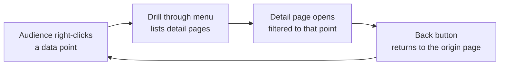
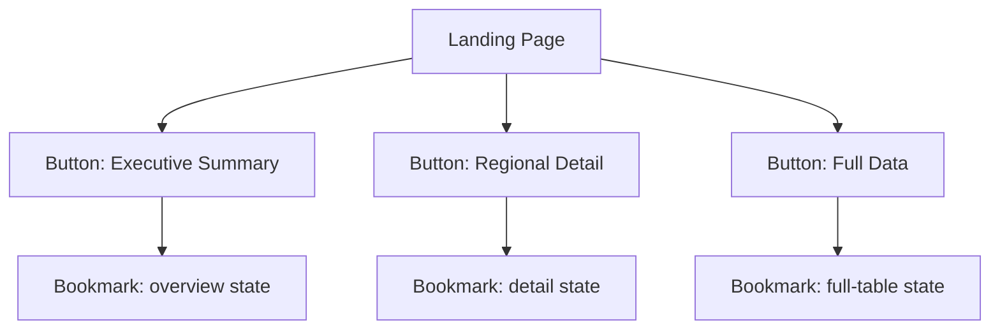
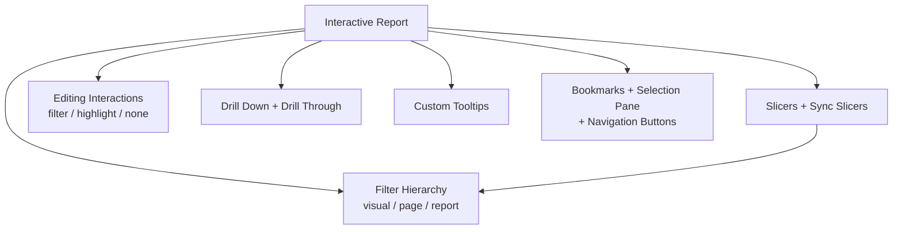

<!--
NANO BANANA PRO — CHAPTER 4 OPENING INFOGRAPHIC
File: images/ch04/fig-4-1-ch4-at-a-glance.png
Title: Interactive Storytelling (Chapter 4 Overview)
Concept: A master infographic of the chapter — the six controls that turn a static report into a conversation.
Archetype: Master infographic — a hub-and-spoke with a central report and six richly illustrated control spokes, in the ai4educators.net chapter-overview style, retinted to the book's navy/gold brand.
Reference (composition/density): ../../.ref-ai4ed/ai4ed-ch06-opener.png
Reference (palette/finish): images/_style-reference/fig-3-2-two-reactions.png
Labels: kicker CHAPTER 4 OVERVIEW; title INTERACTIVE STORYTELLING; spokes FILTER HIERARCHY, SLICERS, EDITING INTERACTIONS, DRILL-THROUGH, CUSTOM TOOLTIPS, BOOKMARKS AND NAVIGATION; banner "FROM STATIC TO CONVERSATION".
Palette: navy #1B2A47, gold #C9A23A, white / pale-blue background.
-->

:::{figure} ../images/ch04/fig-4-1-ch4-at-a-glance.png
:label: fig-4-1
:alt: A master infographic titled "Interactive Storytelling." A central report screen connects by six spokes to illustrated controls: filter hierarchy, slicers, editing interactions, drill-through, custom tooltips, and bookmarks and navigation. A banner reads "from static to conversation."
:width: 100%
:align: center

**Figure 4.1.** *Interactive Storytelling — Chapter 4 Overview.* The six controls that turn a static report into a conversation.
:::

**Chapter 4 of 8** | **Part 2 of 4: Design and Interaction**

---

### Power BI View Compass — Where We Live This Chapter

| View | What You See | What You Do Here | Used In This Chapter |
|------|--------------|------------------|----------------------|
| **Report View** | Canvas with visuals, the Visualizations pane, and the Filter pane | Build slicers, set filters, configure interactions, wire drill-through, tooltips, bookmarks, and navigation buttons | **Primary view (every section)** |
| **Table View** | Rows of data in a grid | Inspect values | Not used |
| **Model View** | Tables connected by relationships | Manage relationships | Not used |
| **DAX Query View** | Code editor for DAX | Test measures | Not used |
| **Power Query Editor** | A separate window with a green ribbon | Clean and transform data | Not used |

> 💜 **Where Am I?** Chapter 4, like Chapter 3, is a one-room chapter. Every interaction happens inside **Report View** of Power BI Desktop. You will spend more time than usual in the Filter pane on the right and the Bookmarks and Selection panes — but you will not leave Report View at any point.

---

## Opening: The Question Camila Could Not Answer

The territory report was the best thing Camila had built. The board had approved the South Florida marketing budget on the strength of it. Marcus had walked out of that Thursday meeting and shaken her hand.

So when he asked her to present it again — this time to his eight regional sales managers, in the Monday operations review — she was not nervous. She knew the report cold.

She got about four minutes in.

A manager from the Orlando territory leaned toward the screen. "That sales number," she said. "Is that everything? Or only the bikes?"

It was everything — bikes, components, clothing, accessories, all four product categories summed together. Camila said so.

"Could we see only the bikes?"

Camila looked at the report. The report showed all four categories. There was no control on it that would let her pull the other three out. "I can send an updated version this afternoon," she said.

Two minutes later, the Phoenix manager: "What about third quarter on its own? The full-year number is hiding our summer."

"I will add that too," Camila said, and wrote it down.

By the time the meeting ended she had a list. Bikes only. Q3 only. Reseller channel only. Each one was a different version of the same report, and she would spend her afternoon building all of them.

Marcus caught her at the door. He was not annoyed — he had seen something.

"Camila. I do not want five versions of this by five o'clock. I want one report. One. Where they can ask those questions themselves, while we are all sitting there looking at it. The report should answer them. Not you." He paused. "Can you build that?"

She could. That is this entire chapter.

### Learning Objectives

By the end of this chapter, you will be able to:

1. **Place** a filter at the correct layer of the three-layer hierarchy — visual, page, or report — for the scope a question needs.
2. **Build** slicers, including a sync slicer shared across pages, and choose between single-select and multi-select behavior.
3. **Configure** editing interactions between visuals — filter, highlight, or none — so a click produces the response the audience expects.
4. **Set up** drill-down inside a visual, drill-through to a dedicated detail page, and a custom tooltip that reveals detail on hover.
5. **Assemble** bookmarks, the Selection pane, and navigation buttons into a self-service report "app."

### Chapter Roadmap

The chapter has seven subchapters. The first two build the controls — the filter hierarchy that decides scope, and slicers, the filters the audience can touch. The middle three are about what a click does — editing interactions, drill-down and drill-through, and custom tooltips. The last builds the package: bookmarks, the Selection pane, and navigation buttons that turn a report into a small app. The chapter closes with a case study where Camila rebuilds the territory report as the one self-service report Marcus asked for at the door.

---

## 4.1 From Static to Interactive — Why a Report Answers Back

Up to this point, every report you have built has done one job well: it has presented a finished answer. You asked the Decision Question from Chapter 1, chose the right visual from Chapter 2, formatted it to look convincing in Chapter 3 — and then handed the audience a conclusion.

A finished conclusion is a fine thing. It is also a frozen thing. It answers exactly one question, the question you decided to ask when you built it. The audience always arrives with more.

That is not a flaw in your audience. It is how people read data. Marcus's managers saw a number and immediately wanted to know what was inside it — *which categories, which quarter, which channel*. A static report cannot take that question. So the question travels to the next available human, which is you, and you become the report's filter pane, running queries by hand at five o'clock.

An **interactive report** moves those controls onto the page. The audience filters, drills, and explores inside the report itself — in the meeting, in real time. You build the possibilities once; the audience walks the paths.

Think of the difference between a printed restaurant menu and a good server. The menu is complete, and it is silent. Ask it whether the rice can be swapped for black beans and it has nothing to say. The server carries the same information but answers the question you actually have. A static report is the menu. An interactive report is the server.

<strong style="color: #1B4F72;">💡 WHY ARE WE DOING THIS?</strong>  
The PL-300 exam groups this chapter's skills under <em>enhance reports for usability and storytelling</em>. Microsoft treats interactivity as a core analyst competency, not an advanced extra — configuring filters, slicers, interactions, drill-through, and navigation are all explicitly testable. A report the audience can question is the professional standard the exam measures you against.

---

## 4.2 The Three-Layer Filter Hierarchy

Every Power BI report already filters — every time a field lands on a chart's axis, Power BI groups and filters the fact table behind the scenes. This section is about the controls that filter *on purpose*, and the first thing to understand is that a filter has a **scope**: how much of the report it reaches.

Power BI gives you three scopes, and they live together in one place — the **Filter pane** (older Power BI tutorials call it the *Filters pane*). It sits on the right side of Report View, and it has three labelled sections, from narrowest reach to widest:

- **Filters on this visual** — affects one selected visual and nothing else.
- **Filters on this page** — affects every visual on the current page.
- **Filters on all pages** — affects every visual on every page. This is the **report filter**.

<!--
NANO BANANA PRO — CHAPTER 4 FIGURE 2 (concept infographic)
File: images/ch04/fig-4-2-filter-hierarchy.png
Title: The Filter Hierarchy
Concept: The three scopes a filter can have — visual, page, report — drawn as a pyramid of widening reach.
Archetype: Rich three-tier pyramid — each tier illustrated with what it affects, plus a side SCOPE WIDENS arrow; ai4educators master-infographic style, navy/gold.
Reference (composition): ../../.ref-ai4ed/ai4ed-ch01-fig-bloom.png
Reference (palette): images/ch04/fig-4-1-ch4-at-a-glance.png
Labels: tiers VISUAL FILTER / AFFECTS ONE VISUAL, PAGE FILTER / AFFECTS EVERY VISUAL ON ONE PAGE, REPORT FILTER / AFFECTS EVERY PAGE; side arrow SCOPE WIDENS; banner "PICK THE NARROWEST SCOPE THAT WORKS".
Palette: navy #1B2A47, gold #C9A23A, white / pale-blue background.
-->

:::{figure} ../images/ch04/fig-4-2-filter-hierarchy.png
:label: fig-4-2
:alt: A three-tier pyramid infographic titled "The Filter Hierarchy." The narrow top tier is "visual filter — affects one visual," the middle tier is "page filter — affects every visual on one page," and the wide bottom tier is "report filter — affects every page." A side arrow reads "scope widens."
:width: 100%
:align: center

**Figure 4.2.** *The Filter Hierarchy.* Three layers, three scopes of effect — the wider the layer, the more of the report a filter reaches.
:::

A South Florida analogy that holds up well: the keys to an office building. The room key opens one office — that is the visual filter. The floor key opens every office on one floor — the page filter. The master key opens every room in the building — the report filter. A facilities manager does not hand out master keys for a job that needs a room key. Scope is a decision, and choosing too wide a scope is the most common filtering mistake there is.

<strong style="color: #1E8449;">✅ DO THIS</strong>  
<strong>See it.</strong> The Filter pane is the vertical panel on the right of Report View, between the canvas and the Visualizations pane. It carries three grey section headers. 
<strong>Name it.</strong> The bottom section is <strong>Filters on all pages</strong>. A field dropped here becomes a report filter. 
<strong>Find it.</strong> If the pane is closed: View tab → Show panes group → Filters. Then locate the <em>Filters on all pages</em> section. 
<strong>Do it.</strong> From the Data pane, drag <code>Date.Year</code> into <em>Filters on all pages</em>. Set it to the most recent year. Every page of the report now shows that year only — and you did not touch a single visual.

Inside any of the three sections, a filter offers more than a checklist. **Basic filtering** is the checklist. **Advanced filtering** lets you write a condition — *Sales Amount is greater than 500000*. **Top N** keeps only the highest or lowest few — *the top 10 resellers by Sales Amount*. The filter *type* you pick does not change the *scope*; a Top N filter in *Filters on this visual* still reaches one visual only.

<strong style="color: #7D6608;">⚠️ COMMON MISTAKE</strong>  
A filter placed at the wrong scope is silent — Power BI will not warn you. An analyst who means to filter one chart to <em>Bikes only</em> but drops the field into <em>Filters on all pages</em> quietly strips every other category out of every visual on every page. When a number looks wrong across a whole report, check the report filter first.

### Sorting — The Order the Eye Reads

Filtering decides *which* rows a visual shows. **Sorting** decides the *order* it shows them in, and order is not cosmetic. Chapter 1's pre-attentive processing means the audience reads the first bar as the most important one before they read any labels at all.

Every visual carries its own sort. Hover a visual, open its **More options** menu — the three dots in the visual header — and choose **Sort axis**. You can sort by any field in the visual, and, usefully, by a field the visual is *not* displaying: a bar chart of Country can sort itself by Sales Amount even when Sales Amount is not the bar label, so the longest bar lands on top.

The rule of thumb: sort by the measure that answers the question. A *who is winning* chart sorts by value, descending. A *how did the year go* chart sorts by date. Leaving a chart in alphabetical order by accident — Australia, Canada, France — buries the story under the alphabet.

---

## 4.3 Slicers — The Filter the Audience Can Touch

The Filter pane is powerful, and it is mostly yours. You, the analyst, set those filters while building the report. Your audience *can* open the Filter pane, but most of them never will — it reads as a developer tool, and it is one.

A **slicer** is a filter that has been promoted to a visual. It sits on the canvas, in plain sight, styled like everything else, and it invites the audience to operate it. A slicer is how Marcus's managers will pull *bikes only* out of the report without calling you.

You add a slicer the same way you add any visual.

<strong style="color: #1E8449;">✅ DO THIS</strong>  
<strong>See it.</strong> The Visualizations pane holds a grid of visual-type icons. One looks like a small funnel. 
<strong>Name it.</strong> That is the <strong>Slicer</strong> visual. 
<strong>Find it.</strong> With no visual selected, click the Slicer icon in the Visualizations pane. 
<strong>Do it.</strong> A blank slicer appears on the canvas. From the Data pane, drag <code>Product.Category</code> into its Field well. The slicer fills with four items — Accessories, Bikes, Clothing, Components. Click <em>Bikes</em>. Every other visual on the page redraws to Bikes only.

<strong style="color: #922B21;">🛑 STOP AND CHECK</strong>  
After you click <em>Bikes</em> in the slicer, every other visual on the page should redraw, and the slicer item <em>Bikes</em> should show a filled, selected state. If nothing changed, confirm the slicer actually has a field in its Field well — an empty slicer is drawn on the canvas but filters nothing.

A slicer changes shape to fit its field. A text field like Category renders as a **list** by default; the slicer header has a control that switches it to a compact **dropdown**. A numeric field offers a **between** slider. A date field offers a **relative date** option — *the last 3 months* — recalculated every time the report opens.

### Single Select or Multi-Select

By default, a list slicer is multi-select with a modifier: the audience clicks one item, then Ctrl-clicks to add more. That is flexible, and it is also a quiet source of confusion — an audience member who selected three categories and forgot is reading a filtered number they believe is the total.

The **Selection** settings, in the slicer's Format pane, give you two deliberate choices. *Single select* forces exactly one item at a time, like the station presets on a car radio — push one button, the last one pops out. *Show "Select all"* adds an explicit all-items option, so the audience can return to the full picture without guessing. For a slicer that drives a headline number, single select plus a clear default is the calmer design.

> **Story: The Slicer That Lied**
>
> Camila built Marcus a three-page report — one page for sales, one for resellers, one for channel mix. Each page had its own Year slicer in the top corner. She was proud of how consistent the three pages looked.
>
> Marcus opened it, set the Year slicer on page one to 2022, and studied the sales page. Then he clicked through to page two. The reseller numbers were enormous — far bigger than the sales page had led him to expect. He clicked to page three. Same problem. He came back to Camila convinced the reseller data was double-counted.
>
> It was not double-counted. Page one was showing 2022. Pages two and three were showing every year at once, because each page had its *own* separate Year slicer, and Marcus had set only the one on page one. Three slicers that looked identical were filtering three different things.
>
> ---
> ***Technical Connection:*** A slicer filters its own page only, unless you tell it otherwise. **Sync slicers** lets one slicer control several pages at once. Open the pane from View tab → Show panes group → Sync slicers. It shows a row per page with two checkboxes: *sync* (this page obeys the slicer) and *visible* (the slicer is drawn on this page). Camila ticked *sync* for all three pages and *visible* for the two with room to spare. One Year selection now followed Marcus everywhere. For the PL-300 exam, hold the pair together: a slicer is page-scoped by default, and sync slicers is the feature that widens it.

---

## 4.4 Editing Interactions — How Visuals Talk to Each Other

Slicers are not the only thing on the page the audience can click. Every regular visual is also clickable. Click a bar in a bar chart and, by default, the *other* visuals on the page respond to that click. This cross-visual behavior is on automatically — and you can control it, visual by visual, with **editing interactions**.

When a click in visual A changes visual B, B is doing one of three things. Power BI calls them **Filter**, **Highlight**, and **None**.

<!--
NANO BANANA PRO — CHAPTER 4 FIGURE 3 (concept infographic)
File: images/ch04/fig-4-3-editing-interactions.png
Title: Editing Interactions
Concept: The three things a clicked visual can do to a neighbouring visual — filter, highlight, or none.
Archetype: Rich row diagram — three panels, each a clicked source chart and the neighbour's response with a verdict pill; ai4educators master-infographic style, navy/gold.
Reference (composition): ../../.ref-ai4ed/ai4ed-ch01-fig-struggle.png
Reference (palette): images/ch04/fig-4-1-ch4-at-a-glance.png
Labels: rows FILTER / OTHERS REFILTER, HIGHLIGHT / OTHERS DIM, NONE / OTHERS IGNORE; banner "ONE CLICK, THREE BEHAVIORS".
Palette: navy #1B2A47, gold #C9A23A, white / pale-blue background.
-->

:::{figure} ../images/ch04/fig-4-3-editing-interactions.png
:label: fig-4-3
:alt: A three-row infographic titled "Editing Interactions." The Filter row shows a neighbouring bar chart shrunk to the selected slice, verdict "others refilter." The Highlight row shows a chart keeping all bars with unselected bars dimmed, verdict "others dim." The None row shows an unchanged chart, verdict "others ignore." A footer reads "one click, three behaviors."
:width: 100%
:align: center

**Figure 4.3.** *Editing Interactions.* One click in one visual, three possible responses from its neighbours — and you choose which.
:::

**Filter** refilters the receiving visual down to only the clicked selection — click *Bikes* in a category chart and a neighbouring trend line redraws as the Bikes trend alone. **Highlight** keeps the receiving visual whole but dims everything that does not match, leaving the matching part bright — the audience sees the selected slice *and* the context it sits inside. **None** means the receiving visual ignores the click entirely.

The bicycle workshop has a version of this. Tighten one spoke on a wheel and the whole wheel changes shape a little — those parts interact. Tighten the bolt holding the seat post and the wheel does not care — no interaction. On a report page, you decide, for each pair of visuals, whether they are spokes or seat bolts.

<strong style="color: #1E8449;">✅ DO THIS</strong>  
<strong>See it.</strong> Select any visual. A contextual <strong>Format</strong> tab appears on the ribbon while a visual is selected. 
<strong>Name it.</strong> On that Format tab, in the Interactions group, is the <strong>Edit interactions</strong> button. 
<strong>Find it.</strong> Select your category bar chart → Format tab → Edit interactions. 
<strong>Do it.</strong> Small icons now sit on the top corner of every <em>other</em> visual — a filter icon, a highlight icon, and a None icon. Click the one you want for each receiving visual. Click <em>Edit interactions</em> again to leave editing mode.

Most chart-to-chart pairs are fine left on their default. The visuals worth a deliberate decision are the ones that should *not* move. A KPI card showing the company-wide total is on the page precisely to be the fixed reference point — if it refilters every time someone clicks a bar, it stops being a total. Set those to **None**.

<strong style="color: #7D6608;">⚠️ COMMON MISTAKE</strong>  
Highlight is not offered by every visual. A card has nothing to dim, so it shows only Filter and None. If you expect three interaction icons on a receiving visual and see two, the visual type does not support highlighting — that is the visual, not a bug.

<strong style="color: #6C3483;">💜 TAKE A BREATH</strong>  
That was the densest stretch of the chapter — three filter scopes, slicers, sync slicers, three interaction modes, and all of them <em>filter</em> something. Step back from the screen for a moment. Here is the one sentence that organizes it: a filter is anything that decides which data a visual shows, and the only real questions are <em>who controls it</em> — you, or the audience — and <em>how far it reaches</em>. When that lands, the rest of the chapter gets lighter.

---

## 4.5 Drill Down and Drill Through — Going Deeper

Two features in this chapter have similar names and do genuinely different things, and almost everyone mixes them up the first time. Working analysts mix them up. Let us separate them cleanly once, and they will stay separated.

**Drill down** moves through a hierarchy *inside one visual*. **Drill through** jumps *to a different page* built to show detail. Same page versus new page — that is the whole line.

### Drill Down

A **hierarchy** is a field with built-in levels. Sales Territory has a Group level, then Country inside it, then Region inside that. Put a hierarchy on a visual's axis and the visual can **drill down** — show the top level, then expand a chosen branch one level deeper, without ever leaving the visual or the page.

Picture the map app on your phone. You start zoomed out on the whole state of Florida. You pinch in on Miami-Dade County. You pinch again onto a single street. It is one map the entire time — you are changing depth, not changing maps. That is drill down.

<strong style="color: #1E8449;">✅ DO THIS</strong>  
<strong>See it.</strong> A visual with a hierarchy on its axis shows a small set of arrow icons in its top corner. 
<strong>Name it.</strong> The downward split-arrow turns on <strong>drill mode</strong>; the single down-arrow steps the whole visual down a level; the fork icon expands one level while keeping the parent. 
<strong>Find it.</strong> Build a column chart with the Sales Territory hierarchy on the X-axis and Sales Amount on the Y-axis. 
<strong>Do it.</strong> Click the drill-mode arrow to turn it on, then click the <em>Europe</em> column. The chart redraws to show the countries inside Europe. Click the <em>drill up</em> arrow to climb back.

### Drill Through

Drill through is the other motion. Instead of going deeper inside the visual, the audience right-clicks a data point and is carried to a *separate page* you have prepared — a detail page that automatically filters itself to whatever was right-clicked.

This is the player-statistics move. You are looking at a league table, you see a name you care about, you click it, and a whole page opens that is about that one player. The league table itself did not change. A new page, scoped to your selection, came forward.

**Diagram 4.1.** The drill-through round trip. A right-click carries the audience to a pre-built detail page filtered to their selection; the auto-added Back button returns them to where they started.

<strong style="color: #1E8449;">✅ DO THIS</strong>  
<strong>See it.</strong> When no visual is selected, the Visualizations pane shows a set of field wells for the page itself. 
<strong>Name it.</strong> One of them is the <strong>Drill through</strong> well. 
<strong>Find it.</strong> Add a new page named <em>Territory Detail</em>. Build it with the detail visuals you want — a product-mix chart, a channel split, a top-resellers table. With no visual selected, locate the <em>Drill through</em> well. 
<strong>Do it.</strong> Drag <code>Sales Territory.Country</code> into the Drill through well. Power BI adds a <strong>Back</strong> button to the page corner automatically. Now go to any other page, right-click a country in any visual, and choose <em>Drill through → Territory Detail</em>. The detail page opens, filtered to that country.

<strong style="color: #922B21;">🛑 STOP AND CHECK</strong>  
Arrive at <em>Territory Detail</em> by right-clicking <em>Germany</em>. Every visual on that page should now show Germany only, and the field you placed in the Drill through well should appear as a filter the audience cannot remove. If the page still shows all countries, confirm the field is in the <em>Drill through</em> well — not in the page filter section, which is a different well.

---

## 4.6 Custom Tooltips — Detail on Demand

Drill through answers a large follow-up question by opening a whole page. Some follow-up questions are smaller than that. *What is the exact number behind this bar? How did this point get where it is?* For those, the audience should not have to click and travel anywhere. They should be able to **hover**.

Every Power BI visual already has a tooltip — rest the pointer on a data point and a small box reports the value. You can enrich that default box by dragging extra fields into the visual's **Tooltips** well; the hover box now reports those fields too.

The richer option is a **custom tooltip**, also called a **tooltip page**: an entire mini report page that appears, floating, when the audience hovers a data point. Where the default tooltip shows numbers, a tooltip page can show a small chart.

Think of the placard beside a painting in a museum. The painting is the headline. You do not need the placard until you lean in — and when you do, it is right there, exactly the depth of detail you wanted, and then you straighten up and it is gone.

<strong style="color: #1E8449;">✅ DO THIS</strong>  
<strong>See it.</strong> With no visual selected, the Format pane shows settings for the <em>page</em>, including a Page information section and a Canvas settings section. 
<strong>Name it.</strong> The setting that makes a page usable as a tooltip is <strong>Allow use as tooltip</strong>; the matching canvas size is the <strong>Tooltip</strong> type. 
<strong>Find it.</strong> Add a new page. With no visual selected, open the Format pane → Page information. 
<strong>Do it.</strong> Turn <strong>Allow use as tooltip</strong> on. In Canvas settings, set Type to <strong>Tooltip</strong> — the page shrinks to a small card. Build one small visual on it, such as a Sales Amount by Month line chart. Then select a visual on your main page → Format pane → General → Tooltips → set Type to <strong>Report page</strong> and pick your tooltip page. Hover a data point to watch the mini chart appear.

<strong style="color: #6C3483;">💜 TAKE A BREATH</strong>  
You now have two ways to go deeper — drill-through for a full page, a tooltip page for a hover — and they answer the same instinct: let the audience reach the detail without making them ask a person for it. You do not need to memorize every dialog path. Build the report, then walk it as if you were Marcus in the meeting: at each visual, ask <em>what would I want to know next</em>, and add the drill-through or the tooltip that answers it.

---

## 4.7 Bookmarks, the Selection Pane, and Navigation — Building a Report App

Everything so far has added controls to a page. The last step is to package those controls so the report behaves less like a document and more like a small **app** — with views the audience can switch between and buttons that move them around.

Three features build the app, and they work as a set.

A **bookmark** is a saved snapshot of the report's current state. It remembers the active filters, every slicer selection, the sort order, the drill level, the current page, and which visuals are shown or hidden. Capture a bookmark and you can return the report to that exact state later with one click. Bookmarks are the saved-station presets on a car radio — you tuned the dial once, and now the station is one button away.

The **Selection pane** lists every visual on the page and puts an eye icon next to each one, so you can show or hide visuals deliberately. Hide a detail table, capture a bookmark; show it, capture another. Now you have an *overview* state and a *detail* state of one page.

A **navigation button** is what the audience presses to move between those states, or between pages. The Insert tab's Buttons gallery includes a plain button you can wire to a bookmark, and two ready-made navigators — a Page navigator and a Bookmark navigator — that build their own button set automatically.

<strong style="color: #1E8449;">✅ DO THIS</strong>  
<strong>See it.</strong> The Bookmarks pane is a narrow list panel; each saved bookmark is one row. 
<strong>Name it.</strong> The control that captures the current state is the <strong>Add</strong> button at the top of the <strong>Bookmarks pane</strong>. 
<strong>Find it.</strong> View tab → Show panes group → Bookmarks. 
<strong>Do it.</strong> Set the page the way the audience should first see it — slicers cleared, the detail table hidden in the Selection pane. Click <strong>Add</strong> and rename the new bookmark <em>Overview</em>. Now change the page — show the detail table, set a slicer — and click <strong>Add</strong> again; name it <em>Detail</em>. Clicking either bookmark snaps the page back to that state.

> **Story: Jamal's One-Report Rule**
>
> Jamal Foster stopped by Camila's desk while she was wiring up her second bookmark. He works in the AdventureWorks BI Center of Excellence, and he had seen her *bikes only, Q3 only, resellers only* problem before — every analyst hits it.
>
> "We used to ship a separate report for every audience," he told her. "An executive version, a manager version, an analyst version. Three files. Every time a measure changed, somebody had to remember to fix it in three places. Somebody always forgot."
>
> The BI Center's rule now is one report. One file. The audiences are bookmarks. A landing page carries three buttons — *Executive Summary*, *Regional Detail*, *Full Data* — and each button is wired to a bookmark that shows the right visuals and hides the rest. The measures live in one model, so a change lands everywhere at once.
>
> "Same data, three doors into it," Jamal said. "Not three buildings."
>
> ---
> ***Technical Connection:*** A bookmark captures visibility state from the Selection pane along with filters and slicers, which is what lets one page serve as several. A navigation button's **Action** — set in the button's Format pane, with Type set to *Bookmark* — is the door. For the PL-300 exam, recognize the pattern: when a scenario asks for several tailored views of one model without maintaining several report files, the answer is bookmarks plus buttons, not copies of the file.

**Diagram 4.2.** The one-report app. A landing page of navigation buttons, each wired to a bookmark, lets one file serve three audiences without three files to maintain.

<strong style="color: #7D6608;">⚠️ COMMON MISTAKE</strong>  
A bookmark stores several aspects — <em>Data</em>, <em>Display</em>, and <em>Current page</em> — and it can store either all visuals or only selected ones. Visibility lives under <em>Display</em>. If a bookmark does not hide the table you expected it to hide, right-click the bookmark, open its options, and confirm <em>Display</em> is included. A bookmark captured <em>before</em> you hid the table cannot hide the table — update it after.

---

## 4.8 Case Study — Camila's Self-Service Territory Report

<!--
NANO BANANA PRO — CHAPTER 4 FIGURE 4 (synthesis infographic)
File: images/ch04/fig-4-4-question-to-tool.png
Title: Match the Question to the Tool
Concept: A decision framework — every audience follow-up question maps to one interactive feature from this chapter.
Archetype: Rich card row — four tall illustrated cards, each a question with a drawn illustration of the matching tool; ai4educators master-infographic style, navy/gold.
Reference (composition): ../../.ref-ai4ed/ai4ed-ch01-fig-tuesdays.png
Reference (palette): images/ch04/fig-4-1-ch4-at-a-glance.png
Labels: cards WHAT IF I ONLY WANT BIKES → SLICER, WHY IS THAT BAR SO TALL → DRILL-THROUGH, WHAT IS BEHIND THIS POINT → CUSTOM TOOLTIP, SHOW ME THE SUMMARY VIEW → BOOKMARK; banner "THE AUDIENCE ASKS, THE REPORT ANSWERS".
Palette: navy #1B2A47, gold #C9A23A, white / pale-blue background.
-->

:::{figure} ../images/ch04/fig-4-4-question-to-tool.png
:label: fig-4-4
:alt: A four-card infographic titled "Match the Question to the Tool." The question "what if I only want bikes" maps to a slicer; "why is that bar so tall" maps to drill-through; "what is behind this point" maps to a custom tooltip; "show me the summary view" maps to a bookmark. A banner reads "the audience asks, the report answers."
:width: 100%
:align: center

**Figure 4.4.** *Match the Question to the Tool.* Every follow-up question the audience asks has a right interactive feature to answer it.
:::

Camila gave herself Tuesday to turn the territory report into the one report Marcus had asked for. She did not build new visuals. She added the controls that let the existing visuals answer questions.

She started with scope. The fact table held a few in-progress orders that were not real revenue yet, so she added one **report filter** — *Order Status is Complete* — in *Filters on all pages*. Every page, every visual, cleaned at once, and no audience member could undo it by accident.

Next, the controls the managers would touch. She placed two **slicers** on the main page, Product Category and Year. She opened the **Sync slicers** pane and ticked both to sync across all three pages, so a manager who chose *Bikes* and *2024* on page one would still see *Bikes* and *2024* on pages two and three. The Year slicer she set to **single select** — one year at a time keeps the headline number honest.

Then **interactions**. The page's headline KPI card showed the company-wide total. Camila selected it, clicked **Edit interactions** on the Format tab, and set every other visual to send it **None** — the total would stay a fixed reference no matter what anyone clicked. The charts she left to filter one another.

She added **drill-down** to the territory column chart by putting the Sales Territory hierarchy — Group, Country, Region — on its axis. And she built the *Territory Detail* page: product mix, channel split, top resellers, with `Country` in the **Drill through** well and the Back button in place. One more layer of depth went on the trend line — a **custom tooltip** page with a month-by-month mini chart, so a hover explained any single point.

Finally she packaged it. Using the **Selection pane** and the **Bookmarks pane**, she built an *Overview* state and a *Detail* state, and an *Insert tab → Buttons* navigator to switch between them.

The next regional meeting told her it had worked. Four minutes in, the Orlando manager asked about bikes — and Marcus reached over and clicked the Category slicer himself. Phoenix asked about Q3; Marcus clicked the Year slicer. When someone asked why Germany looked low, Camila right-clicked Germany and the Territory Detail page answered before she had finished the sentence.

She did not build five versions that afternoon. The report answered. She watched.

---

## Chapter Closing

### Key Takeaways

- An interactive report moves the follow-up question onto the page. You build the paths once; the audience walks them, in the meeting, without you becoming the bottleneck.
- Filters have **scope**. The three-layer hierarchy — visual, page, report — lives in the Filter pane, and choosing too wide a scope is the quietest, most common filtering mistake there is.
- A **slicer** is a filter promoted to a visual the audience can see and operate. A slicer is page-scoped by default; **sync slicers** widens one slicer's reach across pages.
- **Editing interactions** decides what a clicked visual does to its neighbours — Filter, Highlight, or None. A visual that exists as a fixed reference, like a company-total card, should be set to None.
- **Drill-down** goes deeper inside one visual through a hierarchy. **Drill-through** carries the audience to a separate detail page filtered to their selection. Same page versus new page.
- **Custom tooltips** answer a small follow-up question on hover — a whole mini report page that appears without a click.
- **Bookmarks**, the **Selection pane**, and **navigation buttons** package a report into an app: saved states, controlled visibility, and buttons that move between them. One file, several audiences.

### Concept Map

**Diagram 4.3.** Chapter 4 in one picture. An interactive report is the goal; the six tracks below it are how the audience asks their own questions of it. A slicer is itself a filter, which is why it points back to the hierarchy.

### Vocabulary Review

- **Interactive report** — A report whose audience can filter, drill, and explore inside the page itself, rather than receiving a single frozen answer.
- **Filter pane** — The Power BI panel that holds report-, page-, and visual-level filters (older tutorials call it the Filters pane).
- **Filter hierarchy** — The three scopes a filter can have: visual (one visual), page (one page), report (every page).
- **Slicer** — A filter rendered as an on-canvas visual, so the audience can operate it directly.
- **Sync slicers** — A feature that links one slicer's selection across several pages, with separate *sync* and *visible* settings per page.
- **Editing interactions** — The setting that controls what a clicked visual does to each other visual on the page.
- **Cross-filter / cross-highlight** — The two ways one visual responds to a click in another: refiltering down, or dimming the non-matching part while keeping context.
- **Drill down** — Moving through a hierarchy's levels inside a single visual, without leaving the page.
- **Drill through** — Right-clicking a data point to navigate to a separate detail page, automatically filtered to that point.
- **Custom tooltip** — A report page configured to appear, floating, when the audience hovers a data point (also called a tooltip page).
- **Bookmark** — A saved snapshot of the report's state — filters, slicers, sort, drill level, page, and visual visibility.
- **Navigation button** — A button whose Action moves the audience to a bookmark, a page, or back, used to assemble a report into an app.

### Bridge to Chapter 5

You can now build a report that answers the questions the audience knows to ask. Chapter 5 is about the questions they *do not* know to ask — the patterns hiding inside the data that no slicer will surface on its own. You will use the Analyze feature, reference lines and forecasting in the Analytics pane, Top N analysis, and the Play Axis for time-based stories. The chapter also opens two skills new for the January 2026 PL-300 exam: narrative visuals built with Copilot, and **Visual Calculations with DAX** — a calculation you write directly on the visual. The report has learned to answer back; next it learns to point things out.

### Self-Check Questions

1. An analyst needs one chart on a page filtered to *Bikes* only, with every other visual on that page and the rest of the report left untouched. Where should the filter go? (a) Filters on all pages; (b) Filters on this page; (c) Filters on this visual; (d) A report-level slicer. *(Answer: c — Filters on this visual reaches exactly one visual and nothing else.)*

2. A report has a Year slicer on each of three pages. A manager sets the slicer on page one, moves to page two, and finds it still showing every year. Which feature fixes this? (a) Single select; (b) Sync slicers; (c) Editing interactions; (d) Drill through. *(Answer: b — sync slicers links one slicer's selection across pages.)*

3. A KPI card shows the company-wide total and must never change when a user clicks a bar elsewhere on the page. Which editing-interaction setting should that card receive? (a) Filter; (b) Highlight; (c) None; (d) Drill through. *(Answer: c — None makes the card ignore clicks from other visuals.)*

4. *True or False:* Drill-through moves the audience deeper within the same visual on the same page. *(Answer: False. That is drill-down. Drill-through navigates to a separate detail page filtered to the selected data point.)*

5. A team must deliver an executive summary view and a detailed analyst view of the same data model, without maintaining two separate report files. What is the best approach? (a) Two PBIX files; (b) Two bookmarks and navigation buttons in one report; (c) Two slicers; (d) Two tooltip pages. *(Answer: b — bookmarks capture visibility and filter states, and buttons switch between them, so one file serves both audiences.)*

### Reflection Prompt

Think of a report you have presented or sat through where the audience kept asking follow-up questions the report could not answer on its own. Pick three of those questions. For each one, name which tool from this chapter would have let the audience answer it themselves — a slicer, an editing interaction, a drill-through, a custom tooltip, or a bookmark. Which of the three would have been the fastest to add? Which one would have changed the meeting the most? Write a short paragraph for each question.

---

*End of Chapter 4.*
