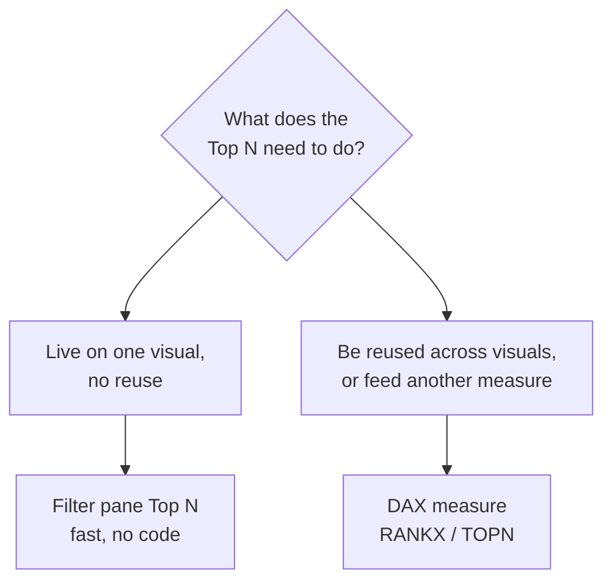
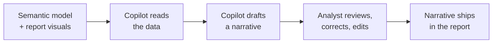
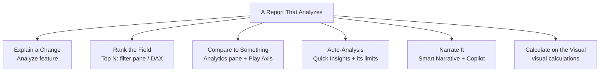

<!--
NANO BANANA PRO — CHAPTER 5 OPENING INFOGRAPHIC
File: images/ch05/fig-5-1-ch5-at-a-glance.png
Title: Analytics and Insight at a Glance
Concept: A roadmap of the chapter — the six features that move a report from showing data to finding the story inside it.
Archetype: Hub-and-spoke — central "FINDING THE INSIGHT" node, six labelled spokes.
Reference: images/_style-reference/fig-3-2-two-reactions.png
Labels: spokes ANALYZE FEATURE, TOP N ANALYSIS, ANALYTICS PANE, QUICK INSIGHTS, SMART NARRATIVE AND COPILOT, VISUAL CALCULATIONS; banner "FROM SHOWING TO FINDING".
Palette: navy #1B2A47, gold #C9A23A, white / pale-blue background.
-->

:::{figure} ../images/ch05/fig-5-1-ch5-at-a-glance.png
:label: fig-5-1
:alt: A hub-and-spoke infographic titled "Analytics and Insight at a Glance." A central node, "finding the insight," connects to six spokes: analyze feature, top N analysis, analytics pane, quick insights, smart narrative and Copilot, and visual calculations. A banner reads "from showing to finding."
:width: 100%
:align: center

**Figure 5.1.** *Analytics and Insight at a Glance.* The six features that move a report from showing data to finding the story inside it.
:::

**Chapter 5 of 8** | **Part 3 of 4: Analytics and AI**

---

### Power BI View Compass — Where We Live This Chapter

| View | What You See | What You Do Here | Used In This Chapter |
|------|--------------|------------------|----------------------|
| **Report View** | Canvas with visuals, the Visualizations pane, and its Analytics tab | Run the Analyze feature, add reference lines and forecasts, write visual calculations, place Smart Narrative | **Primary view (most sections)** |
| **Table View** | Rows of data in a grid | Inspect values | Not used |
| **Model View** | Tables connected by relationships | Manage relationships | Not used |
| **DAX Query View** | Code editor for DAX | Test measures | Not used |
| **Power Query Editor** | A separate window with a green ribbon | Clean and transform data | Not used |

> 💜 **Where Am I?** Chapter 5 lives mostly in **Report View** of Power BI Desktop. One section is the exception: Section 5.5 leaves Desktop entirely for the **Power BI Service** in your web browser. A *WHERE AM I?* marker flags that move when it arrives — until then, assume Report View.

---

## Opening: The Report That Showed, But Did Not Tell

The interactive territory report had changed Marcus's meetings. His managers filtered it themselves now — bikes only, Q3 only, Germany only — and the follow-up questions that used to land on Camila's desk got answered in the room.

Which is why his next request surprised her.

It was a Thursday. Marcus had the report open on the conference screen, filtered to the third quarter. The sales line dipped in the middle of the quarter — a clear, visible drop.

"There," he said, pointing. "Every manager in this room can see that dip now. That is the part you built. But not one of them can tell me *why* it dropped. Neither can I." He turned around. "Last year I had a quarter that looked like this. Finding the cause took my team two days of pulling spreadsheets. The answer turned out to be one reseller, in one country."

Camila started to say she could investigate it.

"No," Marcus said, not unkindly. "That is the point. I do not want to send you off to investigate. I want the report to do the first pass. Show me the dip — and then tell me where to look. Can it do that?"

It could. Power BI has a whole layer of features for exactly this — features that do not only display the data but interrogate it. Some are a right-click. One of them, new this year, writes the explanation in plain language. That layer is this chapter.

### Learning Objectives

By the end of this chapter, you will be able to:

1. **Use** the Analyze feature to have Power BI explain an increase, a decrease, or an unusual distribution in a visual.
2. **Produce** a Top N ranking two ways — through the Filter pane and through a DAX measure — and choose the right one for the situation.
3. **Add** reference lines, a trend line, error bars, and a forecast to a chart, and animate a time-based story with the Play Axis.
4. **Generate** a written summary of a report with Smart Narrative and with a Copilot narrative visual, and review it critically before trusting it.
5. **Write** a visual calculation with DAX, and explain when a visual calculation is the right tool and when a measure is.

### Chapter Roadmap

The chapter has seven subchapters. The first three are features you reach for deliberately — the Analyze feature that explains a change, Top N rankings, and the Analytics pane that marks what is normal and projects what is next. Section 5.5 steps into the Power BI Service to meet auto-generated insights and learn to distrust them in the right measure. The last two cover the skills new for the January 2026 PL-300 exam: narrative visuals that write a report's summary in words, and visual calculations with DAX. The chapter closes with a case study where Camila builds the report that does Marcus's first pass for him.

---

## 5.1 From Showing to Finding — Why Analytics

Chapters 1 through 4 built a report that *shows*. You chose the right visual, formatted it to look convincing, and made it interactive enough for the audience to ask their own questions. That is real work, and it is not the whole job.

A report that only shows leaves three questions on the table. *Is this number normal?* The audience sees \$4.1M in sales and has no idea whether that is a good month or an alarming one. *Why did it change?* They see the dip and cannot explain it. *What happens next?* They see the trend and cannot project it. Showing the data does not answer any of those — and those are the questions a decision actually rests on.

The features in this chapter close that gap. They do not draw the data differently; they interrogate it. One explains a change. Several mark what is normal and project what is coming. Two of them, new this year, write the conclusion out in words. Together they move a report from a thermometer to something closer to a doctor's read of that thermometer: not only *101 degrees*, but *that is a fever, here is the likely cause, here is what to expect by morning*.

<strong style="color: #1B4F72;">💡 WHY ARE WE DOING THIS?</strong>  
The PL-300 exam domain is named <em>Visualize <strong>and analyze</strong> the data</em> — analysis is half of it. Two skills in this chapter are flagged <strong>new for the January 15, 2026 exam</strong>: visual calculations with DAX, and narrative visuals with Copilot. Newly added skills are tested deliberately and early, so Sections 5.6 and 5.7 go deeper than the rest of the chapter on purpose.

---

## 5.2 The Analyze Feature — Letting Power BI Explain a Change

Marcus wanted the report to do the first pass on the Q3 dip. The **Analyze feature** is the tool built for that exact request. Right-click a data point on a chart and Power BI offers to explain it — running a machine-learning pass across every table related to that visual and reporting back which factors moved the number.

It is the difference between a mechanic who says *your engine light is on* and one who says *the light is on, and it traces to the third cylinder*. The first describes the symptom. The second points you somewhere.

<!--
NANO BANANA PRO — CHAPTER 5 FIGURE 2 (concept infographic)
File: images/ch05/fig-5-2-explain-the-change.png
Title: Explain the Change
Concept: The Analyze feature's four-step workflow — from spotting a jump or drop to reading the cause behind it.
Archetype: Process flow — four numbered steps joined by gold arrows.
Reference: images/_style-reference/fig-3-2-two-reactions.png
Labels: steps SPOT THE CHANGE, RIGHT-CLICK THE DATA POINT, CHOOSE ANALYZE, READ THE EXPLANATION; footer "THE REPORT DOES THE FIRST PASS".
Palette: navy #1B2A47, gold #C9A23A, white / pale-blue background.
-->

:::{figure} ../images/ch05/fig-5-2-explain-the-change.png
:label: fig-5-2
:alt: A four-step process-flow infographic titled "Explain the Change." The steps run left to right: spot the change, right-click the data point, choose Analyze, and read the explanation. A footer reads "the report does the first pass."
:width: 100%
:align: center

**Figure 5.2.** *Explain the Change.* The Analyze feature's four-step workflow — from spotting a jump or drop to reading the cause behind it.
:::

<strong style="color: #1E8449;">✅ DO THIS</strong>  
<strong>See it.</strong> On a column chart of Sales Amount by Month, each column is a data point you can right-click. 
<strong>Name it.</strong> The right-click menu has an <strong>Analyze</strong> submenu, with <em>Explain the increase</em>, <em>Explain the decrease</em>, and <em>Find where this distribution is different</em>. 
<strong>Find it.</strong> Right-click the column for the month that dropped → <strong>Analyze</strong>. 
<strong>Do it.</strong> Choose <strong>Explain the decrease</strong>. Power BI opens a pop-up with candidate explanations drawn as waterfall and scatter visuals. Page through the factors with the arrows. When one explains the drop, click the small <strong>+</strong> to add that visual to your report page.

Power BI picks *increase* or *decrease* automatically by comparing the point you clicked with the one before it. *Find where this distribution is different* is the third option — it looks for a category whose internal mix is unusual, useful when a total looks fine but something inside it is not.

<strong style="color: #922B21;">🛑 STOP AND CHECK</strong>  
The Analyze pop-up should show one or more charts, each with a short heading naming the factor — a country, a product category, a reseller. If the pop-up says it could not find an explanation, the model may not have a related table that carries the answer. Analyze can only reach fields connected to the visual through a relationship.

> **Story: One Reseller, in One Country**
>
> Camila took Marcus's Q3 dip back to her desk and right-clicked the low month. *Analyze → Explain the decrease.*
>
> Power BI thought for a moment and returned four charts. The first three were noise — small wobbles in categories that always wobble. The fourth was not noise. It showed the decrease concentrated almost entirely in one reseller, in Germany, whose orders had fallen to nearly zero for two months and then recovered.
>
> Camila checked it against the raw data. The feature was right. One mid-sized German reseller had paused ordering during a warehouse move, and that single pause was most of the regional dip.
>
> Last year, Marcus's team had found this kind of answer in two days of spreadsheets. The Analyze feature had found it in about nine seconds.
>
> ---
> ***Technical Connection:*** The Analyze feature runs a machine-learning model across the tables related to your visual and ranks the factors that contributed to a change. It is fast and genuinely useful — but it reports *statistical contribution*, not proven cause. It found that the German reseller's drop *coincided with* the regional dip; it did not know *why* that reseller paused. That last step — checking the finding against reality — stays human. Analyze narrows two days of searching to one chart. It does not close the case.

---

## 5.3 Top N Analysis — The Filter Pane and DAX

A recurring analytical question is *who are the top few* — the top 10 resellers, the bottom 5 territories, the three products carrying the quarter. Power BI gives you two routes to a Top N ranking, and the PL-300 exam expects you to know both and to know when each fits.

The first route is the **Filter pane**. Select a visual, add the field you want to rank, and change its filter type to **Top N**. You set a direction and a count — *Top 10* — and the measure to rank *by*. No code. The ranking recomputes whenever a slicer changes, and it lives on that one visual.

The second route is **DAX**. A measure built with the `RANKX` and `TOPN` functions can number the rows and keep only the highest few. It is more work, and it buys something the Filter pane cannot: the ranking becomes a reusable piece of the model. Other visuals can use it, and other measures can be built on top of it.

**Diagram 5.1.** Choosing a Top N route. The question is not which is more powerful — it is whether the ranking needs to leave the visual it sits on.

<strong style="color: #1E8449;">✅ DO THIS</strong>  
<strong>See it.</strong> Select a bar chart of Sales Amount by Reseller. The Filter pane on the right shows a <em>Filters on this visual</em> section. 
<strong>Name it.</strong> Each field there has a <strong>Filter type</strong> dropdown; one option is <strong>Top N</strong>. 
<strong>Find it.</strong> In <em>Filters on this visual</em>, expand the Reseller field → set Filter type to <strong>Top N</strong>. 
<strong>Do it.</strong> Set <em>Show items</em> to <strong>Top</strong> and <strong>10</strong>. Drag <code>Sales Amount</code> into the <em>By value</em> well. Apply. The chart now shows the ten highest resellers, and it re-ranks itself whenever the audience changes a slicer.

Think of the leaderboard at the end of a cycling stage. The Filter pane Top N is the leaderboard posted at *this one stage* — accurate, immediate, and gone when the next stage starts. A DAX ranking measure is the overall classification carried from stage to stage, referenced everywhere, built into the standings. Most reports need the stage leaderboard. Reach for DAX when the ranking has to travel.

---

## 5.4 The Analytics Pane and the Play Axis — Deepening a Chart

A bare value floats without meaning. Sales of \$4.1M means nothing until the audience knows the target was \$3.8M, or the average month is \$4.4M, or last year this month was \$3.2M. The **Analytics pane** adds those reference points directly onto a chart.

The Analytics pane is the third tab of the Visualizations pane, beside Build and Format — its icon is a magnifying glass over a line. With a cartesian chart selected, it offers a **constant line** (a fixed target you type in), an **average**, **min**, **max**, **median**, and **percentile** line, a **trend line**, and — on a line chart with a date axis — a **forecast**.

**Error bars** do a related job from a different home: they draw a small range above and below each value to show uncertainty or a tolerance band. Error bars are configured in the **Format pane**, in their own Error bars section, rather than in the Analytics pane — but read them as the same family of idea: a chart that admits what it does not know precisely.

Forecasting is the feature worth slowing down on. On a line chart of Sales Amount over a date axis, the Analytics pane's **Forecast** projects the line forward. You set how far ahead, a confidence level, and the seasonality, and Power BI draws a projected line inside a shaded band.

That shaded band is the honest part, and South Florida has the perfect picture for it. Every hurricane season, the National Hurricane Center publishes a forecast *cone* — a center line for the storm's likely path, inside a cone that widens the further out the forecast reaches, because uncertainty grows with distance. A Power BI forecast's confidence band is the same admission. The center line is the projection; the band is the cone.

<strong style="color: #1E8449;">✅ DO THIS</strong>  
<strong>See it.</strong> Select a line chart of Sales Amount by month. The Visualizations pane shows three tabs across the top. 
<strong>Name it.</strong> The third tab is the <strong>Analytics</strong> pane; its last section is <strong>Forecast</strong>. 
<strong>Find it.</strong> Visualizations pane → Analytics tab → Forecast → <strong>Add</strong>. 
<strong>Do it.</strong> Set <em>Forecast length</em> to 3 months and <em>Confidence interval</em> to 95%. The chart extends with a projected line and a shaded band. Present both, always — the line without the band overstates how sure the report is.

### The Play Axis — A Story That Moves

Reference lines and forecasts deepen a still chart. The **Play Axis** does something different: it makes a chart *move*. On a scatter chart, the Play Axis is a field well; drop a date field into it and a play button with a timeline appears below the chart. Press play and the bubbles travel across the canvas as time advances, each leaving a faint trail.

It is time-lapse photography for data. A scatter chart of profit against units sold, played across three years, shows each country's bubble drifting — and the audience watches the whole history happen in eight seconds instead of reading it off three separate charts.

<strong style="color: #6C3483;">💜 TAKE A BREATH</strong>  
That section held a lot of small features — six kinds of reference line, error bars, forecasting, the Play Axis. You do not have to memorize the list. They answer one question between them: <em>compared to what?</em> A reference line compares a value to a target or an average. A forecast compares today to a projected tomorrow. The Play Axis compares now to before. When a chart leaves the audience asking <em>compared to what</em>, this pane has the answer.

---

## 5.5 Quick Insights and the Limits of Auto-Analysis

> 💜 **WHERE AM I?** This section leaves Power BI Desktop. Close it in your mind and open a web browser at **app.powerbi.com** — the **Power BI Service**. Quick Insights is a Service feature; it does not exist in Desktop.

Everything so far has been an analytical feature *you* aimed at a question you already had. **Quick Insights** is the opposite. In the Power BI Service, you point it at a whole semantic model and it runs a battery of algorithms unprompted — hunting for outliers, trends, steady categories, correlations, and majority factors — then hands back a page of auto-generated charts it thinks are interesting.

You reach it from the workspace: find the semantic model, open its **More options (...)** menu, and choose **Get quick insights**. After a moment, *View insights* shows the result.

It feels like magic the first time. It is not magic, and treating it as magic is the mistake the rest of this section is here to prevent.

Quick Insights walks the beach with a metal detector. The detector is real, and it genuinely beeps when there is metal in the sand. But it beeps for every bottle cap, every pull tab, every rusted nail — and once in a while, a ring. Quick Insights is the same. It surfaces real statistical patterns, and most of them are bottle caps: a correlation between two numbers that have no business relationship, a "trend" that is three data points, a pattern that is true and meaningless.

The detector cannot tell the ring from the pull tab. Only you can, because only you know the business. Quick Insights finds *statistical* patterns; it has no idea which ones *matter*, and it cannot tell correlation from cause.

<strong style="color: #7D6608;">⚠️ COMMON MISTAKE</strong>  
Presenting an auto-generated insight to a stakeholder without verifying it first. Quick Insights once reported a strong correlation between accessory sales and a particular shipping region — which turned out to be a calendar coincidence, two unrelated things that happened to rise together for one year. Had it reached a slide unchecked, a manager might have built a plan on a bottle cap. Run Quick Insights for leads; verify every lead before it leaves your screen.

Dr. Iyer puts it to her students this way: auto-analysis is a research assistant, not an analyst. It can fetch a hundred things worth a look. Deciding which three are real, and what they mean, is the job the exam — and the employer — is testing.

---

## 5.6 Smart Narrative and Copilot — Reports That Write Their Own Summary

A chart shows a number. It does not say a sentence. Someone — usually the analyst — still has to write *Sales fell 6% in Q3, driven by one German reseller, and are projected to recover by Q1*. Power BI now offers two features that draft that sentence for you. Both are flagged **new territory for the January 2026 PL-300 exam**, and they are not the same tool.

**Smart Narrative** is a built-in visual. You drop it on the page like any other visual, and it writes a summary of what the page shows — totals, trends, highs and lows — in plain prose. Its sentences carry **dynamic values**: filter the page to Bikes and the narrative's numbers update with it. Smart Narrative is rules-based and template-driven, it needs no special licensing, and you can edit its text and insert your own dynamic values through a natural-language prompt.

The **Copilot narrative visual** is the new one. With Copilot enabled in the organization's tenant, the narrative visual can be powered by Copilot instead — a large language model that reads the report's data and writes a summary that is more fluent, more flexible, and able to answer a request like *summarize this page for an executive*. Where Smart Narrative fills in a template, Copilot composes.

**Diagram 5.2.** The Copilot narrative workflow. Copilot drafts; the analyst reviews. The review step is not optional — it is the step that makes the output trustworthy.

<strong style="color: #1E8449;">✅ DO THIS</strong>  
<strong>See it.</strong> The Visualizations pane holds a grid of visual-type icons; one shows a small speech bubble or text lines. 
<strong>Name it.</strong> That is the <strong>Smart narrative</strong> visual (a narrative visual). 
<strong>Find it.</strong> With no visual selected, click the Smart narrative icon in the Visualizations pane. 
<strong>Do it.</strong> Power BI generates a text box summarizing the current page. Read every sentence. Click into the text to edit it, and use the <strong>+ Value</strong> control to add a dynamic value of your own. Where Copilot is enabled in your tenant, the narrative visual offers a Copilot option that drafts the summary instead.

> **Story: The Sentence Copilot Got Wrong**
>
> Camila added a Copilot narrative visual to the territory report and read what it wrote. The draft was good — fluent, well organized, the numbers correct. One sentence stopped her: *"Sales fell in Q3 because of reduced demand in Germany."*
>
> The numbers in that sentence were right. The word *because* was not. Demand had not fallen — one reseller had paused ordering during a warehouse move, as the Analyze feature had shown her. Copilot had seen the German drop and reached for the most natural-sounding cause. It had written a confident sentence about something it could not actually know.
>
> Jamal, from the BI Center of Excellence, was not surprised when she mentioned it. The Center's rule for Copilot-generated text is one line: *Copilot drafts, an analyst signs.* No Copilot narrative reaches a stakeholder until a named analyst has read every sentence and put their name on it.
>
> Camila rewrote the sentence: *"Sales fell in Q3, concentrated in one German reseller that paused ordering during a warehouse move."* Same length. True this time.
>
> ---
> ***Technical Connection:*** A Copilot narrative is generated from patterns in the data and patterns in language, and language models are built to sound fluent — which means they will phrase a guess with the same confidence as a fact. Copilot is excellent at the draft: structure, phrasing, pulling the right numbers. It cannot be trusted with *because*. For the PL-300 exam, know that Copilot narrative visuals exist, what they do, and that the tenant must have Copilot enabled — and know that the analyst, not Copilot, owns the final text.

<strong style="color: #1B4F72;">💡 WHY ARE WE DOING THIS?</strong>  
Copilot features carry an organizational dependency the exam expects you to recognize: Copilot must be <strong>enabled in the tenant</strong>, on capacity that supports it, by an administrator. An analyst cannot switch it on alone. If a PL-300 question describes a Copilot feature that "is not available," the tenant setting is the first thing to check — the same way an uncertified custom visual fails to load in Chapter 3.

---

## 5.7 Visual Calculations with DAX

This is the second skill new for the January 2026 exam, and it is the one most worth your patience. It trips people up at first — not because it is hard, but because it sits somewhere new. Take it slowly and it becomes one of the most useful tools in the book.

A **visual calculation** is a DAX calculation you write *directly on a visual*. Here is the part that makes it different from everything you learned about DAX in the prerequisite course. A normal **measure** is computed against the model's tables, in filter context, before the visual is drawn. A visual calculation is computed *afterward* — on the visual's own result grid, the rows that are already aggregated and sitting in the visual in front of you.

Because a visual calculation can see the visual's rows, in order, it can do things measures find awkward: a running total down the rows, the difference from the row above, a moving average, each row as a percent of the visual's total. These are all *row-aware* calculations, and the visual is where the rows live.

<!--
NANO BANANA PRO — CHAPTER 5 FIGURE 3 (concept infographic)
File: images/ch05/fig-5-3-measure-vs-visual-calc.png
Title: Two Places to Calculate
Concept: A measure is computed in the model and reusable everywhere; a visual calculation is computed on the visual and local to it.
Archetype: Before/after — two side-by-side panels, central gold divider.
Reference: images/_style-reference/fig-3-2-two-reactions.png
Labels: left panel MEASURE — COMPUTED IN THE MODEL / REUSABLE EVERYWHERE / CANNOT SEE THE VISUAL LAYOUT; right panel VISUAL CALCULATION — COMPUTED ON THE VISUAL / SEES THE VISUAL ROWS / LOCAL TO ONE VISUAL; footer "PICK BY WHERE THE ANSWER MUST LIVE".
Palette: navy #1B2A47, gold #C9A23A, white / pale-blue background.
-->

:::{figure} ../images/ch05/fig-5-3-measure-vs-visual-calc.png
:label: fig-5-3
:alt: A two-panel comparison infographic titled "Two Places to Calculate." The left panel, "measure," reads "computed in the model, reusable everywhere, cannot see the visual layout." The right panel, "visual calculation," reads "computed on the visual, sees the visual rows, local to one visual." A footer reads "pick by where the answer must live."
:width: 100%
:align: center

**Figure 5.3.** *Two Places to Calculate.* A measure lives in the model and travels everywhere; a visual calculation lives on one visual and sees its rows.
:::

You create one by selecting a visual and choosing **New visual calculation** — Power BI opens an editing screen showing the visual's data as a grid, with a formula bar above it. You write a DAX expression there, and it becomes a new field in the visual. A running total on a Sales Amount by Month table is a single line:

`Running Total = RUNNINGSUM([Sales Amount])`

`RUNNINGSUM` is one of a family of functions — `MOVINGAVERAGE`, `PREVIOUS`, `NEXT`, `RANGE` — that exist *because* a visual calculation can walk the visual's rows. As a measure, a running total takes a denser pattern of `CALCULATE` and `FILTER`. As a visual calculation, it is the function name and the field.

<strong style="color: #1E8449;">✅ DO THIS</strong>  
<strong>See it.</strong> Select a table visual showing Sales Amount by Month. 
<strong>Name it.</strong> The control that adds a calculation onto the visual is <strong>New visual calculation</strong>. 
<strong>Find it.</strong> With the visual selected, on the ribbon: Home tab → <strong>New visual calculation</strong>. The visual calculations edit screen opens. 
<strong>Do it.</strong> In the formula bar, type <code>Running Total = RUNNINGSUM([Sales Amount])</code> and confirm. Close the edit screen. The table now carries a Running Total column that accumulates down the months — written in one line, living on this visual only.

So when do you reach for which? Picture the difference between the company handbook and a note in the margin. A **measure** is a formula in the handbook — written once, used by every team, in force everywhere. A **visual calculation** is a number you work out in the margin of the one page in front of you: quick, shaped exactly to that page, and it does not exist anywhere else. Use a measure for anything reused across visuals, referenced by other measures, or part of the model's shared logic. Use a visual calculation for a row-aware result — a running total, a row-to-row change, a percent of the visual's own total — that belongs to one visual and one visual only.

<strong style="color: #7D6608;">⚠️ COMMON MISTAKE</strong>  
Expecting a visual calculation to be reusable. It is not. A visual calculation belongs to the visual it was written on — it does not appear in the Data pane, no other visual can use it, and no measure can reference it. If you build a running total as a visual calculation and then need the same figure on a second visual, you write it again there. When a result must travel, it has to be a measure.

<strong style="color: #6C3483;">💜 TAKE A BREATH</strong>  
If the measure-versus-visual-calculation line feels blurry right now, that is the expected place to be — professional Power BI developers worked through this same confusion when visual calculations arrived. Hold one question and let the rest follow from it: <em>does this result need to leave the visual?</em> If yes, it is a measure. If no, a visual calculation is lighter and the row-aware functions make it shorter to write. That single question is most of the skill.

---

## 5.8 Case Study — Camila's Report That Explains Itself

<!--
NANO BANANA PRO — CHAPTER 5 FIGURE 4 (synthesis infographic)
File: images/ch05/fig-5-4-data-to-insight.png
Title: From Data to Insight
Concept: The chapter's features stacked as a ladder of escalating analytical value, from showing a number to narrating the story.
Archetype: Pyramid / ladder — five stacked rungs, value rising upward.
Reference: images/_style-reference/fig-3-2-two-reactions.png
Labels: rungs bottom to top SHOW THE NUMBER, ADD A REFERENCE LINE, EXPLAIN THE CHANGE, FORECAST FORWARD, NARRATE THE STORY; side arrow "MORE INSIGHT"; footer "A REPORT THAT ANALYZES, NOT ONLY DISPLAYS".
Palette: navy #1B2A47, gold #C9A23A, white / pale-blue background.
-->

:::{figure} ../images/ch05/fig-5-4-data-to-insight.png
:label: fig-5-4
:alt: A five-rung ladder infographic titled "From Data to Insight." From bottom to top the rungs read "show the number," "add a reference line," "explain the change," "forecast forward," and "narrate the story." A side arrow reads "more insight." A footer reads "a report that analyzes, not only displays."
:width: 100%
:align: center

**Figure 5.4.** *From Data to Insight.* Each rung makes the report do more analytical work — the chapter, climbed in one picture.
:::

Camila set out to build the report Marcus had described at the conference screen — one that does the first pass.

She started where he had pointed. On the Sales Amount by Month chart she right-clicked the low Q3 month and ran **Analyze → Explain the decrease**. Power BI returned the German reseller, the same finding as before. She clicked the **+** and the explaining chart landed on a detail page, ready for anyone who asked *why*.

Next she gave the numbers something to be measured against. On the main sales chart she added a **constant line** from the Analytics pane at the quarterly target of \$12M, so the dip would be read against the plan rather than in a vacuum. Then she added a **3-month forecast** at a 95% confidence interval — projected line and shaded band together, the cone and its center.

She added a **Top 5 resellers** bar chart using the Filter pane's Top N, so the largest accounts stayed visible without anyone hunting for them. On the monthly table she wrote one **visual calculation** — `Running Total = RUNNINGSUM([Sales Amount])` — so the cumulative climb sat right beside the monthly figures.

Last, she dropped in a **Copilot narrative visual** and let it draft the page's summary. The draft was clean, except for one sentence that blamed *reduced demand*. She rewrote it to name the warehouse move, and put her initials on it.

The next Thursday, Marcus filtered the report to Q3. It showed the dip, marked the target line, projected the recovery with its honest band, listed the top resellers, accumulated the running total, and — in a paragraph at the corner of the page — explained the quarter in three sentences a board member could read in four seconds.

The investigation that once took two days was now part of the report. Marcus read the paragraph, nodded, and moved the meeting on.

---

## Chapter Closing

### Key Takeaways

- A report that only *shows* leaves three questions unanswered — is this normal, why did it change, what comes next. The analytics layer exists to answer them.
- The **Analyze feature** explains an increase or decrease by ranking the factors that contributed to it. It narrows the search; it reports statistical contribution, not proven cause, so the final check stays human.
- **Top N** has two routes. The **Filter pane** is fast, code-free, and local to one visual. A **DAX** measure with `RANKX` or `TOPN` is more work but reusable across visuals and inside other measures.
- The **Analytics pane** adds reference lines, a trend line, and a **forecast**. Always present a forecast with its confidence band — the band is an honest statement of uncertainty, like a hurricane cone. The **Play Axis** animates a scatter chart across time.
- **Quick Insights** auto-generates analysis in the Power BI Service. It finds statistical patterns without business context — treat every result as a lead to verify, never as a finding to present.
- **Smart Narrative** writes a rules-based summary of a page; the **Copilot narrative visual** (new for 2026) drafts a more fluent one, but needs Copilot enabled in the tenant. Copilot drafts; the analyst reviews, corrects, and owns the final text.
- A **visual calculation** (new for 2026) is DAX written on a visual, computed on the visual's row grid — ideal for running totals and row-to-row math. A **measure** lives in the model and travels everywhere. The deciding question: does the result need to leave the visual?

### Concept Map

**Diagram 5.3.** Chapter 5 in one picture. Six ways a report stops merely displaying data and starts analyzing it.

### Vocabulary Review

- **Analyze feature** — A right-click tool that has Power BI explain an increase, a decrease, or an unusual distribution by ranking contributing factors.
- **Explain the increase / decrease** — The Analyze options that compare a data point to the one before it and surface what moved the number.
- **Top N filter** — A Filter pane filter type that keeps only the highest or lowest few items by a chosen measure.
- **TOPN / RANKX** — DAX functions used to build a ranking inside a measure, reusable across visuals.
- **Analytics pane** — The Visualizations pane tab that adds reference lines, a trend line, and a forecast to a chart.
- **Reference line** — A line drawn on a chart at a constant, average, or other value, giving the audience a *compared to what*.
- **Forecast** — An Analytics pane projection of a line chart into the future, drawn with a confidence band that widens with distance.
- **Play Axis** — A scatter chart field well that animates the chart across a time field.
- **Quick Insights** — A Power BI Service feature that auto-generates candidate analyses from a semantic model; its results are leads to verify, not findings.
- **Smart Narrative** — A built-in visual that writes a rules-based, template-driven text summary of a page, with dynamic values.
- **Copilot narrative visual** — A narrative visual powered by Copilot that drafts a fluent summary; requires Copilot enabled in the tenant.
- **Visual calculation** — A DAX calculation written on a visual, computed on the visual's result grid; local to that visual and not reusable.

### Bridge to Chapter 6

This chapter's tools answer questions you bring to them — you right-click the dip, you add the forecast, you ask for the ranking. Chapter 6 hands more of the asking to the machine. It covers Power BI's AI visuals: the **Key Influencers** visual that explains what drives a metric, the **Decomposition Tree** that breaks a number apart on demand, the **Q&A visual** that takes a typed question in plain language, and anomaly and clustering tools that flag what you did not think to look for. It also opens the rest of the Copilot story new for 2026 — Copilot creating whole report pages, and Copilot summarizing the semantic model. Chapter 5 made the report analyze. Chapter 6 makes it notice.

### Self-Check Questions

1. Marcus sees a sales drop in one month and wants Power BI to suggest what caused it. Which feature fits? (a) Smart Narrative; (b) Right-click the data point → Analyze → Explain the decrease; (c) A reference line; (d) A Top N filter. *(Answer: b — the Analyze feature ranks the factors that contributed to the change.)*

2. An analyst needs a Top 10 reseller ranking that several different visuals will reuse, and that another measure will be built on top of. Which route is the right fit? (a) The Filter pane Top N; (b) A DAX measure using `RANKX` or `TOPN`; (c) A constant line; (d) Quick Insights. *(Answer: b — a DAX ranking is reusable across visuals and can feed other measures; the Filter pane Top N is local to one visual.)*

3. *True or False:* A forecast's shaded confidence band should be removed before presenting, so the projection looks more authoritative. *(Answer: False. The band is an honest statement of uncertainty — like a hurricane forecast cone. Removing it makes the report overstate how sure it is.)*

4. Which task is the right fit for a visual calculation rather than a measure? (a) A Total Sales figure reused on every page of the report; (b) A running total down the rows of one specific table visual; (c) A profit-margin calculation referenced by three other measures; (d) A model-wide year-over-year measure. *(Answer: b — a running total down one visual's rows is row-aware and local; the others must travel, so they are measures.)*

5. Quick Insights surfaces a strong correlation between two fields in the model. What should the analyst do before showing it to a stakeholder? (a) Present it immediately, since Quick Insights is automated and reliable; (b) Verify the relationship makes business sense and check for a confounding cause; (c) Delete the report; (d) Convert it into a forecast. *(Answer: b — auto-analysis finds statistical patterns without business context; every result is a lead to verify.)*

### Reflection Prompt

Think of a time you saw a number presented — at work, in school, in the news — and were left asking *is that normal?* or *why did it change?* or *what happens next?* Pick one of those three questions. Which feature from this chapter would have answered it: a reference line, the Analyze feature, a forecast? Then consider the harder one: if a Copilot narrative had written a confident sentence explaining that number, how would you have checked whether the sentence was true? Write a short paragraph on each.

---

*End of Chapter 5.*
