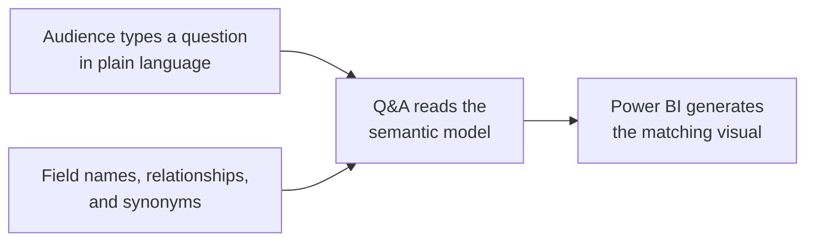
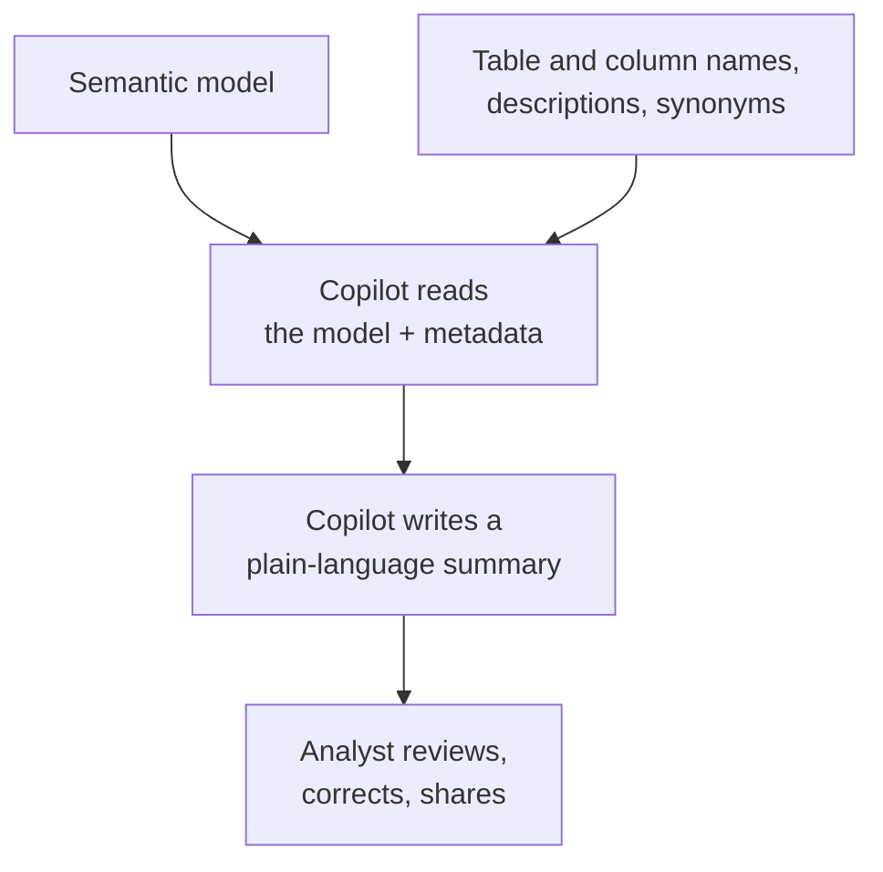
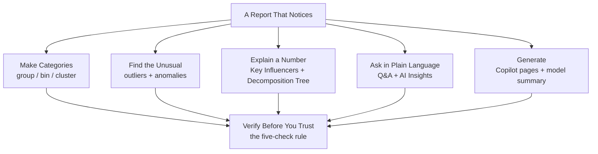

<!--
NANO BANANA PRO — CHAPTER 6 OPENING INFOGRAPHIC
File: images/ch06/fig-6-1-ch6-at-a-glance.png
Title: AI-Powered Analysis (Chapter 6 Overview)
Concept: A master infographic of the chapter — the AI features that let a report notice what the analyst did not think to ask.
Archetype: Master infographic — a central analysis diagram flanked by two side-panels, richly illustrated in the ai4educators.net chapter-overview style, retinted to the book's navy/gold brand.
Reference (composition/density): ../../.ref-ai4ed/ai4ed-ch06-opener.png
Reference (palette/finish): images/_style-reference/fig-3-2-two-reactions.png
Labels: kicker CHAPTER 6 OVERVIEW; title AI-POWERED ANALYSIS; centre AI ANALYSIS with KEY INFLUENCERS, DECOMPOSITION TREE, THE Q AND A VISUAL; left panel FIND THE UNUSUAL (grouping and clustering, outliers, anomalies); right panel COPILOT (create report pages, summarize the model); banner "FROM ANALYZING TO NOTICING".
Palette: navy #1B2A47, gold #C9A23A, white / pale-blue background.
-->

:::{figure} ../images/ch06/fig-6-1-ch6-at-a-glance.png
:label: fig-6-1
:alt: A master infographic titled "AI-Powered Analysis." A central "AI analysis" diagram shows key influencers, a decomposition tree, and the Q&A visual; a left panel "find the unusual" covers grouping and clustering, outliers, and anomalies; a right panel covers Copilot. A banner reads "from analyzing to noticing."
:width: 100%
:align: center

**Figure 6.1.** *AI-Powered Analysis — Chapter 6 Overview.* The AI features that let a report notice what the analyst did not think to ask.
:::

**Chapter 6 of 8** | **Part 3 of 4: Analytics and AI**

---

### Power BI View Compass — Where We Live This Chapter

| View | What You See | What You Do Here | Used In This Chapter |
|------|--------------|------------------|----------------------|
| **Report View** | Canvas with visuals, the Visualizations pane, the Copilot pane | Build AI visuals, run clustering and anomaly detection, ask Q&A, work with Copilot | **Primary view (every section)** |
| **Table View** | Rows of data in a grid | Inspect values | Not used |
| **Model View** | Tables connected by relationships | Manage relationships | Referenced in 6.6 |
| **DAX Query View** | Code editor for DAX | Test measures | Not used |
| **Power Query Editor** | A separate window with a green ribbon | Clean data; host the AI Insights tools | Mentioned in 6.5 |

> 💜 **Where Am I?** Chapter 6 lives in **Report View** of Power BI Desktop. Every AI visual — Key Influencers, the Decomposition Tree, Q&A — is a visual you place on the canvas like any other. One feature, AI Insights, lives in the Power Query Editor instead; Section 6.5 names it but does not send you there.

---

## Opening: The Thing Nobody Looked For

The Monday review had gone well. Camila's report did everything it was built to do — Marcus filtered it, drilled into it, read the Copilot summary at the corner of the page. Total sales were on target. Every manager left satisfied.

Three weeks later, Marcus was not satisfied.

He had found it himself, by accident, clicking around the report on a Friday afternoon. Sales of one accessory line — bike helmets — had been falling in the Pacific Northwest for two straight months. Not catastrophically. Quietly. Enough that the regional total still looked fine, because road bikes were having a strong quarter and the average covered the helmet collapse completely.

"Nobody built a chart for helmets in the Northwest," Marcus said. He was not angry. He was thinking. "Why would they? It is one product line in one region out of hundreds of combinations. We cannot make a chart for every one."

Camila knew where this was going.

"The report answers every question we ask it," Marcus said. "It is very good at that now. The problem is the question nobody asked. The helmet thing — no human was ever going to spot that by reading charts. There are too many slices." He looked at her. "I need the report to raise its own hand. To look at all the slices itself, and tell us which one is worth our attention."

That is a different kind of help than anything in the last five chapters. It is not answering a question faster. It is finding the question. That is what Power BI's AI features are for, and that is this chapter.

### Learning Objectives

By the end of this chapter, you will be able to:

1. **Choose** among grouping, binning, and clustering to turn raw detail into the categories an analysis needs.
2. **Detect** outliers in a scatter chart and anomalies in a time series, and read what Power BI flags and why.
3. **Use** the Key Influencers visual and the Decomposition Tree to explain what moves a number and what it is made of.
4. **Build** a Q&A visual that answers typed questions, and use Copilot to draft report pages and summarize a semantic model.
5. **Apply** a verification checklist to any AI-generated insight before it informs a decision.

### Chapter Roadmap

The chapter has seven subchapters. The first three are AI features that *find* something — categories you did not draw by hand, outliers, and anomalies in time. The middle two *explain* and *converse* — the Key Influencers visual and the Decomposition Tree, then the Q&A visual and a look at AI Insights. Section 6.6 covers Copilot in depth: drafting report pages and summarizing a semantic model, both new for the January 2026 exam. Section 6.7 is the one every AI chapter owes its reader — when these tools mislead, and how to not be misled. The chapter closes with Camila building the report that raises its own hand.

---

## 6.1 From Analyzing to Noticing — Why AI Analysis

Chapter 5 gave the report a set of analytical tools, and every one of them had the same shape: *you* aimed it. You right-clicked the dip and asked for an explanation. You added the forecast. You asked for the ranking. The report analyzed — but only where you pointed it.

Marcus's helmet problem is the limit of that approach. The AdventureWorks data has hundreds of product-and-region combinations. A human analyst, reading charts, can hold maybe a dozen in attention at once. The other few hundred are dark. A quiet decline in one of them is invisible, not because the report is weak, but because nobody pointed a tool at that exact slice.

AI-powered analysis changes who does the pointing. These features sweep the whole dataset — every slice, every combination — looking for what stands out: a cluster, an outlier, an anomaly, a factor that moves a number more than the others. They do not wait to be aimed. They surface a short list of *things worth your attention*, and then you, the analyst, decide which ones are real.

That last sentence is the whole chapter in miniature, and Section 6.7 will return to it hard. AI features are very good at *noticing* and genuinely bad at *judging*. The noticing is a real gift. The judging stays yours.

<strong style="color: #1B4F72;">💡 WHY ARE WE DOING THIS?</strong>  
The PL-300 exam expects you to recognize Power BI's AI visuals on sight and know what each one is for — Key Influencers, the Decomposition Tree, Q&A, anomaly detection. Two more skills in this chapter are flagged <strong>new for the January 15, 2026 exam</strong>: using Copilot to create report pages, and using Copilot to summarize a semantic model. Section 6.6 covers both in depth, because new exam skills are tested deliberately.

---

## 6.2 Grouping, Binning, and Clustering — Three Ways to Make a Category

Before the AI features that *find* things, one foundational skill: making categories. Raw data rarely arrives in the buckets an analysis wants. AdventureWorks has individual customers, individual product prices, individual order sizes — and a report usually needs them grouped. Power BI offers three ways to build a category, and they differ by *who decides the buckets*.

<!--
NANO BANANA PRO — CHAPTER 6 FIGURE 2 (concept infographic)
File: images/ch06/fig-6-2-three-ways-category.png
Title: Three Ways to Make a Category
Concept: Grouping, binning, and clustering compared — who decides the buckets in each.
Archetype: Three-panel comparison — three equal side-by-side panels.
Reference: images/_style-reference/fig-3-2-two-reactions.png
Labels: panels GROUPING / YOU PICK THE MEMBERS, BINNING / EQUAL NUMERIC RANGES, CLUSTERING / THE MACHINE FINDS THE GROUPS; footer "MANUAL, NUMERIC, OR MACHINE-FOUND".
Palette: navy #1B2A47, gold #C9A23A, white / pale-blue background.
-->

:::{figure} ../images/ch06/fig-6-2-three-ways-category.png
:label: fig-6-2
:alt: A three-panel comparison infographic titled "Three Ways to Make a Category." Grouping — "you pick the members." Binning — "equal numeric ranges." Clustering — "the machine finds the groups." A footer reads "manual, numeric, or machine-found."
:width: 100%
:align: center

**Figure 6.2.** *Three Ways to Make a Category.* Grouping, binning, and clustering — the difference is who decides the buckets.
:::

**Grouping** is you, by hand. You select the values that belong together and name the bucket. AdventureWorks sells in six countries; you might group them into *North America* and *Overseas* because that is how Marcus thinks about his regions. Grouping is a manual decision recorded as a field.

**Binning** is you, by rule. On a numeric or date field, you set a bin size — *every \$500 of order value*, *every 10 years of customer age* — and Power BI slices the range into equal bands. You decide the rule; the math decides the boundaries.

**Clustering** is the machine. On a scatter chart, Power BI can run a clustering algorithm that groups data points by how close together they fall, and hands back a category field of clusters it found on its own. You did not pick the members or the rule. The data's own shape decided.

<strong style="color: #1E8449;">✅ DO THIS</strong>  
<strong>See it.</strong> Build a scatter chart of customer Income against customer Sales Amount. Each dot is a customer. 
<strong>Name it.</strong> The tool that finds groups in that scatter is <strong>Automatically find clusters</strong>. 
<strong>Find it.</strong> Hover the scatter chart → click <strong>More options (...)</strong> in its header → <strong>Automatically find clusters</strong>. 
<strong>Do it.</strong> Power BI proposes a number of clusters; accept it. It adds a new <em>Cluster</em> field and colors the dots by cluster. The groups were found by the data, not drawn by you.

<strong style="color: #7D6608;">⚠️ COMMON MISTAKE</strong>  
Treating a cluster as if it were a meaningful business segment the moment Power BI draws it. Clustering finds points that sit near each other mathematically. Whether those points share anything a business would care about is a separate question — and it is yours to answer. A cluster is a hypothesis, not a finding.

---

## 6.3 Finding the Outlier — Anomalies in Points and in Time

An **outlier** is a data point that sits far from the rest. Some outliers are errors — a customer age of 200, a negative order quantity. Some are the most important rows in the dataset — the one reseller buying ten times what anyone else buys. Either way, the outlier is the point you want to see, and Power BI helps two ways.

### Outliers in a Scatter

The first way is visual, and you already own it. A scatter chart plots two measures against each other, and an outlier *looks* like an outlier — a lonely dot far from the crowd. The eye is genuinely good at this; pre-attentive processing from Chapter 1 makes a distant point pop without effort. For finding outliers among items — customers, products, resellers — a scatter chart is often all the tool you need.

### Anomalies in a Time Series

The second way is for time. A single low month in a sales line is harder to judge — is it a real problem, or normal seasonal noise? Power BI's **anomaly detection** answers that. On a line chart with a date axis, it learns the expected pattern, draws an expected range as a shaded band, and flags any point that falls outside the band as an anomaly — with a marker and a generated explanation.

<strong style="color: #1E8449;">✅ DO THIS</strong>  
<strong>See it.</strong> Select a line chart of Sales Amount by date. The Visualizations pane shows its three tabs — Build, Format, Analytics. 
<strong>Name it.</strong> The Analytics tab has a section called <strong>Find anomalies</strong>. 
<strong>Find it.</strong> Visualizations pane → Analytics tab → <strong>Find anomalies</strong> → <strong>Add</strong>. 
<strong>Do it.</strong> Power BI shades an expected band along the line and marks any point outside it. Click a flagged point to open its explanation pane, which ranks the factors associated with the anomaly.

<strong style="color: #922B21;">🛑 STOP AND CHECK</strong>  
A flagged anomaly should sit clearly outside the shaded expected band, with a marker on the point. If the chart flags nothing, that is a finding, not a failure — the series stayed inside its expected range. Anomaly detection needs a continuous date axis; if the option is greyed out, the chart's axis is not a date.

The Northwest helmet decline from the opening is exactly an anomaly-detection problem. No human would chart that slice. A line chart of helmet sales with *Find anomalies* turned on would have marked the second low month with a red dot weeks before Marcus found it on a Friday.

---

## 6.4 Key Influencers and the Decomposition Tree — Two Visuals That Explain

Two of Power BI's AI visuals do the work of explaining a number. They answer different questions, and a strong analyst knows which question fits which visual.

The **Key Influencers** visual answers *what moves this?* You give it a metric to **Analyze** and a set of fields to **Explain by**, and it runs a statistical model that ranks which factors push the metric up or down. *Customers with a tenure under six months are 3.2 times more likely to churn.* It also has a Top Segments tab that finds combinations of factors forming a notably high or low group.

The **Decomposition Tree** answers *what is this made of?* You give it a metric and a set of fields, and it builds an interactive tree you break apart on demand — click a node to split it by the dimension you choose. It also has an AI feature: instead of choosing the dimension yourself, you can ask it for the **High value** or **Low value** split, and it picks the dimension that most explains where the number is high or low.

<!--
NANO BANANA PRO — CHAPTER 6 FIGURE 3 (concept infographic)
File: images/ch06/fig-6-3-decomposition-tree.png
Title: The Decomposition Tree
Concept: How the Decomposition Tree breaks one measure apart, branch by branch, with an optional AI-chosen split.
Archetype: Tree diagram — a left-to-right branching tree.
Reference: images/_style-reference/fig-3-2-two-reactions.png
Labels: root TOTAL SALES; level 2 BIKES, COMPONENTS, CLOTHING; level 3 (under BIKES) UNITED STATES, GERMANY, AUSTRALIA; GERMANY carries a "HIGH VALUE" badge; footer "CLICK A BRANCH, OR LET AI PICK THE SPLIT".
Palette: navy #1B2A47, gold #C9A23A, white / pale-blue background.
-->

:::{figure} ../images/ch06/fig-6-3-decomposition-tree.png
:label: fig-6-3
:alt: A branching tree-diagram infographic titled "The Decomposition Tree." A root node "total sales" branches into bikes, components, and clothing; the bikes node branches again into United States, Germany, and Australia, with Germany marked "high value." A footer reads "click a branch, or let AI pick the split."
:width: 100%
:align: center

**Figure 6.3.** *The Decomposition Tree.* One measure broken apart branch by branch — you choose each split, or let the AI pick the one that explains the most.
:::

<strong style="color: #1E8449;">✅ DO THIS</strong>  
<strong>See it.</strong> The Visualizations pane's grid of icons includes one shaped like a small branching tree. 
<strong>Name it.</strong> That is the <strong>Decomposition tree</strong> visual. 
<strong>Find it.</strong> With no visual selected, click the Decomposition tree icon in the Visualizations pane. 
<strong>Do it.</strong> Drag <code>Sales Amount</code> into the <em>Analyze</em> well, and Product Category, Country, and Channel into the <em>Explain by</em> well. Click the <strong>+</strong> on the root node and pick a field to split by — or choose <strong>High value</strong> and let Power BI pick the field that explains the most.

> **Story: What the Key Influencers Visual Told Camila**
>
> Camila wanted to understand reseller churn — which resellers stopped ordering. She built a Key Influencers visual: Analyze *whether a reseller churned*, Explain by reseller size, region, product mix, and years as a partner.
>
> Her own guess, before she looked, was that small resellers churned most. Small accounts, thin margins, quick to walk away. It was a reasonable guess and most of her team would have made it.
>
> The visual ranked years-as-a-partner first, and the pattern was not the one she expected. Resellers in their *second* year churned far more than first-year or long-tenured ones. First-year resellers were still in onboarding and supported closely. Veterans were locked in. The second year was the gap — the support had stopped and the loyalty had not yet formed.
>
> Camila checked the finding against the raw data. It held. She brought it to Marcus, who moved a support program to cover second-year resellers.
>
> ---
> ***Technical Connection:*** The Key Influencers visual ran a statistical model across every reseller and ranked the factors associated with churn. It found a real pattern that contradicted a reasonable human guess — that is the feature at its best. Note the exact wording, though: factors *associated with* churn. The visual reports influence, which is correlation, not proven cause. It pointed Camila to the second-year gap; confirming *why* that gap exists was still her work and the business's.

<strong style="color: #6C3483;">💜 TAKE A BREATH</strong>  
Two visuals, two questions, and it is worth fixing the pair in memory before moving on. <strong>Key Influencers</strong> — <em>what moves this number?</em> <strong>Decomposition Tree</strong> — <em>what is this number made of?</em> If a question is about cause and effect, it is a Key Influencers question. If it is about breaking a total into parts, it is a tree. Hold those two sentences; the exam rewards telling them apart.

---

## 6.5 The Q&A Visual and AI Insights — Analysis in Plain Language

Every feature so far needed you to build something. The **Q&A visual** removes even that. It is a visual that holds a text box; an audience member types a question in plain language — *sales by country last year* — and Power BI generates the chart that answers it, live, on the page.

**Diagram 6.1.** How the Q&A visual answers. It interprets the typed question against the semantic model — so the model's field names and synonyms decide how well it understands.

The quality of Q&A depends entirely on the model underneath it. If a column is named `Sales Amount`, Q&A understands *sales*, *revenue*, and *amount* — especially if you have added those as **synonyms** in the model. If the column is named `f_amt_2`, Q&A is lost, and so is the audience.

<strong style="color: #1E8449;">✅ DO THIS</strong>  
<strong>See it.</strong> The Visualizations pane holds a grid of visual-type icons; one shows a question-mark speech bubble. 
<strong>Name it.</strong> That is the <strong>Q&A</strong> visual. 
<strong>Find it.</strong> With no visual selected, click the Q&A icon in the Visualizations pane. 
<strong>Do it.</strong> In the text box, type <code>top 5 resellers by sales amount</code>. Power BI generates a bar chart. Change the text to <code>... by profit</code> and the chart updates. Suggested questions appear below the box to guide the audience.

A related family of AI features lives one view away, in the **Power Query Editor**: **AI Insights**. Its Text Analytics tools score sentiment, extract key phrases, and detect language; its Vision tool tags the contents of images. They run during data refresh and require a Fabric or Power BI Premium capacity. You will not configure AI Insights for the PL-300 exam — you need to recognize that it exists, that it lives in Power Query, and that it brings language and image analysis into a model that otherwise holds only numbers and text.

---

## 6.6 Copilot — Building Pages and Summarizing the Model

Copilot is the generative layer of Power BI, and two of its abilities are **new for the January 2026 exam**. Both deserve a careful look, because both change how fast an analyst can work — and both have the same dependency you met in Chapter 5: Copilot must be **enabled in the tenant**, on supported capacity, by an administrator.

**Copilot can create a report page.** Open the Copilot pane and describe what you want — *a page showing sales performance by territory and channel* — and Copilot drafts a page: it picks visuals, binds fields, lays them out. It can also *suggest content* for a report you have started, proposing visuals you did not think to add. The draft is a starting point. You keep what works, fix what does not, and delete what misses.

**Copilot can summarize a semantic model.** Point Copilot at a model and it writes a plain-language overview — what the model contains, what its main tables and measures represent, what questions it can answer. For a new analyst handed an unfamiliar model, or a stakeholder who wants to know what a dataset is *for* without reading the technical fields, that summary is a genuine shortcut.

**Diagram 6.2.** Copilot summarizing a semantic model. The metadata it reads — names, descriptions, synonyms — decides the quality of the summary. A well-described model summarizes well; a cryptic one does not.

> **Story: Jamal and the Two Models**
>
> Jamal Foster, from the AdventureWorks BI Center of Excellence, showed Camila a demonstration. He had two copies of the same semantic model — same tables, same data, same relationships. He asked Copilot to summarize each one.
>
> The first copy summarized into something close to gibberish. *This model contains tables Tbl1 and DimX with measures M1 and calc_2.* The columns were named the way they had come out of the source system, years ago, and nobody had touched them.
>
> The second copy summarized into something a manager could read. *This model tracks reseller and internet sales for a global cycling company, with measures for sales amount, profit, and order quantity, broken out by product, territory, customer, and date.* Same data — but this copy had real table names, column descriptions, and synonyms.
>
> "Copilot did not get smarter between the two," Jamal said. "The model did."
>
> ---
> ***Technical Connection:*** Copilot reads a model's metadata — table and column names, descriptions, synonyms, marked date tables — to understand it. Good metadata produces a good summary; cryptic metadata produces a cryptic one. For the PL-300 exam, hold this as a cause-and-effect pair: preparing a model with clear names and descriptions is what makes Copilot's summary, and the Q&A visual, work well. The prep is the skill.

<strong style="color: #1B4F72;">💡 WHY ARE WE DOING THIS?</strong>  
Copilot creating pages and summarizing models are the kind of skills a new exam tests with scenario questions: <em>a team wants a quick plain-language overview of an unfamiliar dataset — what do they use?</em> The answer is Copilot's model summary. And if a question adds that the summary came back unusable, the cause is almost always the model's metadata, not Copilot.

<strong style="color: #1E8449;">✅ DO THIS</strong>  
<strong>See it.</strong> The Home tab of the Power BI ribbon has a Copilot button near the right. 
<strong>Name it.</strong> It opens the <strong>Copilot pane</strong>. 
<strong>Find it.</strong> Home tab → <strong>Copilot</strong>. 
<strong>Do it.</strong> In the pane, type <code>Give me an overview of this model</code> and read the summary. Then type <code>Create a page showing sales by territory</code> and review the page it drafts. Treat both as drafts — read every visual and every sentence before you keep them.

---

## 6.7 When AI Misleads — The Ethics and Limits of AI Analysis

Every feature in this chapter shares one weakness, and an analyst who does not understand it will eventually hand a stakeholder something false with full confidence.

AI features are pattern-matchers. They are excellent at finding patterns and incapable of knowing whether a pattern *means* anything. Four ways that goes wrong are worth naming directly.

**Correlation is not cause.** The Key Influencers visual reports what is *associated with* a metric. Anomaly detection flags what *departs from* a pattern. Neither has found a cause. The second-year reseller churn in Section 6.4 was a real correlation; the cause was a human explanation laid over it afterward.

**Biased data makes biased AI.** Every AI feature learns from the data you give it. If AdventureWorks historically under-served one region, a clustering or influencers model trained on that history will treat the under-service as normal and quietly recommend more of it. The model is not neutral; it is a mirror of its data.

**Generative tools sound certain even when wrong.** Copilot writes fluent, confident prose whether the underlying claim is solid or a guess — the same lesson as the Copilot narrative in Chapter 5. Fluency is not accuracy.

**The numbers can be precise and still mislead.** An anomaly flagged at exactly 95% confidence, a cluster drawn with crisp boundaries — the precision is real and the meaning may be empty. False precision is the most persuasive kind of wrong.

<!--
NANO BANANA PRO — CHAPTER 6 FIGURE 4 (synthesis infographic)
File: images/ch06/fig-6-4-trust-ai-insight.png
Title: Before You Trust an AI Insight
Concept: A five-point verification checklist to run on any AI-generated insight before it informs a decision.
Archetype: Checklist — five stacked check rows.
Reference: images/_style-reference/fig-1-3-visual-encoding.png
Labels: checks DOES IT MAKE BUSINESS SENSE, IS IT CORRELATION OR CAUSE, COULD THE DATA BE BIASED, CAN YOU TRACE THE NUMBERS, WOULD YOU SIGN YOUR NAME TO IT; footer "THE ANALYST OWNS THE ANSWER, NOT THE AI".
Palette: navy #1B2A47, gold #C9A23A, white / pale-blue background.
-->

:::{figure} ../images/ch06/fig-6-4-trust-ai-insight.png
:label: fig-6-4
:alt: A five-item checklist infographic titled "Before You Trust an AI Insight": does it make business sense, is it correlation or cause, could the data be biased, can you trace the numbers, would you sign your name to it. A footer reads "the analyst owns the answer, not the AI."
:width: 100%
:align: center

**Figure 6.4.** *Before You Trust an AI Insight.* Five checks between an AI answer and a decision — run them every time.
:::

Dr. Iyer puts it to her students as a rule about accountability. When a report informs a decision and the decision goes wrong, no one accepts *the AI suggested it* as an answer. The analyst's name is on the report. The AI is a tool the analyst chose to trust, and choosing to trust it is itself a professional judgment — one the five checks above are designed to make on purpose rather than by reflex.

<strong style="color: #7D6608;">⚠️ COMMON MISTAKE</strong>  
Letting the polish of an AI feature stand in for verification. A Key Influencers bar, a confident Copilot paragraph, and a crisply drawn cluster all <em>look</em> finished, and that finish is persuasive. Looking finished and being correct are unrelated properties. The checklist exists because the eye cannot tell them apart.

<strong style="color: #6C3483;">💜 TAKE A BREATH</strong>  
This section can read as discouraging after six chapters of building. It is not meant to. AI analysis is one of the most useful things in Power BI — the helmet decline, the second-year churn, both were real and both were worth knowing. The point is not to distrust the tools. It is to stay the person in the loop who decides. That role is not a burden the chapter is adding; it is the job.

---

## 6.8 Case Study — The Report That Raises Its Own Hand

Camila set out to answer Marcus's actual request: a report that finds the slice nobody charted.

She started with anomaly detection. On the company sales line, broken out by product category on small multiples, she turned on **Find anomalies** for each. Power BI now watched every category's trend and would mark any month that fell outside its expected band — the helmet decline, had it happened again, would surface on its own.

For the *why*, she added a **Key Influencers** visual: Analyze *Sales Amount*, Explain by product, region, channel, and reseller. When a number moved, the visual would rank what moved it. Beside it she placed a **Decomposition Tree** on Sales Amount, so Marcus could break any total apart himself — and she left the AI **High value** split available, so the tree could pick the revealing dimension when he did not know which to choose.

She added a **Q&A visual** to the landing page, after spending an hour she considered well spent on the model underneath it — adding synonyms so a manager typing *revenue* or *bookings* would be understood.

Then she opened **Copilot** and asked it to draft an executive overview page. The draft was uneven; she kept two of its four visuals and rebuilt the rest. She also ran Copilot's **model summary** and pasted a cleaned-up version into the report's documentation, so the next analyst would not start cold.

Last, she walked the whole report against the five checks from Section 6.7 — every AI element traced, sense-checked, owned.

The next month, the report flagged an anomaly on its own: a clothing line sliding in Canada. A manager saw the red marker in the meeting, before it became a Friday-afternoon discovery. Marcus did not say much about it. He did not need to. The report had raised its hand.

---

## Chapter Closing

### Key Takeaways

- AI-powered analysis sweeps the whole dataset for what stands out, instead of waiting to be aimed. It is built to *notice* — to surface the slice no analyst thought to chart.
- **Grouping** (you pick the members), **binning** (you set a numeric rule), and **clustering** (the machine finds the groups) are three ways to make a category, differing by who decides the buckets.
- A scatter chart finds **outliers** among items by eye; **anomaly detection** on a line chart flags points outside a learned expected band, with an explanation.
- The **Key Influencers** visual answers *what moves this number?* The **Decomposition Tree** answers *what is this number made of?* — and can pick a revealing split with its AI High/Low value option.
- The **Q&A visual** answers typed plain-language questions; its quality depends on the model's field names and synonyms. **AI Insights**, in Power Query, adds text and image analysis.
- **Copilot** (new for 2026) can draft report pages and summarize a semantic model. Both depend on Copilot being enabled in the tenant, and the model-summary quality depends on the model's metadata.
- Every AI feature finds patterns and cannot judge them. Correlation is not cause, biased data makes biased output, generative text sounds certain when wrong. The analyst — not the AI — owns the answer.

### Concept Map

**Diagram 6.3.** Chapter 6 in one picture. Five families of AI feature feed one non-negotiable last step — the analyst's verification.

### Vocabulary Review

- **Grouping** — A manually defined category; the analyst selects which values belong together and names the bucket.
- **Binning** — A category built by a numeric or date rule that slices a range into equal bands.
- **Clustering** — A category found by a machine-learning algorithm that groups data points by proximity, typically from a scatter chart.
- **Outlier** — A data point sitting far from the rest; sometimes an error, sometimes the most important row.
- **Anomaly detection** — An Analytics pane feature that learns a time series' expected range and flags points outside it.
- **Key Influencers visual** — An AI visual that ranks the factors associated with a metric going up or down.
- **Top Segments** — The Key Influencers tab that finds combinations of factors forming a notably high or low group.
- **Decomposition Tree** — An AI visual that breaks a measure apart into an interactive tree, with optional AI-chosen High/Low value splits.
- **Q&A visual** — A visual that answers typed natural-language questions by generating a chart from the semantic model.
- **Synonyms** — Alternative terms registered in the model so Q&A and Copilot recognize the words an audience actually uses.
- **AI Insights** — Power Query tools for text analytics and image analysis; require a Fabric or Premium capacity.
- **Copilot** — Power BI's generative AI; can draft report pages and summarize a semantic model, and must be enabled in the tenant.

### Bridge to Chapter 7

Chapters 1 through 6 built a report that shows, formats, interacts, analyzes, and now notices. Every chapter so far has lived inside Power BI Desktop, on your own machine. Chapter 7 changes the address. It moves into the Power BI Service — the cloud — and the question of *distribution*: dashboards versus reports versus apps, mobile-optimized layouts, data alerts and subscriptions, paginated reports for pixel-perfect output, and letting end users personalize what they see. A finished report is not finished until the right people can actually use it. Part 4 is about delivery.

### Self-Check Questions

1. An analyst wants Power BI to group customers based on patterns in the data itself, without deciding the groups in advance. Which tool fits? (a) Grouping; (b) Binning; (c) Clustering; (d) A slicer. *(Answer: c — clustering finds the groups from the data's own shape; grouping and binning require the analyst to decide the buckets.)*

2. A monthly sales line has one low point, and the analyst needs to know whether it is a genuine problem or normal seasonal variation. Which feature answers that? (a) The Decomposition Tree; (b) Anomaly detection in the Analytics pane; (c) The Q&A visual; (d) Clustering. *(Answer: b — anomaly detection learns the expected range and flags points that fall outside it.)*

3. A manager asks *what factors are associated with resellers churning?* Which AI visual is built for that question? (a) The Key Influencers visual; (b) The Decomposition Tree; (c) A scatter chart; (d) The Q&A visual. *(Answer: a — Key Influencers ranks the factors associated with a metric. The Decomposition Tree breaks a number into parts; it does not rank influence.)*

4. A team asks Copilot to summarize a semantic model and gets back a vague, unusable description full of names like `Tbl1` and `M2`. What is the most likely cause? (a) Copilot is not enabled; (b) The model's tables, columns, and measures lack clear names and descriptions; (c) The report has too many pages; (d) The capacity is too large. *(Answer: b — Copilot's summary quality depends on the model's metadata; cryptic names produce a cryptic summary.)*

5. *True or False:* If the Key Influencers visual reports that a factor strongly influences a metric, the analyst can present that factor to stakeholders as the proven cause. *(Answer: False. Key Influencers reports association — correlation — not proven cause. Confirming causation is a separate, human step.)*

### Reflection Prompt

Think of a decision — at work, in school, or in the news — that was justified with an AI-generated finding or an automated recommendation. Walk it through the five checks from Section 6.7: did it make business sense, was it correlation or cause, could the underlying data have been biased, could the numbers be traced, and would you have signed your name to it? Which check would have been hardest to answer from the outside? Write a short paragraph on what you would have needed to know to verify the finding properly.

---

*End of Chapter 6.*
