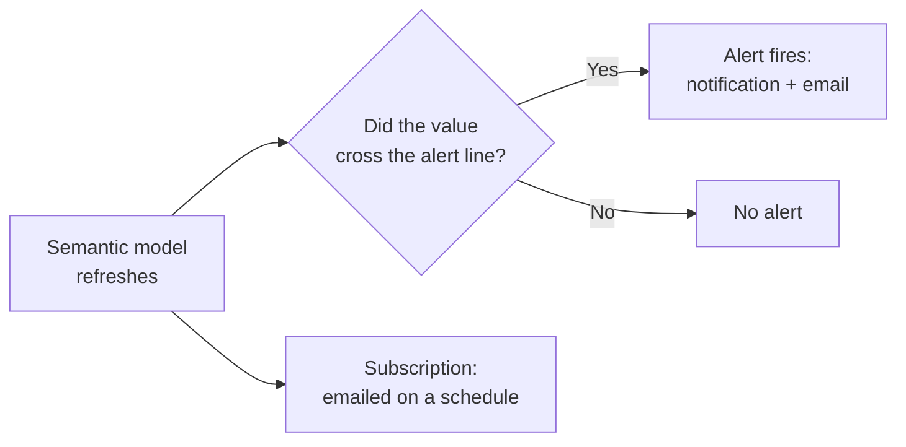
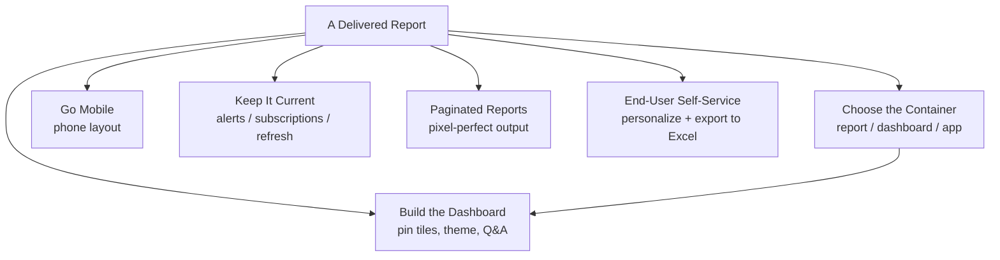

<!--
NANO BANANA PRO — CHAPTER 7 OPENING INFOGRAPHIC
File: images/ch07/fig-7-1-ch7-at-a-glance.png
Title: Beyond the Report (Chapter 7 Overview)
Concept: A master infographic of the chapter — the delivery journey that carries a finished report file to every screen.
Archetype: Master infographic — a dense, richly illustrated three-zone left-to-right journey with depicted objects (laptop, cloud, containers, devices) and connecting arrows. Modeled on the ai4educators.net chapter-overview style, retinted to the book's navy/gold brand.
Reference (composition/density): ../../.ref-ai4ed/ai4ed-ch02-opener.png
Reference (palette/finish): images/_style-reference/fig-3-2-two-reactions.png
Labels: kicker CHAPTER 7 OVERVIEW; title BEYOND THE REPORT; zones "1 BUILD AND PUBLISH", "2 CHOOSE THE CONTAINER", "3 DELIVER TO EVERY DEVICE"; objects THE POWER BI SERVICE, REPORT, DASHBOARD, APP, MOBILE LAYOUT, DATA ALERT, SUBSCRIPTION, AUTO-REFRESH, PAGINATED REPORT; banner "BUILDING IT IS HALF THE JOB".
Palette: navy #1B2A47, gold #C9A23A, white / pale-blue background.
-->

:::{figure} ../images/ch07/fig-7-1-ch7-at-a-glance.png
:label: fig-7-1
:alt: A master infographic titled "Beyond the Report." A three-zone left-to-right journey — zone 1, build and publish: a laptop report published up to the Power BI Service cloud; zone 2, choose the container: a report, a dashboard, and an app; zone 3, deliver to every device: a phone mobile layout, a data alert, a subscription, an auto-refresh monitor, and a paginated report. A banner reads "building it is half the job."
:width: 100%
:align: center

**Figure 7.1.** *Beyond the Report — Chapter 7 Overview.* The delivery journey: from a finished report, through the right container, to every screen.
:::

**Chapter 7 of 8** | **Part 4 of 4: Distribution and Production**

---

### Power BI View Compass — Where We Work This Chapter

Chapters 1 through 6 lived inside Power BI Desktop. Chapter 7 changes address. Most of the work now happens in the **Power BI Service** — the cloud, in your browser — with a few stops back in Desktop.

| Where | What It Is | What You Do Here | Used In This Chapter |
|-------|-----------|------------------|----------------------|
| **Power BI Service** | The cloud workspace at app.powerbi.com, in a browser | Build dashboards, pin tiles, publish apps, set alerts and subscriptions | **Primary — most sections** |
| **Power BI Desktop** | The authoring tool on your machine | Design a report's phone layout, enable Personalize visuals, set page refresh | Sections 7.4, 7.5, 7.7 |
| **Power BI Report Builder** | A separate free app for paginated reports | Build pixel-perfect, print-ready reports | Section 7.6 |
| **Power BI Mobile app** | The app on a phone or tablet | View reports and dashboards on the go | Section 7.4 |

> 💜 **Where Am I?** This is the chapter where the venue moves. You will hop between the browser (the Service) and Desktop, and one section visits a separate app, Power BI Report Builder. Each hop gets a *WHERE AM I?* marker. When in doubt this chapter, assume the browser.

---

## Opening: The Report Nobody Could Find

Camila's report was finished. Genuinely finished — six chapters of craft in one file. She published it to the Power BI Service on a Tuesday, told Marcus it was live, and closed her laptop with the quiet satisfaction of a job done.

Two weeks later, Jamal Foster asked her how the rollout was going.

"It is published," Camila said.

"That is not what I asked." Jamal pulled up the workspace on his screen. The report was there — one item in a list of more than two hundred, in a workspace the field sales team had no reason to ever open. "Marcus's three direct reports have viewed it. That is the whole audience. You built something for forty people and three of them found it."

It was not that the report was bad. The report was excellent. It was that a report sitting in a workspace is like a book sitting in a printing plant. Printed, bound, correct — and not in a single reader's hands.

"The field team does not sit at a desk," Jamal went on. "They are in cars, in stores, on phones. They are never going to browse a workspace. Marcus wants the headline number while he is walking through an airport, not a twelve-page report he has to pan around on a phone screen."

Camila started to see it.

"Building the report was half the job," Jamal said. "Maybe less than half. Getting it to land — the right shape, on the right screen, in front of the right person, at the right moment — that is a separate craft. It has its own tools. That is what I do all day, and it is what this chapter is."

### Learning Objectives

By the end of this chapter, you will be able to:

1. **Choose** among a report, a dashboard, and an app for a given audience and purpose.
2. **Build** a dashboard in the Power BI Service by pinning tiles from one or more reports, and apply a dashboard theme and Q&A.
3. **Design** a phone-optimized layout for both a report and a dashboard.
4. **Configure** data alerts, email subscriptions, and automatic page refresh so an audience stays current without reopening anything.
5. **Decide** when a paginated report is the right output, and enable end-user self-service with Personalize Visuals and export to Excel.

### Chapter Roadmap

The chapter has seven subchapters. The first establishes why distribution is its own craft. The next two cover the containers — choosing among dashboards, reports, and apps, then building a dashboard. Section 7.4 takes the report to a phone. Section 7.5 keeps the audience current with alerts, subscriptions, and refresh. Section 7.6 covers paginated reports for pixel-perfect output, and Section 7.7 hands control to the end user with Personalize Visuals and Excel export. The chapter closes with Camila and Jamal shipping the report properly.

---

## 7.1 From Building to Delivering — Why Distribution Is Its Own Craft

For six chapters, *finished* has meant the report was correct, clear, formatted, interactive, and analytically sharp. Jamal's correction in the opening is that this definition stops one step short. A report that is correct and unread has not finished its job. It has finished its *author's* job and not yet started its *reader's*.

Distribution is the work of closing that gap, and it is genuinely a different craft from authoring. Authoring asks *is this the right chart, the right number, the right design*. Distribution asks a different set of questions. *Who is the audience, exactly? What device are they on? Do they want to explore, or to glance? Do they need it pushed to them, or will they come and get it? How will they know it changed?*

Those questions have tools as their answers, and this chapter is a tour of the tools. A **dashboard** for the glance. An **app** for the broad audience. A **phone layout** for the device. **Alerts** and **subscriptions** for the push. **Paginated reports** for the pixel-perfect printout. **Personalize Visuals** for the reader who wants to bend the report to their own question.

None of it changes the analysis. All of it changes whether the analysis is used.

<strong style="color: #1B4F72;">💡 WHY ARE WE DOING THIS?</strong>  
This is the start of Part 4, and a shift in the PL-300 exam too. Chapters 1 through 6 covered the <em>Visualize and analyze the data</em> domain. Chapters 7 and 8 cover <em>Manage and secure Power BI</em> — 15 to 20 percent of the exam. Distribution choices are testable: the exam expects you to know that a dashboard is Service-only, that an app is how you reach a broad audience, and which delivery method fits a described scenario.

---

## 7.2 Dashboards, Reports, and Apps — Choosing the Container

Three words get used loosely in most offices — *dashboard*, *report*, *app* — and Power BI gives each one a precise meaning. Using the wrong one is the most common distribution mistake there is.

<!--
NANO BANANA PRO — CHAPTER 7 FIGURE 2 (concept infographic)
File: images/ch07/fig-7-2-dashboard-report-app.png
Title: Dashboard, Report, or App
Concept: The three Power BI containers compared — what each is and which audience it serves.
Archetype: Rich row diagram — three full-width stacked panels, each an icon badge, an illustrated example, and a pill verdict; ai4educators master-infographic style, navy/gold.
Reference (composition): ../../.ref-ai4ed/ai4ed-ch01-fig-struggle.png
Reference (palette): images/ch07/fig-7-1-ch7-at-a-glance.png
Labels: rows DASHBOARD / AT-A-GLANCE MONITOR, REPORT / EXPLORE THE DETAIL, APP / DELIVER TO EVERYONE; footer "PICK BY WHO THE AUDIENCE IS".
Palette: navy #1B2A47, gold #C9A23A, white / pale-blue background.
-->

:::{figure} ../images/ch07/fig-7-2-dashboard-report-app.png
:label: fig-7-2
:alt: A three-row infographic titled "Dashboard, Report, or App." Dashboard — a single screen of pinned tiles from many reports, "at-a-glance monitor." Report — multi-page, interactive, one model, "explore the detail." App — a packaged bundle published to an audience, "deliver to everyone." A footer reads "pick by who the audience is."
:width: 100%
:align: center

**Figure 7.2.** *Dashboard, Report, or App.* Three containers, three jobs — the choice follows the audience.
:::

A **report** is what you have built for six chapters: multi-page, interactive, connected to one semantic model. A report is for an audience that wants to *explore* — filter, drill, follow a question into the detail.

A **dashboard** is a single screen — one page, no scrolling, no pages to flip. It is built only in the Power BI Service, never in Desktop, and it is assembled from **tiles** pinned from reports. Its defining power: a dashboard can pull tiles from *several different reports and several different models* onto one canvas. A report cannot — a report is bound to one model. A dashboard is for the audience that wants to *monitor* — one glance, the whole picture.

An **app** is a packaged, polished bundle of dashboards and reports, published from a workspace to an audience. An app is how you deliver to *many* people — a whole department, the whole company — without handing them a messy workspace. It has a clean front door and a defined audience.

> **Story: Jamal and the Forty Reports**
>
> Before the BI Center of Excellence existed, Jamal told Camila, AdventureWorks had no apps. Every analyst published reports straight into shared workspaces, and every consumer was handed the workspace.
>
> The sales workspace, by the time Jamal audited it, held forty-one reports. Some were live. Some were two years stale. Three were called variations of *Sales Final*. A regional manager looking for this quarter's numbers had to know which of the forty-one was the real one, and most did not — so they phoned an analyst and asked, which is the exact bottleneck this whole book has been trying to remove.
>
> Jamal's team rebuilt it as one app. The app had three reports and two dashboards — the ones that mattered, vetted, current — behind a single clean front door. The other thirty-six reports stayed in the workspace, visible to analysts, invisible to consumers. Support calls about *which report* dropped to almost nothing within a month.
>
> ---
> ***Technical Connection:*** A workspace is a back room — a place where analysts build and store everything, including drafts and dead ends. An app is the storefront — a curated selection, published to a defined audience, updated on the publisher's command. Consumers should almost always receive an app, not raw workspace access. For the PL-300 exam: the app is the standard answer for distributing content to a broad audience cleanly.

<strong style="color: #7D6608;">⚠️ COMMON MISTAKE</strong>  
Calling every Power BI screen a "dashboard." In casual speech it does not matter; on the exam and in a real workspace it does. A dashboard is a specific Service-only object made of pinned tiles. If someone asks you to "fix the dashboard" and points at a multi-page interactive file, they mean a report. Match the word to the object.

---

## 7.3 Building a Dashboard — Tiles, Themes, and Q&A

A dashboard is built by **pinning**. You open a report in the Service, find a visual worth monitoring, and pin it to a dashboard as a tile. Repeat across as many reports as you like, and the dashboard becomes a single wall assembled from your best visuals.

<!--
NANO BANANA PRO — CHAPTER 7 FIGURE 3 (concept infographic)
File: images/ch07/fig-7-3-pinning-dashboard.png
Title: Pinning Builds a Dashboard
Concept: A dashboard is assembled by pinning individual visuals from one or more report pages into one tiled screen.
Archetype: Rich before/after — two illustrated panels (report pages with pushpins / one tiled dashboard) with a central PIN arrow; ai4educators master-infographic style, navy/gold.
Reference (composition): ../../.ref-ai4ed/ai4ed-ch01-fig-tuesdays.png
Reference (palette): images/ch07/fig-7-1-ch7-at-a-glance.png
Labels: left panel "REPORT PAGES" (separate report pages with pushpin icons on visuals); right panel "ONE DASHBOARD" (a tidy grid of pinned tiles); footer "PIN THE BEST TILES INTO ONE VIEW".
Palette: navy #1B2A47, gold #C9A23A, white / pale-blue background.
-->

:::{figure} ../images/ch07/fig-7-3-pinning-dashboard.png
:label: fig-7-3
:alt: A before-and-after infographic titled "Pinning Builds a Dashboard." The left panel, "report pages," shows separate report pages with pushpin icons on their visuals; the right panel, "one dashboard," shows those visuals assembled into a tidy grid of tiles. A footer reads "pin the best tiles into one view."
:width: 100%
:align: center

**Figure 7.3.** *Pinning Builds a Dashboard.* A dashboard is a curated wall — the best tiles, pinned from across your reports into one screen.
:::

<strong style="color: #1E8449;">✅ DO THIS</strong>  
<strong>See it.</strong> In the Power BI Service, open a published report and hover the pointer over any visual. A small toolbar appears in the visual's corner. 
<strong>Name it.</strong> The pushpin icon on that toolbar is <strong>Pin visual</strong>. 
<strong>Find it.</strong> Hover the visual → click the <strong>pushpin</strong> icon. 
<strong>Do it.</strong> A dialog asks for a destination. Choose <strong>New dashboard</strong>, name it <code>South Florida Monitor</code>, and pin. To pin a whole report page as one live tile, use the page's <strong>Pin to a dashboard</strong> command instead — that tile stays fully interactive.

A pinned visual is a snapshot tile that refreshes with its source. A **pinned live page** is the entire report page, interactive, embedded in the dashboard. Tiles can be moved, resized, and given a custom title or a link through the tile's edit details.

Two finishing touches make a dashboard feel deliberate. A **dashboard theme** sets the background and tile styling for the whole dashboard at once — light, dark, or a custom color — reached from the dashboard's edit menu. And the **Q&A question box** sits across the top of every dashboard: a consumer types a plain-language question, Power BI answers with a visual, and they can pin that answer as a new tile themselves.

<strong style="color: #922B21;">🛑 STOP AND CHECK</strong>  
After pinning, open the dashboard from the workspace. The tile should show your visual, and clicking it should jump you back to the report page it came from. If a tile shows an error or a stale value, its underlying report or model has a refresh problem — a dashboard tile is only ever as current as the data feeding it.

---

## 7.4 Mobile — Your Report on a Phone

> 💜 **WHERE AM I?** This section starts back in **Power BI Desktop**. Designing a report's phone layout is a Desktop task. The dashboard phone layout, later in the section, is set in the Service. Both are then viewed in the Power BI Mobile app.

A report built on a wide laptop canvas does not fit a phone held upright. Pan-and-zoom on a phone is the experience Jamal called unusable — and it is the default if you do nothing. Power BI's answer is a separate **mobile layout**: a second, phone-shaped arrangement of the same visuals, which the Power BI Mobile app shows automatically to phone users while desktop users still see the wide version.

<strong style="color: #1E8449;">✅ DO THIS</strong>  
<strong>See it.</strong> In Power BI Desktop, the ribbon's View tab has a group for layout options. 
<strong>Name it.</strong> The control is <strong>Mobile layout</strong>. 
<strong>Find it.</strong> View tab → <strong>Mobile layout</strong>. The canvas switches to a tall phone frame with a grid. 
<strong>Do it.</strong> The page's visuals wait in a side panel. Drag only the ones a phone user needs — the headline card, the key chart — onto the phone grid, and size them for a thumb. Switch back with View tab → Desktop layout. You have built a phone version without touching the desktop version.

A **dashboard** gets the same treatment in the Service: open the dashboard, choose the mobile-layout view from its edit menu, and arrange the tiles for a phone. And a small set of reports are built phone-first from the start — narrow, vertical, tap-friendly — and are called **mobile reports** in their own right.

The guiding idea is restraint. A phone layout is not the desktop report shrunk. It is a deliberate choice of the few things that matter on a small screen, in the thirty seconds a walking user will give it. Marcus in the airport needs one number and one trend, large. He does not need the twelve-visual page.

---

## 7.5 Keeping the Audience Current — Alerts, Subscriptions, and Page Refresh

> 💜 **WHERE AM I?** Alerts and subscriptions are set in the **Power BI Service**, in the browser. Automatic page refresh is configured back in **Power BI Desktop**. The section flags the hop when it comes.

A delivered report still has one weakness: it waits to be opened. The audience has to remember to go look. Three features remove that requirement — they bring the report to the audience instead.

A **data alert** watches a single number and tells you when it crosses a line you set. Alerts are placed on a dashboard tile that shows one value — a card, a KPI, a gauge.

<strong style="color: #1E8449;">✅ DO THIS</strong>  
<strong>See it.</strong> In the Service, on a dashboard, find a tile that shows a single value. 
<strong>Name it.</strong> The tile's <strong>More options (...)</strong> menu includes <strong>Manage alerts</strong>. 
<strong>Find it.</strong> Hover the tile → <strong>More options (...)</strong> → <strong>Manage alerts</strong> → <strong>Add alert rule</strong>. 
<strong>Do it.</strong> Set a condition — <em>Total Sales below \$10M</em> — and a check frequency. When the data refreshes and the value crosses the line, Power BI sends a notification, and an email if you ask for one.

A **subscription** is a scheduled delivery: Power BI emails you a snapshot of a report page or a dashboard on a timetable you choose — every weekday at 8 a.m., say. Where an alert fires on a *condition*, a subscription arrives on a *schedule*.

**Diagram 7.1.** Two ways the report reaches the audience without being opened. An alert is driven by a *condition* met at refresh; a subscription is driven by the *clock*.

The third feature is for the opposite extreme — data that changes by the minute. **Automatic page refresh**, set on a report page in Desktop, re-queries the source on a fixed interval, so a page on a wall-mounted screen stays live. It applies to DirectQuery sources and has a minimum interval set by the capacity. A subscription suits a daily rhythm; automatic page refresh suits an operations screen that must never be stale.

<strong style="color: #7D6608;">⚠️ COMMON MISTAKE</strong>  
Expecting an alert to fire the instant the real-world number changes. An alert is only checked when the <em>semantic model refreshes</em>. If the model refreshes once a day at 6 a.m., the alert can be a full day behind the real world. The alert is honest about the data it has — and the data is only as fresh as the last refresh.

> **Story: The Alert That Reached Marcus First**
>
> Marcus was in the security line at Miami International when his phone buzzed. Not a text — a Power BI notification. *Total Sales, South Florida, is below \$10M.*
>
> It was the alert Camila had set on the dashboard's headline card. The number had crossed the line on that morning's refresh, and Power BI had told him within the hour — in an airport, with no laptop open and no report in front of him.
>
> He forwarded it to the team from the gate. By the time he landed, an analyst had traced it. Not a sales collapse: a single large reseller order had been keyed with next month's date and had dropped out of the current period. A data-entry correction, not a crisis. Fixed before lunch.
>
> The part Marcus kept thinking about was the timing. Without the alert, he would have seen that number on Monday morning, in the operations review, in front of eight managers — and the meeting would have spent twenty minutes panicking about a problem that was already a closed fix. The alert had not only delivered a number. It had delivered it early enough to be useful.
>
> ---
> ***Technical Connection:*** An alert changes the report from something the audience visits into something that reaches the audience. It carries one limit worth holding onto: the alert fired on the morning *refresh*, not the instant the order was keyed. Alerts are timely, not instant — their speed is the refresh schedule's speed. For the PL-300 exam, pair the two facts: an alert is evaluated at model refresh, so its usefulness depends on the refresh frequency matching how fast the business needs to know.

<strong style="color: #6C3483;">💜 TAKE A BREATH</strong>  
Three delivery features, and the way to keep them straight is to ask <em>what triggers the message</em>. An <strong>alert</strong> is triggered by a condition — a number crossing a line. A <strong>subscription</strong> is triggered by the clock — a scheduled time. <strong>Automatic page refresh</strong> is triggered by a timer on the page itself. Condition, clock, timer. That is the whole section.

---

## 7.6 Paginated Reports — When the Output Must Be Pixel-Perfect

Every report so far has been an *interactive* report — built for a screen, designed to be filtered and clicked. Some outputs are not for a screen. An invoice. A multi-page customer statement. A regulatory filing. A 600-row operational list that has to print cleanly across forty numbered pages. For those, Power BI has a second, older, very different report type: the **paginated report**.

Paginated reports are built in a separate free application, **Power BI Report Builder**, not in Power BI Desktop. They are designed page by page, for paper or PDF — every margin, every header, every page break controlled exactly. A table that runs to thousands of rows flows across as many pages as it needs, repeating its column headers on each. An interactive Power BI report cannot do that; it was never meant to.

<strong style="color: #1B4F72;">💡 WHY ARE WE DOING THIS?</strong>  
For the PL-300 exam, you do not build a paginated report — you recognize when one is the answer. The signal words are <em>pixel-perfect</em>, <em>print</em>, <em>PDF</em>, <em>invoice</em>, <em>statement</em>, and <em>every row of a long table</em>. When a scenario needs an exact printable document rather than an interactive screen, the answer is a paginated report, authored in Power BI Report Builder and published to the Service alongside the interactive reports.

The two report types are not rivals. A mature workspace holds both: interactive reports for the analysts who explore, and paginated reports for the statements and operational lists that must be printed or archived. Choosing between them is choosing whether the output's final home is a *screen* or a *page*.

---

## 7.7 Letting Users Take Over — Personalize Visuals and Export to Excel

The last delivery idea hands a measure of control to the audience. However well you design a report, some readers will want it bent slightly toward their own question — a different chart type, a different field on the axis, the raw numbers in their own spreadsheet. Two features let them do that without ever touching your published version.

**Personalize Visuals** is a report setting that, once enabled, lets a consumer in the Service modify a visual for themselves — swap a field, change the chart type, re-sort — and save it as a personal bookmark. Their changes are private; your published report is untouched for everyone else.

<strong style="color: #1E8449;">✅ DO THIS</strong>  
<strong>See it.</strong> In Power BI Desktop, the File menu opens Options and settings. 
<strong>Name it.</strong> The setting is <strong>Personalize visuals</strong>, under the current file's report settings. 
<strong>Find it.</strong> File → Options and settings → Options → Current file → <strong>Report settings</strong> → tick <strong>Personalize visuals</strong>. 
<strong>Do it.</strong> Republish the report. A consumer in the Service now sees a small <em>Personalize this visual</em> icon on visuals, and can reshape them into a private view that never disturbs yours.

The plainer escape hatch is **Excel**. From any visual, the **Export data** command sends the rows behind it to a CSV or Excel file. And from a semantic model in the Service, **Analyze in Excel** opens a live PivotTable connected straight to the Power BI model — the spreadsheet queries your governed model in real time, so the analyst who lives in Excel still works from the single source of truth rather than a stale copy.

<strong style="color: #6C3483;">💜 TAKE A BREATH</strong>  
It can feel like a loss of control to let users repaint your visuals and pull your data into Excel. Reframe it. Every one of these features routes the audience <em>back to your governed model</em> instead of away from it — a personalized visual still uses your measures, an Excel PivotTable still queries your model. The alternative is the audience exporting once and emailing copies around for a month. Self-service done inside the model is how you prevent that.

---

## 7.8 Case Study — Camila and Jamal Ship the Report

<!--
NANO BANANA PRO — CHAPTER 7 FIGURE 4 (synthesis infographic)
File: images/ch07/fig-7-4-one-report-every-audience.png
Title: One Report, Every Audience
Concept: The case study synthesized — one finished report reaching every audience through the right delivery channel.
Archetype: Rich hub-and-spoke — a central delivered report with six illustrated delivery-outcome spokes; ai4educators master-infographic style, navy/gold (deliberately NOT a left-to-right pipeline, to differ from the Ch7 opener journey).
Reference (composition): ../../.ref-ai4ed/ai4ed-ch06-opener.png
Reference (palette): images/ch07/fig-7-1-ch7-at-a-glance.png
Labels: hub THE DELIVERED REPORT; spokes EXEC DASHBOARD, MOBILE, DATA ALERT, WEEKLY SUBSCRIPTION, PAGINATED REPORT, PUBLISHED APP; banner "FROM THREE VIEWERS TO THIRTY-EIGHT".
Palette: navy #1B2A47, gold #C9A23A, white / pale-blue background.
-->

:::{figure} ../images/ch07/fig-7-4-one-report-every-audience.png
:label: fig-7-4
:alt: A hub-and-spoke infographic titled "One Report, Every Audience." A central "delivered report" connects to six delivery outcomes: exec dashboard, mobile, data alert, weekly subscription, paginated report, and published app. A banner reads "from three viewers to thirty-eight."
:width: 100%
:align: center

**Figure 7.4.** *One Report, Every Audience.* The case study — one finished report, reaching every audience through the right channel.
:::

Camila reopened the rollout with Jamal, this time treating delivery as the real work.

They started with the **container** question. The field team did not need the twelve-page report — they needed a monitor. So Camila built a **dashboard** in the Service, pinning four tiles: the headline sales card, the territory bar chart, the small-multiples trend, and one tile pinned live from the anomaly page she had built in Chapter 6.

She gave the dashboard a **phone layout**, arranging those four tiles into a thumb-sized stack — the card and the trend at the top, where a walking user would see them first.

For the numbers that needed pushing, she set a **data alert** on the sales card — *below \$10M* — so Marcus would hear it on his phone the moment a refresh crossed the line. For his managers she set up a **subscription**: the dashboard, emailed every Monday at 7 a.m., waiting before the operations meeting.

The finance team had asked for a printable month-end statement. That was not an interactive report at all, so Jamal showed her **Power BI Report Builder**, and the statement became a **paginated report**, published to the same workspace.

Then Jamal did the part that had been missing the first time. He bundled the interactive report, the dashboard, and the paginated statement into a single **app**, defined the field team as its audience, and published it. One front door. He left Personalize Visuals enabled, so the analysts who wanted to explore could.

This time Camila did not close her laptop and assume. A week later Jamal showed her the usage numbers. Thirty-eight of forty. Marcus had opened the dashboard on his phone eleven times.

"That," Jamal said, "is a finished report."

---

## Chapter Closing

### Key Takeaways

- A report that is correct but unread has not finished its job. **Distribution** — getting the analysis to the right person, on the right device, at the right moment — is a separate craft from authoring.
- A **report** is multi-page and interactive, for an audience that explores. A **dashboard** is a single Service-only screen of pinned tiles, for an audience that monitors. An **app** is a packaged bundle published to a broad audience behind one clean front door.
- A dashboard is built by **pinning** tiles from one or more reports; it can combine tiles from several models, which a report cannot. Dashboard themes and the Q&A box finish it.
- A **mobile layout** is a separate phone-shaped arrangement of a report or dashboard — a deliberate choice of the few things that matter on a small screen, not the desktop version shrunk.
- A **data alert** fires on a condition met at refresh; a **subscription** arrives on a schedule; **automatic page refresh** keeps a live screen current on a timer. Condition, clock, timer.
- A **paginated report**, built in Power BI Report Builder, is for pixel-perfect, printable output — invoices, statements, long tables — where the final home is a page, not a screen.
- **Personalize Visuals** and **Analyze in Excel** hand controlled self-service to the audience while keeping them on your governed model rather than on stale exported copies.

### Concept Map

**Diagram 7.2.** Chapter 7 in one picture. Choosing the container comes first; the other five tracks shape how that container reaches its audience.

### Vocabulary Review

- **Report** — A multi-page, interactive Power BI document bound to one semantic model, built in Power BI Desktop.
- **Dashboard** — A single-screen canvas, built only in the Power BI Service, assembled from tiles pinned from one or more reports.
- **Tile** — A single visual or live page pinned onto a dashboard.
- **Pinning** — The act of placing a report visual, or a whole live page, onto a dashboard as a tile.
- **App** — A packaged collection of dashboards and reports published from a workspace to a defined audience.
- **Workspace** — The back room where analysts build and store Power BI content, including drafts; consumers usually receive an app instead.
- **Mobile layout** — A separate phone-shaped arrangement of a report or dashboard, shown automatically to phone users.
- **Data alert** — A rule on a single-value dashboard tile that notifies you when the value crosses a threshold at refresh.
- **Subscription** — A scheduled email delivery of a report page or dashboard snapshot.
- **Automatic page refresh** — A report-page setting that re-queries a DirectQuery source on a fixed interval to keep a live screen current.
- **Paginated report** — A pixel-perfect, print-oriented report built in Power BI Report Builder, suited to invoices, statements, and long tables.
- **Personalize Visuals** — A report setting that lets a consumer modify a visual for their own private view without changing the published report.

### Bridge to Chapter 8

The report is built, and now it is delivered. Chapter 8 — the final chapter — is about doing all of this *safely and repeatably* at the scale of a real organization. It covers workspaces and their roles, publishing and versioning, sensitivity labels, promoting and certifying trusted content, Row-Level Security so each viewer sees only their own data, scheduled and incremental refresh, gateways, and deployment pipelines that move content cleanly from development to test to production. It also closes the course with PL-300 exam strategy. Chapter 7 got the report to people; Chapter 8 makes that dependable, governed, and exam-ready.

### Self-Check Questions

1. A regional manager wants a single screen that shows the four numbers they monitor every morning, drawn from three different reports. Which container fits? (a) A report; (b) A dashboard; (c) A paginated report; (d) A mobile report. *(Answer: b — a dashboard is a single screen of pinned tiles and is the only container that can combine visuals from several different reports.)*

2. An analyst needs to distribute a polished, curated set of content to an entire 200-person department, without giving them access to the messy workspace behind it. What should they use? (a) Share the workspace; (b) Email the .pbix file; (c) Publish an app; (d) Pin everything to one dashboard. *(Answer: c — an app is a packaged bundle published to a defined audience behind one clean front door.)*

3. *True or False:* A data alert notifies you the instant the real-world value crosses your threshold. *(Answer: False. An alert is evaluated only when the semantic model refreshes; it can lag the real world by as long as the gap between refreshes.)*

4. The finance team needs a month-end customer statement that prints cleanly across many numbered pages, with exact margins. Which Power BI output fits, and which tool builds it? (a) An interactive report in Power BI Desktop; (b) A dashboard in the Service; (c) A paginated report in Power BI Report Builder; (d) A mobile report. *(Answer: c — paginated reports handle pixel-perfect, multi-page printable output and are built in Power BI Report Builder.)*

5. A manager wants to change a chart's type and fields to suit their own analysis, without altering the report for anyone else. Which feature allows this? (a) Editing interactions; (b) Personalize Visuals; (c) A subscription; (d) A data alert. *(Answer: b — Personalize Visuals lets a consumer reshape a visual into a private view that leaves the published report unchanged.)*

### Reflection Prompt

Think of a report, dashboard, or recurring update you receive at work or school. Which Power BI container is it — or which should it be? Is it delivered the way you actually consume it: do you go and find it, or does it come to you on a schedule or a condition? If you could redesign its delivery using this chapter's tools — a dashboard, a phone layout, an alert, a subscription, an app — what one change would make it most likely to be used? Write a short paragraph explaining the change and who it would help.

---

*End of Chapter 7.*
