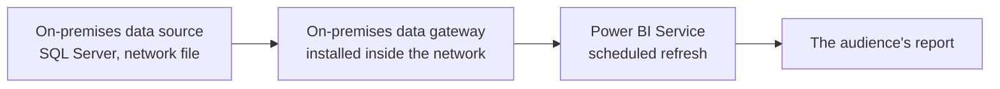
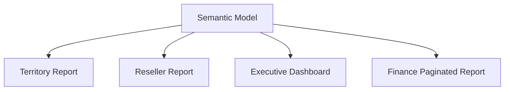
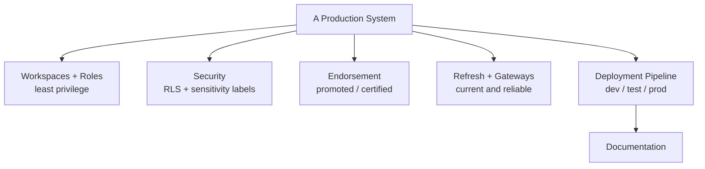

<!--
NANO BANANA PRO — CHAPTER 8 OPENING INFOGRAPHIC
File: images/ch08/fig-8-1-ch8-at-a-glance.png
Title: Production-Ready BI (Chapter 8 Overview)
Concept: A master infographic of the chapter — the governance practices that turn a finished report into a production system.
Archetype: Master infographic — a hub-and-spoke, a central "A PRODUCTION SYSTEM" hub with six illustrated governance spokes; ai4educators master-infographic style, navy/gold.
Reference (composition): ../../.ref-ai4ed/ai4ed-ch06-opener.png
Reference (palette): images/ch07/fig-7-1-ch7-at-a-glance.png
Labels: kicker CHAPTER 8 OVERVIEW; title PRODUCTION-READY BI; hub A PRODUCTION SYSTEM; spokes WORKSPACES AND ROLES, ROW-LEVEL SECURITY, SENSITIVITY LABELS, CERTIFIED CONTENT, REFRESH AND GATEWAYS, DEPLOYMENT PIPELINE; banner "FROM A REPORT TO A SYSTEM".
Palette: navy #1B2A47, gold #C9A23A, white / pale-blue background.
-->

:::{figure} ../images/ch08/fig-8-1-ch8-at-a-glance.png
:label: fig-8-1
:alt: A hub-and-spoke master infographic titled "Production-Ready BI." A central hub, "a production system," connects to six governance spokes: workspaces and roles, row-level security, sensitivity labels, certified content, refresh and gateways, and deployment pipeline. A banner reads "from a report to a system."
:width: 100%
:align: center

**Figure 8.1.** *Production-Ready BI — Chapter 8 Overview.* The governance practices that turn a finished report into a system an organization can run.
:::

**Chapter 8 of 8** | **Part 4 of 4: Distribution and Production**

---

### Power BI View Compass — Where We Work This Chapter

This final chapter lives mostly in the **Power BI Service**, with two specific tasks back in Desktop and one in the admin tools.

| Where | What It Is | What You Do Here | Used In This Chapter |
|-------|-----------|------------------|----------------------|
| **Power BI Service** | The cloud workspace at app.powerbi.com | Configure workspaces and roles, assign RLS members, endorse content, schedule refresh, run deployment pipelines | **Primary — most sections** |
| **Power BI Desktop** | The authoring tool on your machine | Define Row-Level Security roles; configure incremental refresh | Sections 8.3, 8.5 |
| **Admin / Microsoft Purview** | Tenant-level governance settings | Sensitivity labels and who may certify content are configured by administrators | Referenced in 8.3, 8.4 |

> 💜 **Where Am I?** Chapter 8 is a governance chapter, and governance lives in the cloud. Assume the **Power BI Service** in your browser unless a *WHERE AM I?* marker sends you to Desktop.

---

## Opening: The Email Marcus Forwarded

By the spring, Camila's territory report had become the most-opened report in the regional office. Marcus used it. His managers used it. Word spread, and managers in other AdventureWorks regions — Orlando, Phoenix, the Pacific Northwest — asked for access, and were given it.

Then Marcus forwarded her an email with one line on top: *"Call me when you've read this."*

The email was from a regional manager in Phoenix. It was friendly. It thanked Camila for the report. And in the third paragraph it mentioned, by name, a specific South Florida reseller — and that reseller's exact gross margin, a number that lived in Camila's report. The Phoenix manager had no reason to know that number. South Florida's reseller margins were not Phoenix's business, and some of them were commercially sensitive.

Nobody had done anything wrong. The Phoenix manager had not broken into anything. She had opened a report she was given access to, and the report showed her everything — because Camila had never told it not to. There was no Row-Level Security. There were no sensitivity labels. The report had been built to be *seen*, and it was being seen, by everyone, completely.

Camila called Marcus. Then she called Jamal.

Jamal did not sound surprised. "The report works," he said. "That is Chapter 7. Whether it was *safe* to build it the way you did — whether it is something the company can actually run — that is a different question. It is the one nobody asks until an email like this one arrives."

He let that sit a moment. "Come see me. This is the part of the job that turns a report into a system."

This chapter is that part.

### Learning Objectives

By the end of this chapter, you will be able to:

1. **Configure** a workspace — its purpose, its four roles, and the app published from it.
2. **Secure** a semantic model with Row-Level Security, and apply sensitivity labels to classify data.
3. **Endorse** trusted content by promoting and certifying it.
4. **Set up** scheduled and incremental refresh, and explain when a data gateway is required.
5. **Move** content through a dev / test / production deployment pipeline, and name the PL-300 exam skills this course has covered.

### Chapter Roadmap

The chapter has six subchapters and then closes the course. Section 8.1 frames why governance matters. Sections 8.2 through 8.6 are the governance toolkit: workspaces and roles, Row-Level Security and sensitivity labels, endorsement, refresh and gateways, and deployment pipelines. Section 8.7 is the case study — Camila makes her report production-ready. Section 8.8 is the send-off: a PL-300 exam strategy and the course capstone.

---

## 8.1 From a Report to a System — Why Governance

For seven chapters, *finished* has climbed a ladder. A report that shows. A report that is formatted, interactive, analytical. A report that is delivered to the right people on the right devices. Each chapter raised the bar, and each time the bar seemed like the top.

The Phoenix email is the rung above all of them. A report that forty people across a company depend on is no longer a report. It is a **system** — something the organization runs on, something with other people's decisions and other people's confidential data inside it. And a system needs more than to *work*. It needs to be **safe** (the right people see the right data, and no more), **trusted** (people can tell which content is vetted and which is a half-finished draft), **reliable** (the data stays fresh without anyone babysitting it), and **repeatable** (it can be changed and improved without breaking for everyone who depends on it).

That set of practices — safe, trusted, reliable, repeatable — is **governance**. It is not glamorous and it is not optional. It is the difference between an analyst who builds impressive reports and a professional an organization can hand a production system to.

<strong style="color: #1B4F72;">💡 WHY ARE WE DOING THIS?</strong>  
This chapter completes the PL-300 exam's second domain, <em>Manage and secure Power BI</em> — 15 to 20 percent of the exam. The exam tests governance with scenario questions: who should get which workspace role, what stops one viewer from seeing another's data, how trusted content is marked, when a gateway is required. Governance is also the part of the job that separates a junior analyst from a senior one — so this chapter is career advice as much as exam prep.

---

## 8.2 Workspaces, Roles, and Apps

A **workspace** is the container. Every report, semantic model, and dashboard a team builds lives inside a workspace, and the workspace is where the team collaborates on them. It is the back room — and Chapter 7's **app** is the storefront published out of it.

Who can do what in that back room is set by four **workspace roles**.

<!--
NANO BANANA PRO — CHAPTER 8 FIGURE 2 (concept infographic)
File: images/ch08/fig-8-2-workspace-roles.png
Title: The Four Workspace Roles
Concept: The four Power BI workspace roles and what each can do, from least to most permission.
Archetype: Rich row diagram — four role panels with a side MORE PERMISSION arrow; ai4educators master-infographic style, navy/gold.
Reference (composition): ../../.ref-ai4ed/ai4ed-ch01-fig-struggle.png
Reference (palette): images/ch07/fig-7-1-ch7-at-a-glance.png
Labels: rows VIEWER / CONSUME ONLY, CONTRIBUTOR / BUILD, NOT PUBLISH, MEMBER / PUBLISH AND SHARE, ADMIN / FULL CONTROL; banner "GRANT THE LEAST ROLE THAT WORKS".
Palette: navy #1B2A47, gold #C9A23A, white / pale-blue background.
-->

:::{figure} ../images/ch08/fig-8-2-workspace-roles.png
:label: fig-8-2
:alt: A four-row infographic titled "The Four Workspace Roles." Viewer — consume only; Contributor — build, not publish; Member — publish and share; Admin — full control. A side arrow reads "more permission." A banner reads "grant the least role that works."
:width: 100%
:align: center

**Figure 8.2.** *The Four Workspace Roles.* Viewer, Contributor, Member, Admin — and the rule that you grant the least role that does the job.
:::

A **Viewer** reads and explores published content and nothing more. A **Contributor** creates and edits content inside the workspace but cannot publish the app or manage who has access. A **Member** can publish and update the app and share content. An **Admin** controls everything, including the workspace's settings and its access list. The governing principle is *least privilege*: give each person the smallest role that lets them do their job. An analyst who only reads dashboards does not need Contributor.

<strong style="color: #1E8449;">✅ DO THIS</strong>  
<strong>See it.</strong> In the Power BI Service, a workspace page has a toolbar across the top with a <strong>Manage access</strong> button. 
<strong>Name it.</strong> That panel assigns people to the four <strong>workspace roles</strong>. 
<strong>Find it.</strong> Open the workspace → <strong>Manage access</strong> → <strong>Add people or groups</strong>. 
<strong>Do it.</strong> Add a colleague, and assign the role their job needs — Viewer for someone who only consumes, Contributor for someone who builds. Assign roles to <em>security groups</em> rather than individuals where you can; it is far less to maintain.

Publishing is how content reaches the workspace: you publish a report from Desktop, and you republish to update it. An important subtlety — updating the report in the workspace does **not** update the *app*. The app is a separate, deliberate publication step; the audience sees changes only when you update the app. Beyond the workspace, access can also be granted at the **item level** (sharing a single report) and at the **semantic model** level — where a *Build* permission lets a trusted colleague build their own new reports on your model.

One gap to manage with discipline: Power BI has no built-in version history for a published report. The published `.pbix` is overwritten in place. Keep the *source* `.pbix` files versioned yourself — in OneDrive, SharePoint, or Git — so a bad change can be rolled back.

---

## 8.3 Row-Level Security and Sensitivity Labels

The Phoenix email had one root cause: every person who opened the report saw every row in it. **Row-Level Security** — RLS — is the fix.

RLS filters the data a person sees based on who they are. You define a **role** with a DAX filter — `Sales Territory[Region] = "Southwest"` — and a user assigned to that role sees only the rows that pass the filter. One report, one model, but each viewer's screen loads only their slice.

<!--
NANO BANANA PRO — CHAPTER 8 FIGURE 3 (concept infographic)
File: images/ch08/fig-8-3-row-level-security.png
Title: Row-Level Security
Concept: One shared model and report, filtered by role so each viewer sees only their own rows.
Archetype: Rich three-panel comparison — one shared model feeding three role-filtered views; ai4educators master-infographic style, navy/gold.
Reference (composition): ../../.ref-ai4ed/ai4ed-ch02-opener.png
Reference (palette): images/ch07/fig-7-1-ch7-at-a-glance.png
Labels: top ONE SHARED MODEL with a ROLE FILTER badge; panels EAST MANAGER, WEST MANAGER, VP ALL REGIONS; banner "THE ROLE FILTER DECIDES WHAT LOADS".
Palette: navy #1B2A47, gold #C9A23A, white / pale-blue background.
-->

:::{figure} ../images/ch08/fig-8-3-row-level-security.png
:label: fig-8-3
:alt: A three-panel infographic titled "Row-Level Security." One shared model with a role filter feeds three views of the same report: an East manager sees only East data, a West manager sees only West data, and a VP sees all regions. A banner reads "the role filter decides what loads."
:width: 100%
:align: center

**Figure 8.3.** *Row-Level Security.* One model, one report — and a role filter that quietly hands each viewer only the rows that belong to them.
:::

> 💜 **WHERE AM I?** RLS is built in two places. The **roles** are defined in **Power BI Desktop**. The **people** are assigned to those roles in the **Power BI Service**. This section starts in Desktop.

<strong style="color: #1E8449;">✅ DO THIS</strong>  
<strong>See it.</strong> In Power BI Desktop, the Modeling tab of the ribbon has a Security group. 
<strong>Name it.</strong> The control is <strong>Manage roles</strong>. 
<strong>Find it.</strong> Modeling tab → <strong>Manage roles</strong> → <strong>Create</strong>. 
<strong>Do it.</strong> Name the role <code>South Florida</code>. Pick the Sales Territory table and write the DAX filter <code>[Region] = "Southeast"</code>. Save, then use <strong>View as</strong> to preview the report as that role. Publish, then in the Service open the model's <strong>Security</strong> page and assign the regional managers to their roles.

For a model with dozens of regions, writing one role per region does not scale. **Dynamic RLS** solves it: one role, with a filter that uses `USERPRINCIPALNAME()` to match the signed-in user against a table that maps people to regions. One role covers everyone.

<strong style="color: #7D6608;">⚠️ COMMON MISTAKE</strong>  
Assuming RLS protects everyone. It does not protect workspace <strong>Members</strong> and <strong>Admins</strong> — people with edit access to the model see all the data, by design. RLS constrains <strong>Viewers</strong>. Always test with <strong>View as</strong>, and confirm the people who must be limited hold the Viewer role, not Member.

The second tool is classification. A **sensitivity label** — *Public*, *General*, *Confidential*, *Highly Confidential* — is a tag, configured by administrators in Microsoft Purview, that you apply to a report or model. The label is not decoration: it travels **downstream**. Export a *Confidential* report to Excel and the spreadsheet carries the label, and its protection, with it. RLS controls *who sees which rows*; a sensitivity label controls *how the data is handled* wherever it travels.

<strong style="color: #6C3483;">💜 TAKE A BREATH</strong>  
Two security tools, one sentence to keep them apart: <strong>Row-Level Security</strong> decides <em>which rows a person sees</em>; a <strong>sensitivity label</strong> decides <em>how the data is treated</em> once it leaves the report. The Phoenix email needed both — RLS so the manager never saw South Florida's rows, and a label so that if she had exported anything, the file would have known it was confidential.

> **Story: The Role That Camila Tested Twice**
>
> Camila built the RLS roles the week after the Phoenix email. One role per region, a DAX filter on each. She assigned the managers, and she was ready to call it done.
>
> Jamal asked her one question. "How do you know it works?"
>
> She had clicked *View as* in Desktop and seen the report filter correctly. Jamal nodded — and then asked her to do something else. Publish it, he said, and have the Orlando manager open it on her own machine, on a screen-share, while Camila watched.
>
> The Orlando manager opened the report. It showed every region. The filter had not held.
>
> The cause took twenty minutes to find. Camila had assigned the Orlando manager to the workspace as a *Member*, because it had seemed friendlier than Viewer. Members bypass RLS. The role was perfect; the assignment was wrong.
>
> ---
> ***Technical Connection:*** RLS has two halves — the DAX filter, and the role assignment in the Service — and a flawless filter is undone by the wrong assignment. *View as* tests the filter; it cannot test the assignment. The only real test is the one Jamal insisted on: a real user, on their own account, opening the published report. For the PL-300 exam, hold the rule that RLS applies to Viewers, and that testing means testing the whole chain.

---

## 8.4 Promoting and Certifying Content

Chapter 7 told the story of a workspace with forty-one reports, three of them named some version of *Sales Final*. Even with a clean app, a large organization accumulates content, and a consumer searching for a number needs to know which report to trust.

**Endorsement** is the trust signal. Power BI offers two levels. **Promoted** says *the team that built this stands behind it* — any contributor can promote their own content. **Certified** says *the organization vouches for this* — and only a small set of reviewers, designated by an administrator, can certify. A certified semantic model carries a badge wherever it appears, and it rises to the top when people search.

<strong style="color: #1E8449;">✅ DO THIS</strong>  
<strong>See it.</strong> In the Service, open a semantic model and go to its <strong>Settings</strong>. 
<strong>Name it.</strong> The section is <strong>Endorsement and discovery</strong>. 
<strong>Find it.</strong> Semantic model → Settings → <strong>Endorsement</strong>. 
<strong>Do it.</strong> Select <strong>Promoted</strong>. If <strong>Certified</strong> is greyed out, that is expected — certification is restricted to authorized reviewers. To get content certified, you request review from whoever your organization has named.

The distinction is a favourite of the PL-300 exam: *promoted* is self-service and broad; *certified* is restricted and authoritative. When a question asks how an organization marks its single source of truth, the answer is certified — and the follow-up, who can do it, is *only the reviewers an admin designates*.

---

## 8.5 Refresh, Incremental Refresh, and Gateways

A published report is only as current as the data behind it, and that data does not refresh itself. **Scheduled refresh** is the setting, on the semantic model in the Service, that re-imports the source data on a timetable — every morning at 6 a.m., say — so the audience always opens current numbers.

<strong style="color: #1E8449;">✅ DO THIS</strong>  
<strong>See it.</strong> In the Service, open a semantic model's <strong>Settings</strong>. 
<strong>Name it.</strong> The section is <strong>Refresh</strong>, with a <strong>Scheduled refresh</strong> toggle. 
<strong>Find it.</strong> Semantic model → Settings → <strong>Refresh</strong> → <strong>Scheduled refresh</strong>. 
<strong>Do it.</strong> Turn it on, set a frequency and the times of day, and add your email under <em>refresh failure notifications</em> — so that when a refresh fails, a person finds out before the audience does.

<strong style="color: #922B21;">🛑 STOP AND CHECK</strong>  
After you save the schedule, the model's <strong>Refresh history</strong> — in the same Settings area — should list the next scheduled run, and after that run, a green success entry. If you see a red failure instead, open it: the error message names the cause, most often a data source credential that needs re-entering. A schedule that was never verified is a schedule you do not actually have.

For a small dataset, refreshing the whole thing each morning is fine. For a fact table with years of history and millions of rows, re-importing everything daily is slow and wasteful — yesterday's data has not changed. **Incremental refresh** fixes that: configured in Desktop, it refreshes only the recent partitions — the last few days — and leaves the settled history untouched. For the largest models, the **large semantic model** storage format raises the ceiling further. The pattern to remember: incremental refresh is the answer whenever a question describes a big, history-heavy table that takes too long to refresh.

One question decides whether refresh needs extra plumbing: *where does the data live?* If the source is in the cloud, the Service can reach it directly. If the source sits **on-premises** — a SQL Server in the company's own building, a file on a private network — the cloud Service cannot reach it alone. It needs an **on-premises data gateway**: a small piece of software, installed inside the network, that acts as a secure bridge.

**Diagram 8.1.** When a gateway is required. A cloud source needs no gateway; an on-premises source does — the gateway is the only bridge the Service has back across the network boundary.

<strong style="color: #6C3483;">💜 TAKE A BREATH</strong>  
Refresh has three ideas and they nest cleanly. <strong>Scheduled refresh</strong> — the data updates on a timetable. <strong>Incremental refresh</strong> — for big tables, update only the recent part. <strong>Gateway</strong> — needed only when the source lives on-premises. Timetable, recent-only, bridge. If those three land, the refresh portion of the exam is yours.

---

## 8.6 Deployment Pipelines and the Documentation Habit

Camila's report has an audience now. That changes how she is allowed to *change* it. Editing the live report and hoping is no longer acceptable — a mistake is a mistake in front of forty people.

A **deployment pipeline** is the disciplined alternative. It gives the content three stages — **Development**, **Test**, and **Production** — and a controlled way to move between them. New work happens in Development, where breaking things is safe. It is promoted to Test, where real reviewers validate it against real data. Only then is it promoted to Production, the version the audience actually opens.

<!--
NANO BANANA PRO — CHAPTER 8 FIGURE 4 (concept infographic)
File: images/ch08/fig-8-4-deployment-pipeline.png
Title: The Deployment Pipeline
Concept: Moving content cleanly through Development, Test, and Production stages.
Archetype: Rich process flow — three numbered stages joined by arrows; ai4educators master-infographic style, navy/gold.
Reference (composition): ../../.ref-ai4ed/ai4ed-ch02-opener.png
Reference (palette): images/ch07/fig-7-1-ch7-at-a-glance.png
Labels: stages DEVELOPMENT, TEST, PRODUCTION; banner "DEV, TEST, PROD: ONE CONTROLLED PATH".
Palette: navy #1B2A47, gold #C9A23A, white / pale-blue background.
-->

:::{figure} ../images/ch08/fig-8-4-deployment-pipeline.png
:label: fig-8-4
:alt: A three-stage process-flow infographic titled "The Deployment Pipeline": development (build and break things safely), test (validate with real reviewers), and production (the audience's trusted version). A banner reads "dev, test, prod — one controlled path."
:width: 100%
:align: center

**Figure 8.4.** *The Deployment Pipeline.* Three stages and one controlled path — changes reach the audience only after they have been tested.
:::

Pipelines also matter because reports do not stand alone. A single semantic model often feeds many reports and dashboards — its **downstream dependencies**. Change the model and every one of them is affected, sometimes broken. The Service's **lineage view** draws this web so you can see what a change will touch before you make it.

**Diagram 8.2.** Downstream dependencies. One semantic model, four things that depend on it. A change to the model is a change to all four — which is why you check the lineage view before you touch a shared model.

The quiet discipline that holds all of this together is **documentation**. A model with clearly named tables, described measures, and a written note on its RLS roles and refresh schedule can be picked up by the next analyst — or summarized by Copilot, as Chapter 6 showed — without a week of reverse-engineering. Undocumented, the same model becomes a thing nobody dares to change.

<strong style="color: #7D6608;">⚠️ COMMON MISTAKE</strong>  
Editing the production report directly because a fix is "small." There are no small changes to a report forty people depend on — there are only tested changes and untested ones. The pipeline exists so that the size of the change never decides whether it gets tested. Every change takes the same path: Development, Test, Production.

> **Story: Camila's First Deployment**
>
> A year after the stare across her desk in Chapter 1, Camila ran her first deployment pipeline without Jamal in the room.
>
> The change was genuinely small — a new measure, a relabelled axis. The old Camila would have opened the live report and made the edit in four minutes. Instead she made it in Development, promoted it to Test, and sent the Test link to two regional managers with one question: *does anything look wrong?*
>
> One of them wrote back. The new measure double-counted reseller orders that crossed a fiscal-year boundary. In the live report, that error would have reached forty people and the next board meeting. In Test, it reached two reviewers and got fixed before lunch.
>
> Camila promoted the corrected version to Production that afternoon.
>
> ---
> ***Technical Connection:*** A deployment pipeline's value is not the tooling — it is the *enforced pause* between building a change and shipping it. Development is where work is safe to be wrong. Test is where someone other than the author looks. Production is what the audience trusts. The discipline Camila showed — treating a four-minute change with the same process as a major one — is exactly what the PL-300 exam, and an employer, mean by "production-ready."

---

## 8.7 Case Study — Camila Ships to Production

Camila spent a week turning her territory report from a thing that worked into a system the company could run.

She started with the **workspace**. The report had been sitting in a workspace where half the office held Member access "to be friendly." She rebuilt the access list on least privilege: the regional managers became **Viewers**, two fellow analysts **Contributors**, and only she and Jamal kept **Member**.

She fixed the Phoenix problem with **Row-Level Security** — a dynamic role keyed on `USERPRINCIPALNAME()`, mapping each manager to their region. Then she tested it the way Jamal had taught her: a real manager, a real account, a screen-share. The Phoenix manager opened the report and saw Phoenix, and only Phoenix.

She applied a **Confidential** sensitivity label to the model, so that any export would carry its protection along. She requested review from the BI Center, and a week later the model earned its **Certified** badge — the South Florida sales model was now, officially, the source of truth.

She set **scheduled refresh** for 6 a.m. daily, with failure notifications to her own inbox, and because the fact table now held four years of history, she configured **incremental refresh** so the morning refresh stayed quick. The data lived in the cloud, so no gateway was needed.

Finally she put the report into a **deployment pipeline**. From that week on, every change — however small — would travel Development to Test to Production.

She showed it to Jamal. He clicked through the access list, the RLS test results, the certification badge, the refresh history, the pipeline. He did not say much. He did not need to. The report that had drawn a blank stare in Chapter 1 was now a governed production system, and the analyst who built it knew the difference.

---

## 8.8 PL-300 Exam Strategy and Course Capstone

One conversation remained, and Camila had it over a video call with **Dr. Iyer**.

This course — CAP2743C — covered two of the four domains of the PL-300 exam: **Visualize and analyze the data**, the work of Chapters 1 through 6, and **Manage and secure Power BI**, the work of Chapters 7 and 8. The other two domains, *Prepare the data* and *Model the data*, were the work of the prerequisite, CAP2791C. Together, the two courses cover the whole exam.

Dr. Iyer's exam advice was short and she had given it to many students. Read every case-study question twice before looking at the answers — the scenario contains the constraint that eliminates two of the four options. Watch for the skills new to the January 2026 exam, because new skills are tested deliberately: **visual calculations with DAX**, and **Copilot** for narrative visuals, report pages, and model summaries. Practice in Power BI itself, on the AdventureWorks data, not only on flashcards — the exam asks what you would *do*, not what you can recite. And manage the clock: a hard question flagged and returned to is worth more than a hard question that eats ten minutes.

<strong style="color: #1B4F72;">💡 WHY ARE WE DOING THIS?</strong>  
The PL-300 certification is a credential an employer can read in three seconds, but the real exam is the one Marcus gave Camila in Chapter 1: someone with a decision to make looks at your work and asks <em>what next?</em> Every chapter of this book has been practice for that question. The certification confirms it; the work proves it.

The **course capstone** brings all eight chapters into one deliverable. Take the AdventureWorks dataset and build, end to end, a report that earns its place: a clear Decision Question, the right visuals chosen against the accuracy hierarchy, deliberate formatting, interactivity, an analytical layer, an AI feature used and verified, a distribution choice, and a governance plan — workspace roles, Row-Level Security, a sensitivity label, and a refresh schedule. One report that a stakeholder could act on and an organization could safely run. That is the whole course in a single file.

---

## Chapter Closing

### Key Takeaways

- A report many people depend on is a **system**, and a system must be safe, trusted, reliable, and repeatable. The practices that make it so are **governance**.
- A **workspace** is the team's back room; its four roles — Viewer, Contributor, Member, Admin — are granted on *least privilege*. The **app** is a separate publication, updated deliberately.
- **Row-Level Security** filters the rows a person sees through a DAX role; it constrains Viewers, not Members or Admins, and it must be tested with a real user. A **sensitivity label** classifies data and travels downstream with every export.
- **Endorsement** marks trusted content: **Promoted** is self-service; **Certified** is restricted to authorized reviewers and marks the organization's source of truth.
- **Scheduled refresh** keeps data current on a timetable; **incremental refresh** keeps that fast for large history-heavy tables; an **on-premises data gateway** is required only when the source lives behind a network boundary.
- A **deployment pipeline** moves content through Development, Test, and Production, so every change — large or small — is tested before the audience sees it. The **documentation habit** keeps a model usable by the next analyst.
- This course covered two PL-300 domains — Visualize and analyze, Manage and secure. The exam confirms the skill; the work itself is the proof.

### Concept Map

**Diagram 8.3.** Chapter 8 in one picture. Six governance practices turn a finished report into a system an organization can run.

### Vocabulary Review

- **Governance** — The practices that make a report safe, trusted, reliable, and repeatable enough to run as a production system.
- **Workspace** — The container where a team builds and stores Power BI content and collaborates on it.
- **Workspace roles** — Viewer, Contributor, Member, Admin — the four levels of permission inside a workspace, granted on least privilege.
- **Item-level access** — Sharing a single report or granting Build permission on a semantic model, separate from workspace roles.
- **Row-Level Security (RLS)** — A model feature that filters the rows a user sees through a DAX role; it constrains Viewers.
- **Dynamic RLS** — A single RLS role whose DAX filter uses `USERPRINCIPALNAME()` to match the signed-in user, scaling to many regions.
- **Sensitivity label** — A classification tag (Public, Confidential, and so on) that travels downstream with the data and enforces protection.
- **Endorsement** — Marking trusted content: *Promoted* (self-service) or *Certified* (restricted to authorized reviewers).
- **Scheduled refresh** — A setting that re-imports a semantic model's source data on a timetable.
- **Incremental refresh** — Refreshing only recent partitions of a large table, leaving settled history untouched.
- **On-premises data gateway** — Software installed inside a private network that bridges the cloud Service to an on-premises data source.
- **Deployment pipeline** — A Development → Test → Production path that moves content through controlled stages before it reaches the audience.

### The Road From Here

This is the last page of the course, and the right place to say what the eight chapters were really about. Chapter 1 opened with Marcus staring at a beautiful, useless report and asking *what do you want me to do?* Every chapter since has been an answer to that question. You learned to choose visuals that carry an argument, to format so the argument lands, to make a report a conversation, to find the insight and let AI help notice it, to deliver the report to the people who need it, and — here at the end — to run it as a system that is safe and trusted.

The next step is yours: sit the PL-300 exam, build the capstone, and walk into an interview able to say not *I know Power BI* but *I know what a report is for*. Camila started this book three weeks into her first job, unable to answer Marcus. She ends it running a governed production system. That arc is available to you too, and it does not require talent so much as the habit this book has drilled on every page — start from the decision, and build backward to the data.

### Self-Check Questions

1. A colleague needs to read the dashboards in a workspace but should not be able to edit anything. Which workspace role fits? (a) Admin; (b) Member; (c) Contributor; (d) Viewer. *(Answer: d — Viewer reads and explores content; least privilege says do not grant more.)*

2. A report must show each regional manager only their own region's data, while a VP sees all regions. Which feature delivers this? (a) A sensitivity label; (b) Row-Level Security; (c) Endorsement; (d) A separate report per region. *(Answer: b — RLS filters the rows each user sees through a DAX role.)*

3. *True or False:* Assigning a manager to a workspace as a Member is a good way to apply Row-Level Security to them. *(Answer: False. RLS constrains Viewers; Members and Admins bypass it. The manager should be a Viewer.)*

4. An organization wants to mark one semantic model as its official, vetted source of truth. Which endorsement applies, and who can apply it? (a) Promoted, by any contributor; (b) Certified, by any contributor; (c) Certified, by reviewers an administrator authorizes; (d) Promoted, by an administrator only. *(Answer: c — Certified is the authoritative endorsement, restricted to authorized reviewers.)*

5. A semantic model connects to a SQL Server database running on the company's own on-premises network. What is required for scheduled refresh to work? (a) Incremental refresh; (b) A sensitivity label; (c) An on-premises data gateway; (d) A deployment pipeline. *(Answer: c — the gateway is the bridge the cloud Service needs to reach an on-premises source.)*

### Reflection Prompt

Look back across all eight chapters. Pick the one idea that most changed how you think about a report — the Decision Question, the accuracy hierarchy, interactivity, the limits of AI, distribution, governance, or another. Write a paragraph on why it stayed with you. Then look forward: name one report you will build, or rebuild, with everything this course has given you — and write the Decision Question it will answer.

---

*End of Chapter 8 — and of the course. From model to message, and from a report to a system: the work is yours now.*
